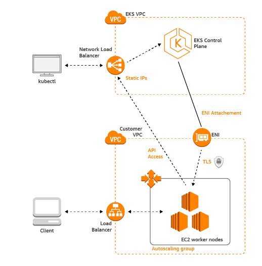

# Architecture of Amazon EKS

Amazon EKS runs a single tenant Kubernetes control plane for each cluster.

The control plane infrastructure isn't shared across clusters or AWS accounts.

The control plane consists of at least two `API server` instances and three `etcd` instances that run across three Availability Zones within an AWS Region.

It is the responsibility of AWS to maintain high availability, high performance and scalability of the EKS control plane.

    

## How Does Amazon EKS Work?

1. Create an Amazon EKS cluster in the AWS Management Console or with the AWS CLI or one of the AWS SDKs.

2. Launch managed or self-managed Amazon EC2 nodes, or deploy your workloads to AWS Fargate.

3. When your cluster is ready, you can configure your favorite Kubernetes tools, such as `kubectl`, to communicate with your cluster.

4. Deploy and manage workloads on your Amazon EKS cluster the same way that you would with any other Kubernetes environment. You can also view information about your workloads using the AWS Management Console.

    

## Node Groups in Amazon EKS

A node group can be thought of as a logical grouping of worker nodes that share the same configuration and Amazon Machine Image (AMI).

Amazon EKS provides three types of node groups to run worker nodes in a Kubernetes cluster.

1. EKS Managed Node Groups
2. Self-Managed Node Groups
3. Fargate Node Groups

### 1. Managed Node Groups

Managed Node Groups are a feature of Amazon Elastic Kubernetes Service (EKS) that allow you to launch and manage worker nodes for your Kubernetes cluster in an easy and scalable way. Managed Node Groups are fully-managed, meaning that AWS handles all the underlying infrastructure and management tasks, such as node provisioning, scaling, and patching. This allows you to focus on your applications rather than worrying about the underlying infrastructure.

Advantages of EKS Managed Node Groups:

- Fully managed by AWS
- Automatic scaling of worker nodes
- High availability and reliability
- Easy integration with other AWS services

Disadvantages of EKS Managed Node Groups:

- Limited customization options
- AWS controls the underlying infrastructure

### 2. Self-Managed Node Groups

Self-Managed Node Groups are an alternative to Managed Node Groups in Amazon Elastic Kubernetes Service (EKS). Unlike Managed Node Groups, Self-Managed Node Groups are not fully managed by AWS, and require more manual configuration and management on your part.

With Self-Managed Node Groups, you are responsible for provisioning and configuring the underlying Amazon Elastic Compute Cloud (EC2) instances, as well as managing the lifecycle of the nodes. This includes tasks such as scaling, patching, and updating the nodes.

Advantages of Self Managed Node Groups:

- More control over underlying infrastructure
- Ability to customize node configuration
- Can run on EC2 or on-premises servers

Disadvantages of Self Managed Node Groups:

- Users are responsible for managing the worker nodes
- No automatic scaling

### 3. Fargate Node Groups

Fargate Node Groups are a feature of Amazon Elastic Kubernetes Service (EKS) that allows you to run Kubernetes pods on AWS Fargate, a serverless compute engine for containers. With Fargate Node Groups, you no longer need to manage the underlying EC2 instances for your Kubernetes cluster - instead, AWS manages the infrastructure for you.

Advantages of Fargate Node Groups:

- Serverless computing
- Fully managed by AWS
- Automatic scaling

Disadvantages of Fargate Node Groups:

- Limited customization options
- AWS controls the underlying infrastructure

!!! quote "References:"
    !!! quote ""
        * [What is Amazon EKS?]{:target="_blank"}
        * [Amazon EKS architecture]{:target="_blank"}

<!-- Hyperlinks -->
[What is Amazon EKS?]: https://docs.aws.amazon.com/eks/latest/userguide/what-is-eks.html
[Amazon EKS architecture]: https://docs.aws.amazon.com/eks/latest/userguide/eks-architecture.html