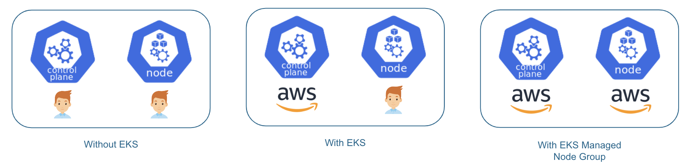

# Introduction to Amazon EKS

Amazon EKS (Elastic Kubernetes Service) is a fully-managed Kubernetes service offered by AWS.

It simplifies the process of deploying, managing, and scaling containerized applications using Kubernetes on AWS infrastructure.

With Amazon EKS, users can create Kubernetes clusters with just a few clicks, and easily deploy, manage, and scale containerized applications on top of them.

EKS provides a highly-available and secure control plane for Kubernetes and automatically manages the scaling, patching, and maintenance of the underlying infrastructure.

## Key Features of Amazon EKS

### 1. Fully-managed Kubernetes service

Amazon EKS is a fully managed service, meaning that AWS manages the control plane of Kubernetes for you, which includes the API server, etcd, and scheduler. This frees you up from the operational overhead of managing a Kubernetes control plane, allowing you to focus on deploying and scaling your containerized applications.

    

### 2. Scalability

Amazon EKS is designed to be highly scalable. It can scale up or down automatically based on demand. Additionally, you can use Auto Scaling groups to automatically adjust the size of your worker node groups to meet the demands of your applications.

### 3. High availability

Amazon EKS is designed to be highly available, with multiple availability zones (AZs) to ensure that your Kubernetes cluster is always available even if an AZ goes down. Additionally, EKS automatically replaces unhealthy control plane instances and provides automated node recovery.

### 4. Security and Compliance

Amazon EKS is designed to be secure and compliant with industry standards. EKS uses AWS Identity and Access Management (IAM) to manage user access to Kubernetes resources, and it also provides built-in security features like network isolation and encryption of data in transit and at rest.

### 5. Seamless integration with AWS services

Amazon EKS is tightly integrated with other AWS services, including Amazon Elastic Container Registry (ECR), AWS Identity and Access Management (IAM), AWS CloudFormation, and more. This integration makes it easy to deploy and manage your containerized applications on AWS.

Overall, Amazon EKS is a powerful and feature-rich Kubernetes service that can help you deploy and manage containerized applications on AWS with ease.