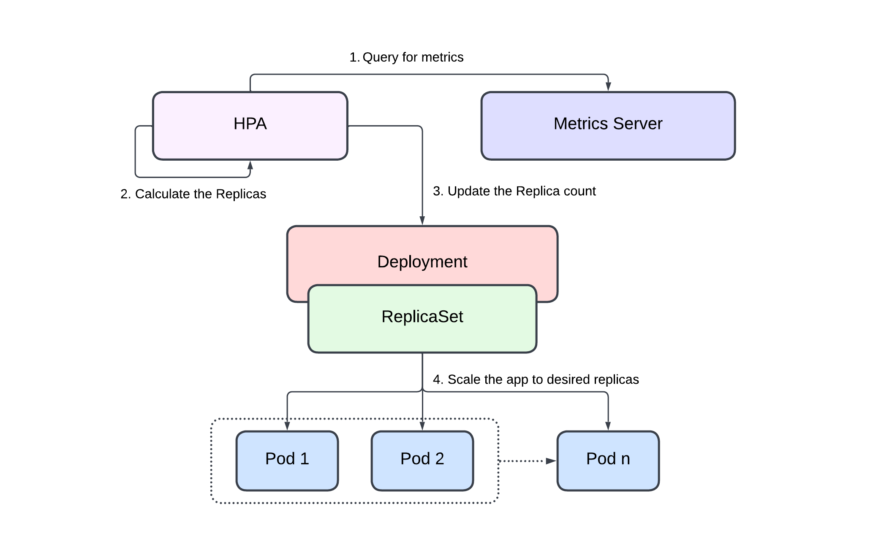

# Introduction to Horizontal Pod Autoscaler (HPA)

The kubernetes `Horizontal Pod Autoscaler (HPA)` automatically scales the number of pods in a deployment, replication controller, or replica set based on that resource's CPU utilization.

This can help your applications scale out to meet increased demand or scale in when resources are not needed, thus freeing up your nodes for other applications. When you set a target CPU utilization percentage, the Horizontal Pod Autoscaler scales your application in or out to try to meet that target.

The Horizontal Pod Autoscaler is a standard API resource in kubernetes that simply requires that a metrics source (such as the kubernetes metrics server) is installed on your Amazon EKS cluster to work. You do not need to deploy or install the Horizontal Pod Autoscaler on your cluster to begin scaling your applications.

You need to set `requests` and/or `limits` for containers in order to allow HPA to calculate resource utilization percentage which it can then use to determine autoscaling actions.

!!! note
    You must have a metrics source for example `metrics-server` installed in your kubernetes cluster.

## How does HPA Work?

Here's how Horizontal Pod Autoscaler (HPA) works in kubernetes:

    

1. HPA continuously monitors the metrics server for resource usage.
2. Based on the collected resource usage, HPA calculates the desired number of replicas.
3. HPA updates the replica count of the deployment to the desired number.
4. The `ReplicaSet` scales the app to desired replicas.

!!! quote "References:"
    !!! quote ""
        * [Horizontal Pod Autoscaler]{:target="_blank"}

<!-- Hyperlinks -->
[Horizontal Pod Autoscaler]: https://docs.aws.amazon.com/eks/latest/userguide/horizontal-pod-autoscaler.html