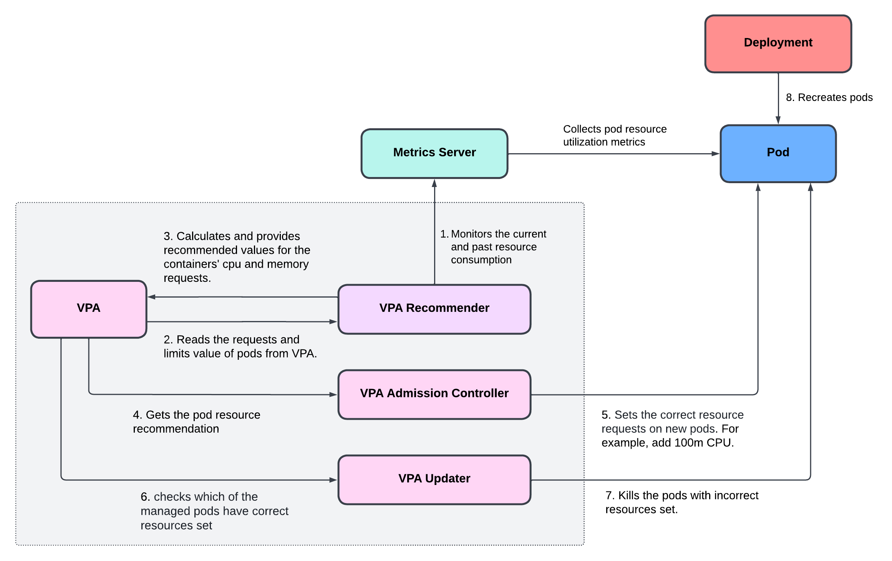

# Introduction to Vertical Pod Autoscaler (VPA)

The Kubernetes `Vertical Pod Autoscaler (VPA)` is a resource management component that helps optimize the resource allocation for pods in a kubernetes cluster. Unlike the Horizontal Pod Autoscaler (HPA), which adjusts the number of pod replicas based on CPU or memory utilization, the Vertical Pod Autoscaler focuses on adjusting the resource limits and requests for individual pod containers.

In summary, the kubernetes Vertical Pod Autoscaler automatically adjusts the CPU and memory reservations for your pods to help "right size" your applications.

Amazon EKS does not come pre-equipped with the Vertical Pod Autoscaler (VPA). To leverage VPA's capabilities for optimizing pod resource allocations, we need to deploy it on our EKS cluster.

!!! note
    You must have a metrics source for example `metrics-server` installed in your kubernetes cluster.

## Components of Vertical Pod Autoscaler (VPA)

The VPA consists of 3 components:

1. **Recommender:** it monitors the current and past resource consumption and, based on it, provides recommended values for the containers' cpu and memory requests.

2. **Updater:** it checks which of the managed pods have correct resources set and, if not, kills them so that they can be recreated by their controllers with the updated requests.

3. **Admission Controller:** it sets the correct resource requests on new pods (either just created or recreated by their controller due to Updater's activity).

## How Does VPA Work?

Here's how Vertical Pod Autoscaler (VPA) works in kubernetes:

    

1. VPA recommender uses metrics server to continuously monitor the current and past resource consumption of pods.
2. VPA recommender reads the `requests` and `limits` value of pods from VPA definition.
3. VPA recommender calculates and provides recommended values for the containers' `cpu` and `memory` requests.
4. VPA admission controller gets the resource recommendation for pods
5. VPA admission controller sets the correct resource `requests` on new pods. For example, add `100m` CPU.
6. VPA updater checks which of the managed pods have correct resources set.
7. VPA updater kills the pods with incorrect resources set.
8. Deployment recreates the pod to match the defined replicas with correct resource `requests`.

## VPA Modes

There are four modes in which VPAs operate:

1. **Auto:** VPA assigns resource requests on pod creation as well as updates them on existing pods using the preferred update mechanism. Currently, this is equivalent to "Recreate" (see below). Once restart free ("in-place") update of pod requests is available, it may be used as the preferred update mechanism by the "Auto" mode.

2. **Recreate:** VPA assigns resource requests on pod creation as well as updates them on existing pods by evicting them when the requested resources differ significantly from the new recommendation (respecting the Pod Disruption Budget, if defined). This mode should be used rarely, only if you need to ensure that the pods are restarted whenever the resource request changes. Otherwise, prefer the "Auto" mode which may take advantage of restart-free updates once they are available.

3. **Initial:** VPA only assigns resource requests on pod creation and never changes them later.

4. **Off:** VPA does not automatically change the resource requirements of the pods. The recommendations are calculated and can be inspected in the VPA object.

## Known Limitations of VPA

1. Whenever VPA updates the pod resources, the pod is recreated, which causes all running containers to be recreated. The pod may be recreated on a different node.
2. Vertical Pod Autoscaler should not be used with the Horizontal Pod Autoscaler (HPA) on CPU or memory at this moment.
3. VPA performance has not been tested in large clusters.
4. VPA cannot guarantee that pods it evicts or deletes to apply recommendations (when configured in Auto and Recreate modes) will be successfully recreated. This can be partly addressed by using VPA together with Cluster Autoscaler.
5. VPA recommendation might exceed available resources (e.g. Node size, available size, available quota) and cause pods to go pending. This can be partly addressed by using VPA together with Cluster Autoscaler.
6. Multiple VPA resources matching the same pod have undefined behavior.

!!! quote "References:"
    !!! quote ""
        * [Vertical Pod Autoscaler]{:target="_blank"}
        * [VPA GitHub Repo]{:target="_blank"}

<!-- Hyperlinks -->
[Vertical Pod Autoscaler]: https://docs.aws.amazon.com/eks/latest/userguide/vertical-pod-autoscaler.html
[VPA GitHub Repo]: https://github.com/kubernetes/autoscaler/tree/master/vertical-pod-autoscaler