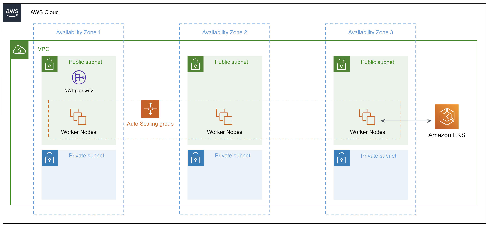

# VPC Resources Created by eksctl

Based on the `ClusterConfig` we provided, Amazon EKS will create the following AWS VPC resources:

1. **VPC**

    eksctl creates a new VPC with a CIDR block of `192.168.0.0/16`.


2. **Internet Gateway**

    An internet gateway is created and attached to the VPC to enable communication between the cluster and the public internet.

3. **Subnets**

    Six subnets are created across 3 availability zones; three public and three private.

    Two subnets in each AZ; one private and one public.

    Here's the CIDR block of each subnet that is created:

    - **subnets for ap-south-1a**

        - public:192.168.0.0/19
        - private:192.168.96.0/19

    - **subnets for ap-south-1b**

        - public:192.168.32.0/19
        - private:192.168.128.0/19

    - **subnets for ap-south-1c**

        - public:192.168.64.0/19
        - private:192.168.160.0/19

4. **Route Tables**

    Four route tables are created as follows:

    - One for public traffic. All the public subnets are associated with this route table.
    - Three for private traffic; one per private subnet. Each private subnet is associated to one of these route tables.


5. **NAT Gateway**

    `eksctl` creates only one NAT gateway and attaches it to all the private route tables. This allows outbound internet traffic from the nodes in the private subnet.

    If you want NAT gateway to be created in each of the three availability zones for high availability, you can add the following fields in the `ClusterConfig`:

    ```yaml
    vpc:
    nat:
        gateway: "highly_available"
    ```

    With the above configuration eks`ctl will create a NAT gateway in each availability zone specified in the `availabilityZones` field.

    !!! warning
        Creating multiple NAT gateways will incur additional costs, and you should carefully consider the cost implications before enabling this feature.


6. **Security Groups**

    `eksctl` creates security groups for initial nodegroup and the control plane.

    If `SSH` was enabled, `eksctl` will also create a security group that allows `SSH` access.

    `eksctl` will also create and manage a shared node security group that allows communication between unmanaged nodes and the cluster control plane and managed nodes.


7. **Elastic Network Interfaces (ENIs)**

    ENIs are created and attached to the nodes for communication with other resources within the VPC.

    An Elastic Network Interface (ENI) is a logical networking component in AWS that represents a virtual network card.


Below is an architectural diagram illustrating the structure of the EKS cluster we've created:

<p align="center">
    
</p>