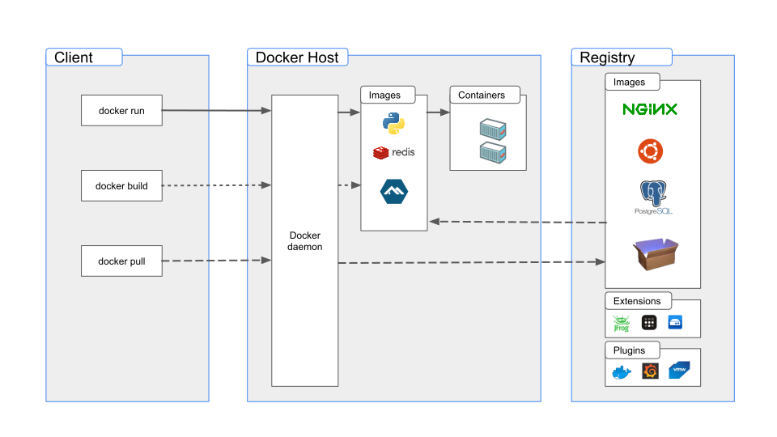

# Introduction to Docker

Have you ever been curious about Docker and why it's such a big deal? Well, you're in the right place. In this tutorial, we'll break it down step by step and figure out what Docker is and why it's important.

Let's get started!

<p align="center">
    
</p>


## Architecture of a Traditional Machine

Before we dive into Docker, it is important to understand the architecture of a traditional machine and how deployments work on it. 

You’ll have a better understanding of Docker and its purpose if you understand the architecture of a traditional machine and the challenges encountered when deploying applications on them.

On a traditional machine, you have hardware consisting of a CPU, RAM, storage, and other components. On this hardware, you install an operating system like Windows, Linux, or Mac. 

Next, you install the necessary libraries and dependencies on the operating system for running your application. Finally, you run your application, such as a Python application, an Nginx server, or a database like MySQL.

<p align="center">
    
</p>

!!! note "Architecture of a Traditional Machine"
    * **Layer1:** Hardware
    * **Layer2:** Operating System
    * **Layer3:** Libraries and Binaries
    * **Layer4:** Applications

## Challenges in Deploying Applications on a Traditional Machine

Now, let’s look at the problems in deploying applications on a traditional machine. Let me illustrate this with a story.

<p align="center">
    
</p>

Adam and Bob are colleagues at ABC Software Private Limited. Adam is a software developer, and Bob is a QA engineer.

Adam has been working on a project using Node.js and MongoDB. He has added a cool new feature that is all set for the QA testing. He hands the feature over to Bob, the QA champ.

Bob gives it a try on his computer, but the feature seems broken and doesn't work. Bob realizes something's off and sends a message to Adam, saying, "There's a problem, the code you shipped is not working as expected.”

Adam is pretty sure that the feature is fine and doesn't have any problems. To make sure, he tries the feature on his own computer again. Turns out, he was right. The feature works perfectly on his computer without any issues.

Adam scratches his head and goes to Bob, saying, "Hey, the code is working fine on my machine. Why the hell isn't it working on yours?”

And that, folks, is just another day in the life of software adventures.

### Reasons Behind the Probelm

!!! question "Why did that happen?"
    How come the exact same code worked on one machine but failed to run on the other?

Let’s look into the possible reasons:

1. Bob might not have installed the libraries and dependencies correctly on his system, for example, Node.js and MongoDB in this case.

2. Bob could've installed the wrong version of the dependencies which is incompatible with parts of the code that Adam shipped. For instance, he might have installed Node.js version 12 instead of version 14.

3. It's also possible that Bob's computer is loaded with other software, causing conflicts with the required dependencies or libraries.

4. And let's not overlook the fact that Bob could be using a completely different operating system than Adam's, one that is incompatible with the required dependencies and libraries.

### The Catastrophe

!!! warning
    What if Bob used the same operating system and dependencies as Adam, and the code worked on his computer?

He would likely send it for production deployment. However, here's the challenge: We cannot ensure that the code will function properly on the production machine unless it is running the same operating system and has the required dependencies and libraries correctly installed.

This particular scenario highlights one of the most significant challenges associated with deploying software in this manner.

Additionally, this method of software development is error-prone because developers are required to install all the necessary libraries and dependencies on their machines, which are OS-dependent. It's very probable they'll skip steps or misconfigure some settings, leading to problems when trying to run the code without issues. Imagine setting up 10 more services apart from Node.js and MongoDB on your machine just to be able to run your code properly. You’ll go crazy!


## What's the Solution?

One solution is to bundle everything together including the operating system, binaries, libraries, and dependencies, and then use the same bundle across environments.

<p align="center">
    
</p>

This is exactly what [Virtual Machines]{:target="_blank"} (VMs) do.
    
With virtual machines, you can bundle everything together, create an image or snapshot of the bundle, and then share it across environments.


## How Do Virtual Machines (VMs) Work?

Imagine you have a regular computer with an operating system on it. Now, imagine adding a special layer on top of that computer. This special layer is a software called [Hypervisor]{:target="_blank"}. Popular options for hypervisors include VMware and VirtualBox. This hypervisor does a cool trick - it creates and runs virtual machines.

Think of virtual machines as another computer inside your real computer. The hypervisor lets your main computer act like a host, sharing its power (like the CPU and memory) with these virtual computers.

Once the hypervisor is in place, you can install a full-fledged operating system on it. This new operating system is like a guest, hanging out inside the main computer.

With the guest operating system set up, you can start adding the required binaries, libraries, and dependencies and finally run your applications.

<p align="center">
    
</p>

The cool thing about this guest operating system is that you can pack it up and share it. It's like making a copy of a game you really like so your friends can play too. In the world of virtual machines, this copy is called an "image".

Now, anyone can use this image to create their own virtual machine and do their work on it.

!!! note "Architecture of a Virtual Machine"
    * **Layer1:** Hardware
    * **Layer2:** Operating System
    * **Layer3:** Hypervisor (E.g. VMware, VirtualBox)
    * **Layer4:** Guest Operating System
    * **Layer5:** Libraries and Binaries
    * **Layer6:** Applications

## Deployment With Virtual Machines

Remember Adam and Bob? Here's the update on their story. The smart DevOps team used VMware to create a virtual machine. They added things like Node.js and MongoDB plus other stuff it needs. Then, they made a copy of everything - that's the image. They gave this image to Adam and Bob, and guess what? The same image will be used for production too.

So, now Adam and Bob each have a copy of this special image. They can use it to create their own virtual machines and do their work. When Adam makes something and wants Bob to check it out, he knows that if it works on his virtual machine, it will work on Bob's and the Production machine too!

<p align="center">
    
</p>

So, with Virtual Machines in place, are things all good now? No!


## Disadvantages of Virtual Machines

Although hypervisors and Virtual Machines offer numerous advantages, there are also some disadvantages to consider:

1. **Performance overhead:** Running a full-fledged operating system inside a virtual machine requires additional processing overhead. This can lead to reduced performance compared to running the same operating system directly on the host hardware.

2. **Resource limitations:** Each virtual machine requires a portion of the host system resources, such as CPU, memory, and storage. This can limit the number of virtual machines that can be run simultaneously on a given hardware.

3. **Complexity:** The setup and management of virtual machines can be more complex than managing physical machines, and may require specialized knowledge and tools.

4. **Licensing costs:** Each virtual machine needs a full-fledged operating system and may need a license. This increases the overall cost of running an application.


## What are Containers?

Containers offer a solution to address the challenges associated with Virtual Machines.

You can think of containers as virtual machines with the following differences:

1. Instead of a hypervisor, you need a container run-time such as `Docker` or `Containerd`.

2. The container provides isolation between the host operating system and the application running inside the container, similar to virtual machines, but without the overhead of a full operating system, leading to better performance and resource utilization.

3. Containers are more lightweight than virtual machines, as they share the host's operating system kernel, leading to better resource utilization and lower overhead.

4. Containers can be deployed and started quickly, as they do not require the time-consuming process of booting up a complete virtual machine.

<p align="center">
    
</p>

!!! note "Architecture of Containers"
    * **Layer1:** Hardware
    * **Layer2:** Operating System
    * **Layer3:** Container Runtime (E.g. Docker)
    * **Layer4:** Containers

## What is Docker?

Docker is a technology that provides a platform for creating, deploying, and managing containers.

Think of [Docker]{:target="_blank"} as a super handy toolbox for containers. It helps you create, manage, and run these nifty container things we talked about earlier.

Docker takes care of all the hard work, like setting up containers and making sure they play nice with your computer. It's like having a container wizard by your side.

!!! tip
    So, if containers are the cool kids, Docker is the captain of the cool kids - making everything easy and awesome.


## Compatibility of Docker Across Operating Systems

In the beginning, Docker was all about Linux. It had a close bond with Linux. For example, you could not run Linux based docker container on a Windows machine because Linux-based containers can’t use Windows OS kernel.

But Docker had a grand vision: they wanted to spread the container magic to Windows and Mac users.

That's where `Docker Desktop` stepped in. It functions as an intelligent mediator, introducing a portion of Linux functionality to both Windows and Mac environments. This unique component, referred to as a lightweight Linux kernel, serves as an intermediary, facilitating the seamless operation of containers across these distinct systems.

With Docker Desktop, it's not just about Linux anymore. Windows and Mac users also get to share the container's goodness. It's like a universal language that these systems understand, making containers accessible and practical for everyone.


## Architecture of Docker

Now that we've got a handle on Docker and containers, let's dive into the nuts and bolts of how Docker actually works behind the scenes.

Docker uses a client-server architecture. Think of the `Docker Client` as your control center. It's what you use to tell Docker what you want to do – like create, start, or stop containers. You talk to it directly. 

The `Docker Daemon` which is the server part, is like the backstage crew. When you give a command to the client, the daemon springs into action, doing the heavy lifting of building, running, and distributing your Docker containers.

These two components – the Docker client and the Docker daemon – communicate using a REST API. This API functions as their communication bridge. When you send a request from the Docker client, it travels via this API to the Docker daemon, which then processes it and sends back the necessary response.


<p align="center">
    
</p>


## Docker Image vs Container

Think of an image as a snapshot or a blueprint of an application and its dependencies. Similar to an image in a virtual machine.

It's like a template that contains everything needed to run your application, including the code, libraries, dependencies, configuration files, and environment variables. 

!!! example
    Let's look at a Node.js application. To start, you pick a lightweight operating system (Just a quick reminder, with Docker, you don't need a full-fledged operating system because the container shares the host's operating system kernel). 
    
    After that, you bring in Node.js run time and npm which is the Node.js package manager, and then your app's code, configuration files, and environment variables. And finally, add the instructions on how to run your app. Once you've got everything set up, you make a package that can be shared anywhere or with others. This package is what's called a Docker Image.

These images are read-only, which means you can't change anything inside them once they're created. They're designed to be consistent and portable across different environments.

Once you have the Docker image ready, you can use it to run a container. Imagine a container as a running instance of your application based on a Docker Image.

Remember, an image is a read-only template with instructions for creating a container while a container is a runnable instance of an image. 

!!! tip
    It's like using a recipe to cook a dish - the image is the recipe, and the container is the cooked meal.

## How Does Docker Know What to Include in an Image?

Well, Docker uses a special recipe called a `Dockerfile` to create your image just the way you want it. 

A `Dockerfile` is like a step-by-step instruction manual for creating a Docker image. It's a plain text file that contains a series of commands and settings that define how to construct a container image. With a Dockerfile, you outline everything needed to set up your application or environment inside a container.

Here's an example Dockerfile:

=== ":octicons-file-code-16: `Dockerfile`"

    ```Dockerfile linenums="1"
    FROM node:18

    # Create app directory
    WORKDIR /usr/src/app

    COPY package*.json ./

    RUN npm install

    # Bundle app source
    COPY . .

    EXPOSE 5000

    CMD [ "node", "server.js" ]
    ```

Each line in a `Dockerfile` represents a specific action, like installing software, copying files, or configuring settings. When you build a Docker image using a `Dockerfile`, Docker reads and executes these instructions sequentially to create a consistent and reproducible image.

In essence, a `Dockerfile` captures your application's requirements and the steps to get it up and running within a container. It's a powerful tool for automating the process of building and deploying containers, making your development and deployment workflows smoother and more reliable.

## Docker Registry and Repository?

When you run the `docker build` command on your host to build a Docker image from a Dockerfile, Docker stores the resulting image on the host machine where you executed the `docker build` command.

What if you wish to securely store an image and have the ability to share it with others? This is where the Docker `registry` comes into play. The Docker registry acts as a centralized location where you can store images, making them accessible to both your team members and the public. 

To put it simply, think of the `registry` as a storage account for holding your images, while the `repository` within that storage account acts as a folder to neatly organize these images.

[Docker Hub]{:target="_blank"} is one of the most popular and widely used public Docker registries. It hosts a rich variety of ready-to-use Docker images customized for popular applications like `MySQL`, `Nginx`, `Node.js`, and others.

You can create your own repository on Docker Hub, store images, and share them with others, or even maintain private repositories for internal use.

## Summary

In summary, Docker solves the problem of inconsistent application behavior across different machines by providing a way to package applications and their dependencies into portable, self-contained containers that can run consistently on any machine that has Docker installed in it.

<p align="center">
    
</p>

!!! quote "References:"
    !!! quote ""
        * [Docker Overview]{:target="_blank"}
        * [Virtual Machines]{:target="_blank"}
        * [Hypervisor]{:target="_blank"}


<!-- Hyperlinks -->
[Hypervisor]: https://en.wikipedia.org/wiki/Hypervisor
[Docker]: https://docs.docker.com/get-started/overview/
[Virtual Machines]: https://en.wikipedia.org/wiki/Virtual_machine
[Docker Overview]: https://docs.docker.com/get-started/overview/
[Docker Hub]: https://hub.docker.com/search?q=