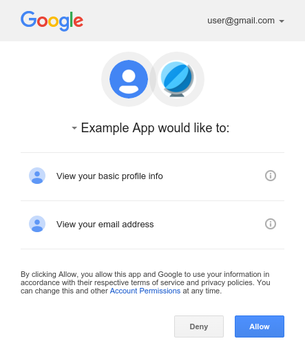
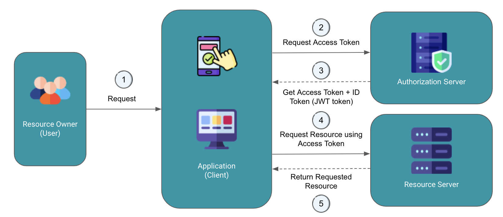
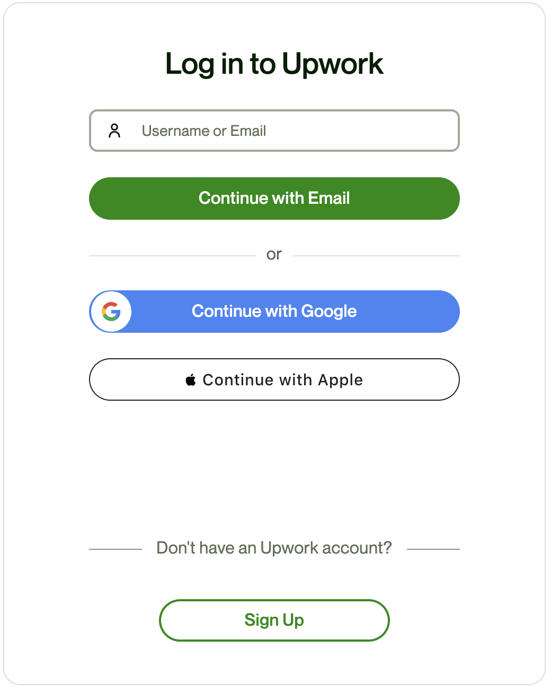
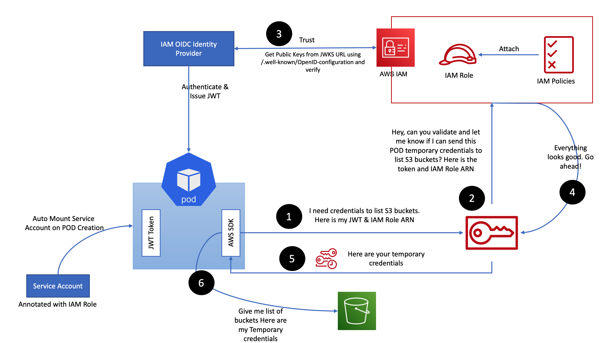

# How Does IRSA Work?

Before diving into how IRSA works, it's crucial to have a basic understanding of concepts like `OAuth 2.0`, `OIDC`, and identity providers.

## What is OAuth 2.0?

`OAuth 2.0` (short for "Open Authorization”) is an open standard protocol for access delegation.

It allows third-party applications to access resources, such as user data, from a server or service without requiring the user's credentials.

In simple terms, `OAuth 2.0` allows users to grant access to their data to third-party applications without giving away their usernames and passwords.

    

`OAuth 2.0` is widely used by many popular web services, such as Facebook, Google, and Twitter, to allow third-party applications to access their users' data.

### OAuth 2.0 Flow

Here's a visual representation of how OAuth 2.0 works:

    

1. The end-user (resource owner) expresses their intent to access protected resources (e.g., emails from Gmail) through the client application (e.g., [CRED]{:target="_blank"}).

2. The client redirects the user to the authorization server's authentication endpoint, which corresponds to the resource they want to access (e.g., Gmail for emails). At the authorization server, the user may be prompted to log in, and if consent is granted, the authorization server redirects the user back to the client with an authorization code.

3. The client application exchanges the received authorization code and its credentials with the authorization server to obtain an access token.

4. The client utilizes the access token to request protected resources on the user's behalf.

5. Finally, the end-user (resource owner) is provided with their protected resources, such as a credit card statement from Gmail, which are made available through the client application.

### OAuth 2.0 Example

Here's an example of OAuth 2.0 in which a client application requests access to emails from your Gmail account.

    

## What is OpenID Connect (OIDC)?

OAuth 2.0 is designed only for authorization. OAuth is like giving a third-party application a key. The key is useful but it doesn’t tell the third-party application who you are or anything about you.

OpenID Connect (OIDC) is an identity layer built on top of the OAuth 2.0 framework. 

It adds an authentication layer to the OAuth 2.0 authorization flow, allowing users to authenticate themselves to a third-party application using an identity provider, such as Google, Facebook, or Microsoft. 

It allows third-party applications to verify the identity of the end-user and to obtain basic user profile information.

Instead of a key, OIDC is like giving the third-party application a badge. The badge not only gives the third-party application permissions to access the authorized data but also provides some basic information about who you are, i.e. your identity.

When an authorization server supports OIDC, it is called an identity provider. Some popular OIDC identity providers are Google, Microsoft, Okta, and Auth0.

### OpenID Connect (OIDC) Flow

Here's a visual representation of how OpenID Connect (OIDC) works:

    

1. The end-user (resource owner) wants to log in to a third-party shopping website (e.g., Amazon) using their Google account.

2. The shopping website redirects the user to Google's OpenID Connect Provider (OP) for authentication. After successful authentication, Google's OP issues an ID Token and an Access Token.

3. The user's browser receives the ID Token and Access Token.

4. The third-party website uses the Access Token to access user's Google profile data from Google's resource server.

5. Google's resource server provides user's Google profile data to the shopping website, enabling the user to log in and personalize his shopping experience.

!!! note
    In OIDC, the primary focus is on providing a secure and standardized way for users to log in and obtain identity-related information in addition to OAuth 2.0 features for resource access.

### OpenID Connect (OIDC) Example

Here's an example of OIDC where you log in to a client application (such as Upwork) using your Google or Apple account.

    

## What is IAM OIDC Provider

IAM OIDC provider is an identity provider that supports OIDC.

It enables kubernetes clusters to authenticate AWS IAM users and roles using OIDC (OpenID Connect) tokens.

The IAM OIDC provider establishes a trust relationship between kubernetes and IAM by acting as a bridge between the kubernetes API server and IAM. It allows kubernetes to authenticate with AWS and obtain temporary security credentials that can be used to access AWS resources.

When a kubernetes service account needs to access AWS resources, such as an Amazon S3 bucket or a DynamoDB table, it requires an AWS Identity and Access Management (IAM) role that grants the necessary permissions. However, kubernetes service accounts do not have AWS credentials by default, and cannot assume IAM roles directly.

To solve this problem, EKS allows you to associate a kubernetes service account with an IAM role using an IAM OIDC provider. The IAM OIDC provider enables kubernetes service accounts to assume IAM roles, and access AWS resources securely and with appropriate permissions.

## How Does IRSA Work?

Here's a visual representation of how IRSA works:

    

1. The AWS SDK in the Pod requests the AWS Security Token Service (AWS STS) service for a temproray credentials. The Pod provides the JWT Token and the IAM Role ARN to STS for validation.

2. The AWS STS service sends a request to the IAM service to validate whether it can issue temporary credentials to the Pod. The STS includes the JWT token and IAM Role ARN in the request to the IAM service for validation.

3. The AWS IAM service, which trusts the IAM OIDC provider, retrieves the public keys from the JWKS (JSON Web Key Set) URL by accessing the /.well-known/OpenId-configuration endpoint. It then uses these keys to verify the authenticity and integrity of the received JWT token.

4. The AWS IAM service validates the request and notifies the AWS STS service, indicating that the request is valid and authorized.

5. The AWS STS service issues the temporary credentials to the POD. These temporary credentials grant the Pod access to the specified IAM role and associated AWS resources for a limited duration.

6. The Pod can now access the desired AWS service, such as S3, within the boundaries set by the IAM policies associated with the IAM role.

!!! quote "References:"
    !!! quote ""
        * [How Does IRSA Work?]{:target="_blank"}

<!-- Hyperlinks -->
[How Does IRSA Work?]: https://aws.amazon.com/blogs/containers/diving-into-iam-roles-for-service-accounts/
[CRED]: https://cred.club/