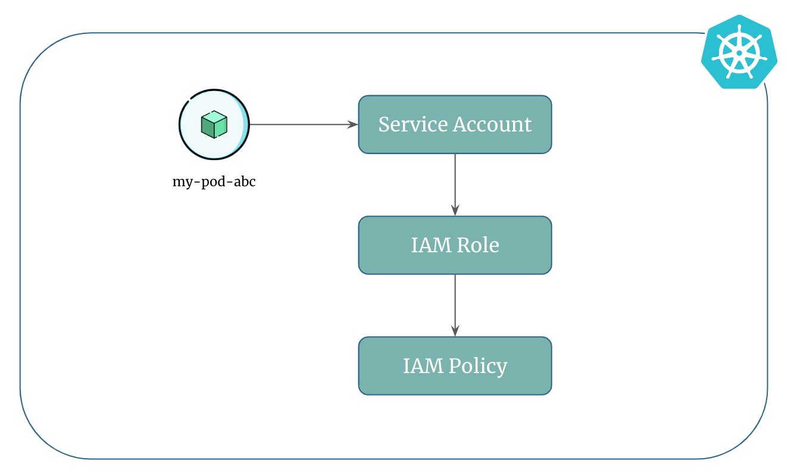

# Introduction to IAM Roles for Service Accounts (IRSA)

In the world of AWS and Kubernetes, applications in container pods need to access AWS services securely. This is typically done by using AWS SDK or CLI with IAM permissions. To simplify this process, IAM roles for service accounts (IRSA) come into play.

Let's dive in!

## Approaches to Grant Pods Access to AWS Resources

There are two ways to grant a pod the required AWS permissions so that it can access AWS resources:

1. **Through the IAM Role attached to the worker node the pod is running on:**

    Pods inherit the IAM permissions from the worker node it is running on. For example, if the role attached to worker node has S3 permissions, pods running on that node will also also have the S3 permissions and can access S3 buckets.

    You can test this by adding S3 permissions to the role attached to the worker node where the pod is running.

    This method is not recommended since all the pods will inherit the same permissions even if the pods don't need it and it might pose security risks.

2. **Through a Service Account that is mapped to an AWS IAM Role:**

    You can create an IAM role for service account and then annotate the kubernetes service account by adding `eks.amazonaws.com/role-arn` field in the `.metadata.annotations` section of the service account definition.

    When you create IAM role for service account using `eksctl` it does everything for you. It creates AWS IAM role, kubernetes service account and also adds the annotation in the service account.

## What is an IAM Role for Service Accounts (IRSA)?

Amazon EKS supports IAM Roles for Service Accounts (IRSA) that allows cluster operators to map AWS IAM Roles to Kubernetes Service Accounts.

The IAM role determines the permissions that the pods associated with the service account will have when interacting with AWS services.

This provides fine-grained permission management for apps that run on EKS and use other AWS services such as S3, RDS, SQS, DynamoDB, and Kubernetes components like AWS Load Balancer controller or ExternalDNS.

In summary, IRSA enables you to manage permissions for your pods using familiar AWS IAM roles and policies, providing fine-grained control over accessing AWS resources from within your EKS cluster.

## How Do Pods Use IRSA to Access AWS Resources?

To use IRSA, you create an IAM role in AWS with the necessary permissions, and then annotate the kubernetes service account with the IAM role's ARN to allow pods to securely access AWS resources without explicit credentials.

    

!!! quote "References:"
    !!! quote ""
        * [IAM Roles for Service Accounts]{:target="_blank"}

<!-- Hyperlinks -->
[IAM Roles for Service Accounts]: https://docs.aws.amazon.com/eks/latest/userguide/iam-roles-for-service-accounts.html