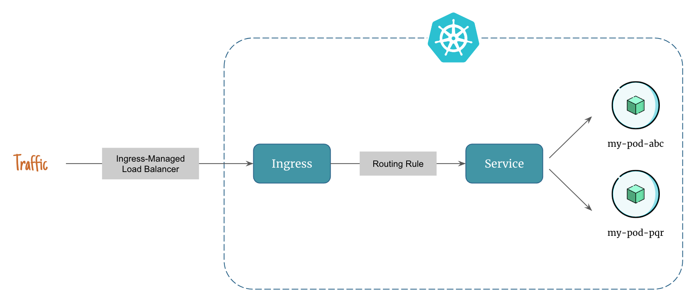

# Introduction to Ingress in Kubernetes

`Ingress` in Kubernetes is like a traffic controller for incoming network traffic to your applications. It acts as a gateway that manages external access to services within your kubernetes cluster.

An `Ingress controller` (e.g. AWS Load Balancer Controller) is responsible for fulfilling the `Ingress`, usually with a load balancer.

To understand this, let's imagine a scenario. You have several applications running inside your kubernetes cluster, each with its own service. These services are accessible within the cluster, but you want to make them available to users outside the cluster, like your website or API.

This is where `Ingress` comes in. Instead of exposing each service individually and managing multiple external IP addresses, `Ingress` provides a single entry point for incoming traffic. It acts as a smart router that directs requests to the appropriate services based on certain rules.

## Analogy to Understand Ingress

Think of `Ingress` as a receptionist at the entrance of an office building. Visitors come to the building and tell the receptionist which department they want to visit. The receptionist then guides them to the correct floor and office.

Similarly, `Ingress` examines the incoming requests and uses rules you define to determine where the traffic should go. For example, you can configure it to direct traffic based on the domain name or the path of the URL. It then forwards the requests to the appropriate services or microservices running inside your cluster.

`Ingress` also provides additional features like load balancing, SSL termination (for secure connections), and traffic routing based on specific rules. It helps simplify the management of external access to your applications, making it easier to handle and control the flow of network traffic.

In summary, `Ingress` in kubernetes is like a smart traffic controller or receptionist that manages incoming requests from outside your cluster and routes them to the correct services based on defined rules.

## Traffic Routing With Ingress

Here's how ingress controls network traffic in kubernetes:

    

1. Client hits the ingress-managed load balancer
2. Ingress sends the traffic to a kubernetes service that mathes the routing rule
3. The kubernetes service serves the traffic from pods

## What is an Ingress Controller?

In order for the `Ingress` resource to work, the cluster must have an `Ingress controller` running.

An `Ingress controller` (e.g. AWS Load Balancer Controller, NGINX Ingress Controller) is responsible for fulfilling the `Ingress`, usually with a load balancer.

While the `Ingress` resource defines the rules and configuration for traffic routing, the Ingress controller is responsible for interpreting those rules and making them effective. It typically runs as a separate pod or deployment within the kubernetes cluster.

The `Ingress controller` continuously monitors the `Ingress` resources and listens for changes or updates. When a new `Ingress` resource is created or modified, the controller reads the rules and configures itself accordingly to handle the specified traffic routing.

In summary, an `Ingress controller` is a component in kubernetes that works alongside the `Ingress` resource to manage and control the routing of incoming network traffic.

!!! quote "References:"
    !!! quote ""
        * [Ingress]{:target="_blank"}

<!-- Hyperlinks -->
[Ingress]: https://kubernetes.io/docs/concepts/services-networking/ingress/