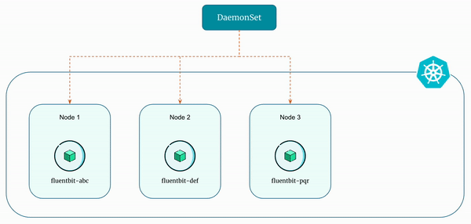

# Introduction to Kubernetes DaemonSet

A `DaemonSet` ensures that all (or some - using node selectors) nodes run a copy of a pod. As nodes are added to the cluster, pods are added to them. As nodes are removed from the cluster, those pods are garbage collected.

Deleting a `DaemonSet` will clean up the pods it created.

Essentially, `DaemonSets` ensure that specific pods are running on all or a subset of nodes within a kubernetes cluster. Unlike other controllers that ensure a specified number of replicas, `DaemonSets` run exactly one instance of a pod on each node in the cluster or a subset defined by node selectors.

    

`DaemonSets` are similar to Deployments in that they both create Pods, and those Pods have processes which are not expected to terminate (e.g. web servers, storage servers).

## Use Cases of DaemonSet

1. **Logging and Monitoring**

    `DaemonSets` are often used for deploying logging agents, monitoring tools, or other system-level applications that need to run on every node. For instance, deploying tools like Prometheus node exporters or log collection agents like Fluentd or Filebeat via DaemonSets ensures comprehensive visibility into cluster health and performance.

2. **Security Agents and Policies**

    Security-related tools like intrusion detection systems, firewalls, or antivirus agents can be deployed using `DaemonSets`, ensuring each node within the cluster has the necessary security measures in place.

3. **Networking and Load Balancing**

    `DaemonSets` can be leveraged to deploy networking solutions such as load balancers, proxies, or service meshes that require a presence on each node to manage traffic or enforce network policies uniformly.