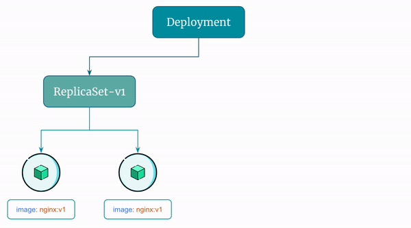
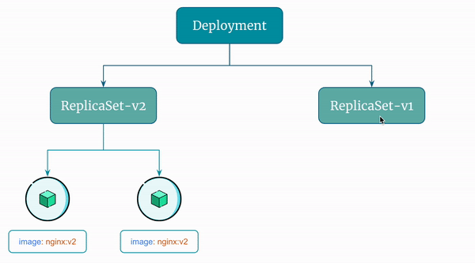

# Create and Manage Deployment Using Declarative Approach

Let's see how you can create and manage Kubernetes Deployments declaratively.

Here is the Docker Image used in this tutorial: [reyanshkharga/nginx]{:target="_blank"}


## Step 1: Create Deployment Manifest

First, we need to write the Deployment manifest as follows:

=== ":octicons-file-code-16: `my-deployment.yml`"

    ```yaml linenums="1"
    apiVersion: apps/v1
    kind: Deployment
    metadata:
      name: my-deployment
    spec:
      replicas: 2
      selector:
        matchLabels:
          app: nginx
      template:
        metadata:
          labels:
            app: nginx
            tier: backend
        spec:
          containers:
          - name: nginx
            image: reyanshkharga/nginx:v1
            imagePullPolicy: Always
            ports:
              - containerPort: 80
    ```

Required fields:

- `apiVersion` - Which version of the Kubernetes API you're using to create this object.
- `kind` - What kind of object you want to create.
- `metadata` - Data that helps uniquely identify the object, including a name string, UID , and optional namespace.
- `spec` - What state you desire for the object.

You'll notice that the YAML configuration for the `Deployment` looks very similar to the `ReplicaSet`, with the exception of the kind attribute.


## Step 2: Create Deployment

Let's use `kubectl apply` to apply the manifest and create the Deployment:

```
# Create deployment
kubectl apply -f my-deployment.yml
```


## Step 3: List Deployments

List Deployments and verify that the deployment we created is available:

```
kubectl get deployments
```


## Step 4: View ReplicaSets Created by the Deployment

As discussion earlier, when you create a `Deployment`, kubernetes creates a `ReplicaSet` for you and manages the replicas of your application based on the Deployment's desired state.

Let's list the `ReplicaSets` created by `my-deployment`:

```
kubectl get rs | grep my-deployment
```

You'll see a `ReplicaSet` created and managed by the Deployment.

The name of the ReplicaSets created by Deployments starts with the deployment name.


## Step 5: View Pods Created by the Deployment

List pods:

```
kubectl get pods
```

You'll see pods created and managed by the Deployment.

The name of the pods created by Deployments starts with the deployment name.


## Step 6: Describe the Deployment

Describe the deployment:

```
kubectl describe deployment/my-deployment
{OR}
kubectl describe deployment my-deployment
```


## Step 7: Scale the Deployment

Let's scale replicas to 3:

```
kubectl scale deployment/my-deployment --replicas 3
```

You can also use `kubectl edit` command to scale the Deployment as follows:

1. Set the editor you want to use (Default is vim):

```
export KUBE_EDITOR=nano
```

2. Edit the YAML manifest by changing the value of replicas to a desired value and then save file to scale the deployment:

```
kubectl edit deployment/my-deployment
{OR}
kubectl edit deployment my-deployment
```

Verify that the deployment was scaled:

```
# List deployments
kubectl get deployments

# List replicasets
kubectl get rs | grep my-deployment

# List pods
kubectl get pods | grep my-deployment
```


## Step 8: Update the Deployment

Let's update the deployment to use a new image `reyanshkharga/nginx:v2`.

In the Deployment YAML manifest change the value of image to `reyanshkharga/nginx:v2`.

Now, apply the manifest to update the deployment:

```
kubectl apply -f my-deployment.yml
```


## Step 9: Verify if the Deployment Was Updated

Verfify the Deployment, Pods, and ReplicaSets:

```
# Describe deployment
kubectl describe deploy/my-deployment

# List pods created by the deployment
kubectl get pods | grep my-deployment

# List replicasets created by the deployment
kubectl get rs | grep my-deployment
```

You'll notice the following:

1. The Deployment is updated and uses the updated image.
2. A new ReplicaSet is created
3. New Pods come up and old Pods are terminated.
4. Old ReplicaSets are not deleted (unless this was 11th revision)


Here's a visual representation of the rolling update described above:

<p align="left">
    
</p>


## Step 10: Update the Deployment Few More Times

1. Change the image to `reyanshkharga/nginx:v3` and apply the configuration again.
2. Change the image to `reyanshkharga/nginx:v4` and apply the configuration again.


## Step 11: List Deployment Revisions

As discussed earlier, Kubernetes Deployment controller stores up to 10 revisions of a Deployment.

You can configure the maximum number of revisions to keep by setting the `.spec.revisionHistoryLimit` field in the Deployment's YAML file.

List the Deployment revisions:

```
kubectl rollout history deployment/my-deployment
```

Get the details of a particular revision:

```
kubectl rollout history deployment/my-deployment --revision=2
```

List ReplicaSets managed by the Deployment:

```
kubectl get rs | grep my-deployment
```


## Step 12: Rollback the Deployment

Rollback to the previous version:

```
kubectl rollout undo deployment/my-deployment
```

Verify rollback:

```
kubectl get rs | grep my-deployment
```

You'll notice that the pods are now managed by the replicaset from previous revision.

You can also rollback to a particular version as follows:

```
kubectl rollout undo deployment my-deployment --to-revision=1
```

Verify rollback:

```
kubectl get rs | grep my-deployment
```


Here's a visual representation of the rollback flow described above:

<p align="left">
    
</p>


## Step 13: Delete the Deployment

```
kubectl delete deployment/my-deployment
{OR}
kubectl delete -f my-deployment.yml
```

!!! quote "References:"
    !!! quote ""
        * [Deployment v1 apps]{:target="_blank"}
        * [Workload Resources - Deployment]{:target="_blank"}
        * [ObjectMeta]{:target="_blank"}
        * [DeploymentSpec]{:target="_blank"}
        * [Deployment Concept]{:target="_blank"}


<!-- Hyperlinks -->
[reyanshkharga/nginx]: https://hub.docker.com/r/reyanshkharga/nginx
[Deployment v1 apps]: https://kubernetes.io/docs/reference/generated/kubernetes-api/v1.22/#deployment-v1-apps
[Workload Resources - Deployment]: https://kubernetes.io/docs/reference/kubernetes-api/workload-resources/deployment-v1/
[ObjectMeta]: https://kubernetes.io/docs/reference/kubernetes-api/common-definitions/object-meta/#ObjectMeta
[DeploymentSpec]: https://kubernetes.io/docs/reference/kubernetes-api/workload-resources/deployment-v1/#DeploymentSpec
[Deployment Concept]: https://kubernetes.io/docs/concepts/workloads/controllers/deployment/