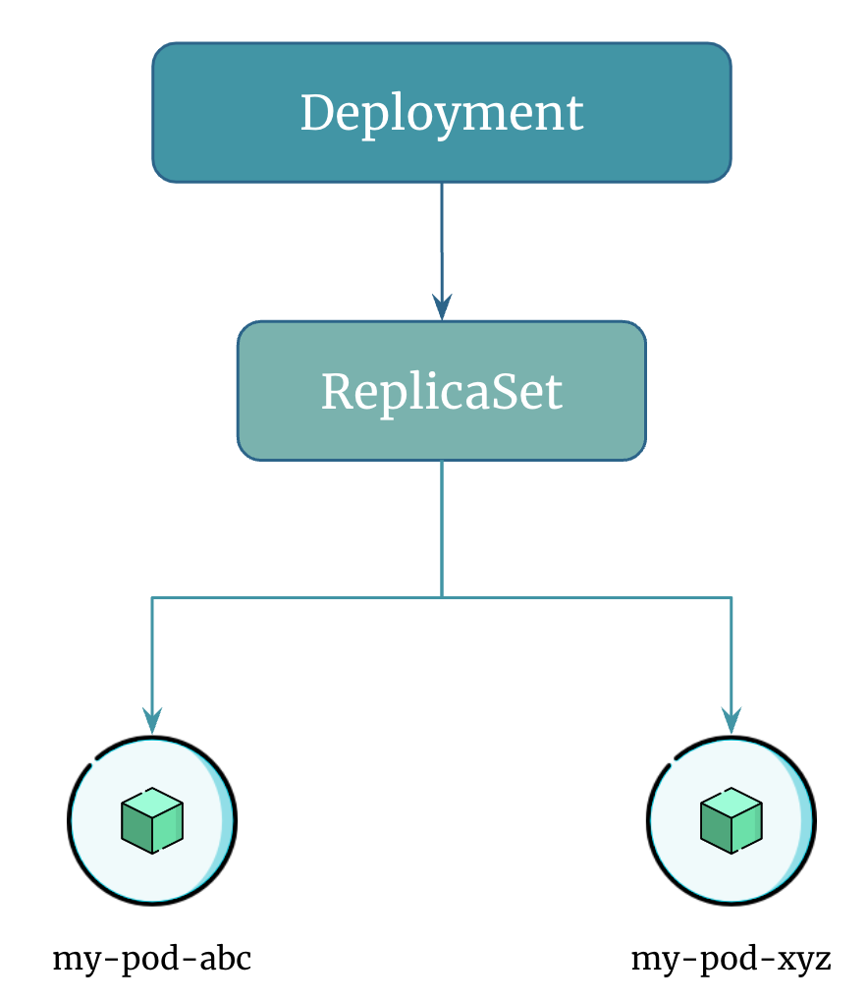

# Introduction to Kubernetes Deployment

A Kubernetes `Deployment` tells Kubernetes how to create or modify instances of the pods.

You describe a desired state in a `Deployment`, and the `Deployment Controller` changes the actual state to the desired state at a controlled rate.

Using `Deployments` you can easily scale the number of replica pods, enable the rollout of updated code in a controlled manner, or roll back to an earlier deployment version if necessary.

`Deployment` in Kubernetes is an abstraction of a `ReplicaSet`. When you create a `Deployment`, Kubernetes creates a `ReplicaSet` for you and manages the replicas of your application based on the Deployment's desired state.

`Deployments` provide additional features such as rolling updates, rollbacks, and scaling strategies, which are not available with `ReplicaSets` alone.

## Deployment Overview

`Deployment` doesn't interact with pods directly. It manages pods using `ReplicaSets`.

    

`Deployment` does the rolling update automatically without any human interaction and increases the abstraction by one level.

It is recommended to use `Deployments` instead of directly using `ReplicaSets`, unless you require custom update orchestration or don't require updates at all.