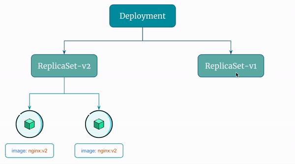

# Rollback a Kubernetes Deployment

In Kubernetes, a rollback is the process of reverting a `Deployment` to a previous revision.

When you update a `Deployment`, Kubernetes stores the previous revision(s) of the Deployment's configuration and the `ReplicaSets` it created.

If there is an issue with the new revision, you can use the `kubectl rollout undo` command to rollback to a particular revision.


## Step 1: Rollback to Previous Revision

```
# Command template
kubectl rollout undo deployment <deployment-name>
{OR}
kubectl rollout undo deployment/<deployment-name>

# Actual command
kubectl rollout undo deployment my-deployment
{OR}
kubectl rollout undo deployment/my-deployment
```

Verify rollback:

```
kubectl get rs | grep my-deployment
```


## Step 2: Rollback to a Particular Revision

To rollback a Kubernetes Deployment to a particular version, You can use the `kubectl rollout undo` command with the `--to-revision` flag followed by the revision number:

```
# Command template
kubectl rollout undo deployment <deployment-name> --to-revision=<revision-number>
{OR}
kubectl rollout undo deployment/<deployment-name> --to-revision=<revision-number>

# Actual command
kubectl rollout undo deployment my-deployment --to-revision=1
{OR}
kubectl rollout undo deployment/my-deployment --to-revision=1
```

Verify rollback:

```
kubectl get rs | grep my-deployment
```

Here's a visual representation of the rollback the `Deployment` performs:

<p align="center">
    
</p>


## Clean Up

Delete the Deployment:

```
kubectl delete deployment my-deployment
```