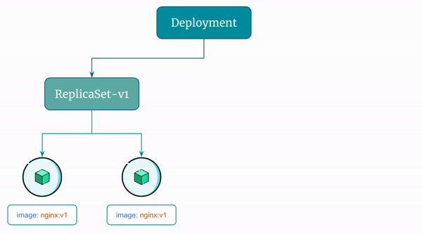

# Update a Kubernetes Deployment

By default, Kubernetes performs rolling updates when you update a `Deployment`. It does so by creating a new `ReplicaSet`.

The old `ReplicaSets` are not deleted. By default, Kubernetes `Deployment` controller stores up to 10 revisions of a `Deployment`. This means that when you update a `Deployment`, the controller will keep up to 10 previous versions of the Deployment's configuration and the `ReplicaSets` it created.

Let's see this in action!


## Step 1: Update a Deployment

Let's update the `Deployment` to use a new image `reyanshkharga/nginx:v2`.

You can use `kubectl set image` command to update the Deployment to use a new image.

```
# Command template
kubectl set image deployment <deployment-name> <container-name>=<new-image>
{OR}
kubectl set image deployment/<deployment-name> <container-name>=<new-image>

# Actual command
kubectl set image deployment my-deployment nginx=reyanshkharga/nginx:v2
{OR}
kubectl set image deployment/my-deployment nginx=reyanshkharga/nginx:v2
```

## Step 2: Verify if the Deployment Was Updated

Verfify the Deployment, Pods, and ReplicaSets:

```
# Describe deployment
kubectl describe deploy/my-deployment

# List pods
kubectl get pods | grep my-deployment

# List replicasets
kubectl get rs | grep my-deployment
```

You'll observe the following:

- The `Deployment` is updated and uses the updated image.
- A new `ReplicaSet` is created
- New Pods come up and old Pods are terminated.
- Old `ReplicaSets` are not deleted (unless this was 11th revision)


Here's a visual representation of the rolling update the `Deployment` performs:

<p align="center">
    
</p>


## Step 3: List Deployment Revisions

As discussed earlier, Kubernetes `Deployment` controller stores up to 10 revisions of a `Deployment`.

You can configure the maximum number of revisions to keep by setting the `.spec.revisionHistoryLimit` field in the Deployment's YAML file using `kubectl edit deployment` command.

List the Deployment revisions:

```
# Command template
kubectl rollout history deployment <deployment-name>
{OR}
kubectl rollout history deployment/<deployment-name>

# Actual command
kubectl rollout history deployment my-deployment
{OR}
kubectl rollout history deployment/my-deployment
```

Get the details of a particular revision:

```
# Command template
kubectl rollout history deployment <deployment-name> --revision=<revision-number>
{OR}
kubectl rollout history deployment/<deployment-name> --revision=<revision-number>

# Actual command
kubectl rollout history deployment my-deployment --revision=2
{OR}
kubectl rollout history deployment/my-deployment --revision=2
```

List ReplicaSets managed by the Deployment:

```
kubectl get rs | grep my-deployment
```