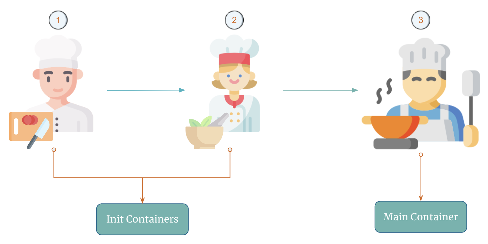
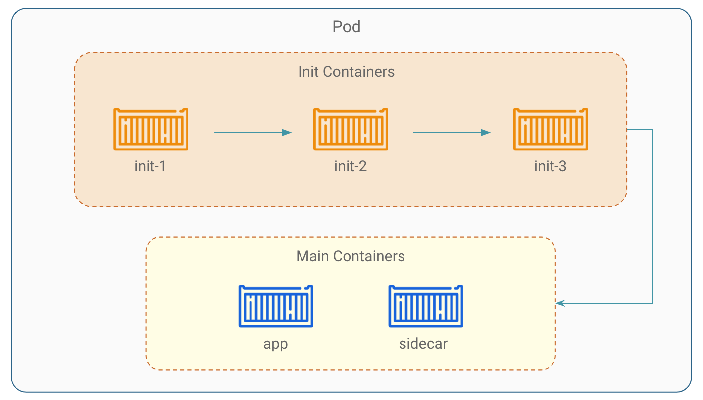

# Introduction to Init Containers

The name "Init" comes from the term "initialization", which refers to the process of preparing something for use.

A pod can have multiple containers running apps within it, but it can also have one or more `init containers`, which are run before the main containers are started.

Init containers are specialized containers in kubernetes that are designed to run initialization tasks before the main containers in a pod start running.

If you specify multiple init containers for a pod, `kubelet` runs each init container sequentially. Each init container must succeed before the next can run.

## Kitchen Analogy for Init Containers

Let's imagine that you're the head chef preparing a meal in a busy restaurant kitchen. You have all the ingredients you need to make your dish, but some of them require special preparation before they can be used.

This is where init containers come in. Just like how you might use a sous chef or assistant to prepare ingredients before you start cooking, init containers are used to perform any necessary setup tasks before your main container starts running.

For example, imagine you need to use vegetables in your dish, but they need to be chopped first. You could have a sous chef (`init container`) who chops the vegetables and stores them in a separate bowl that your main container can access.

Another example could be grinding spices, and you could have another assitant (`init container`) who grinds the spice for you and stores it in a seperate bowl that you can access.

In this way, init containers help ensure that your main container has everything it needs to run properly and efficiently, just like how a well-prepared kitchen helps a chef create a delicious meal.

    

Below are the kubernetes equivalent terms in the above analogy:

- `Restaurant`: Kubernetes Cluster
- `Kitchen`: Pod
- `Sous chef or assistant`: Init Containers
- `Head chef`: Main Containers

## Execution Flow of Init Containers

Kubelet runs each init container sequentially. The main containers start in parallel once all init containers have completed successfully.

    

## Use Cases of Init Containers

Here are three common use cases for init containers in kubernetes:

1. **Data Preparation:** Init containers can be used to prepare data required by the main container. For example, an init container can download data from an external source or a shared volume and convert it to a format that can be consumed by the main container.

2. **Health Checks:** Init containers can be used to perform pre-startup checks to ensure that the main container can start safely. For example, an init container can check if a database is available before starting the main container that depends on it.

3. **Configuration:** Init containers can be used to set up configurations and secrets required by the main container. For example, an init container can populate environment variables with configuration values or mount secrets into the shared volume to be used by the main container.

## Benefits of Init Containers

1. **Decoupling:** One of the benefits of using init containers is that they can be used to perform tasks that require specialized tools or skills that are not available in the main container, without having to modify or bloat the main container image.

2. **Isolation:** Init containers help ensure that the main application container only starts once all the necessary dependencies have been met. This means that you can ensure that your application container has a consistent and stable environment to run in, which can help prevent issues like dependency conflicts.

3. **Flexibility:** By allowing you to set up your dependencies before your main application container starts, init containers help reduce resource waste. Instead of having your application container sit idle while it waits for dependencies to be installed, you can use an init container to ensure that everything is in place before the main container starts.

!!! quote "References:"
    !!! quote ""
        * [Init Containers]{:target="_blank"}

<!-- Hyperlinks -->
[Init Containers]: https://kubernetes.io/docs/concepts/workloads/pods/init-containers/