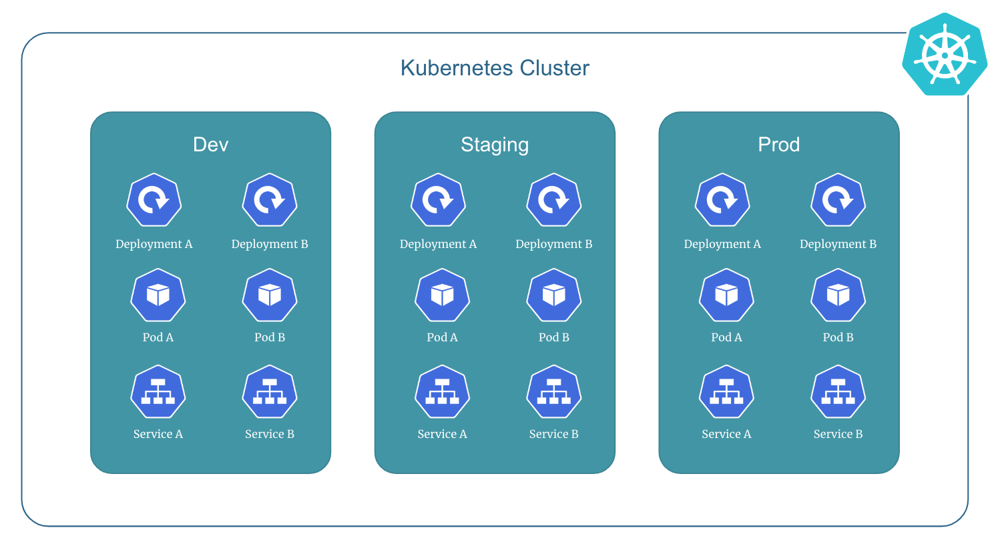

# Introduction to Kubernetes Namespace

In kubernetes, a `namespace` is a way to logically divide a single physical cluster into multiple virtual clusters.

It is used to group and isolate resources such as pods, services, and deployments based on their purpose, owner, or environment.

Namespaces provide a way to organize and manage resources in a multi-tenant or multi-environment setup, and avoid naming conflicts.

Each kubernetes object belongs to a namespace, and objects with the same name can coexist in different namespaces.

    

## Initial Namespaces

Kubernetes starts with four initial namespaces:

1. `default`: Kubernetes includes this namespace so that you can start using your new cluster without first creating a namespace.

2. `kube-node-lease`: This namespace holds Lease objects associated with each node. Node leases allow the kubelet to send heartbeats so that the control plane can detect node failure.

3. `kube-public`: This namespace is readable by all clients (including those not authenticated). This namespace is mostly reserved for cluster usage, in case that some resources should be visible and readable publicly throughout the whole cluster.

4. `kube-system`: The namespace for objects created by the kubernetes system.

!!! quote "References:"
    !!! quote ""
        * [Kubernetes Namespaces]{:target="_blank"}

<!-- Hyperlinks -->
[Kubernetes Namespaces]: https://kubernetes.io/docs/concepts/overview/working-with-objects/namespaces/