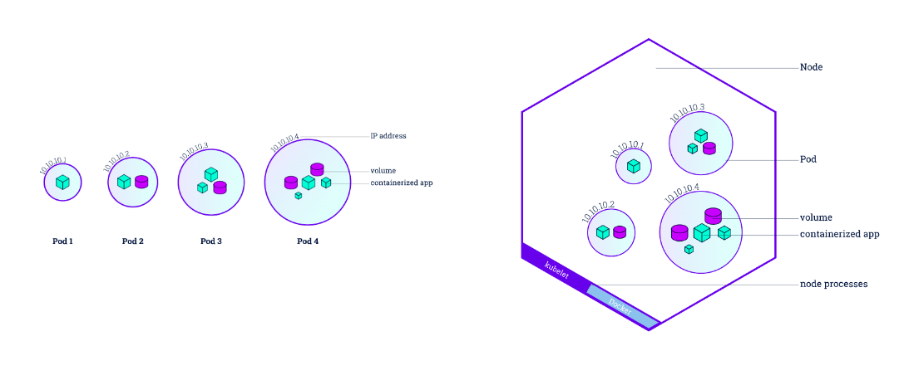

# Introduction to Kubernetes Pod

A Kubernetes pod (as in a pod of whales or pea pod) is the smallest deployable unit in the Kubernetes system.

It runs one or more closely related containers that share the same network and storage resources.

    

Think of a pod like a small team of people working together on a project. Each person has a specific role to play, and they work together towards a common goal. In the same way, a Kubernetes pod consists of one or more containers that work together to provide a specific service or application.

Pods can be easily managed and scaled up or down based on demand. For example, if your application requires more resources to handle a surge in traffic, you can simply add more pods to handle the increased load.

Overall, Kubernetes pods provide a flexible and scalable way to deploy and manage containerized applications