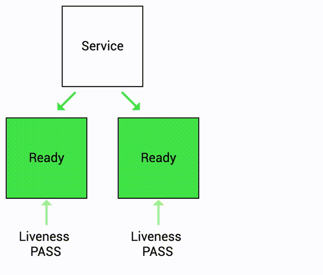
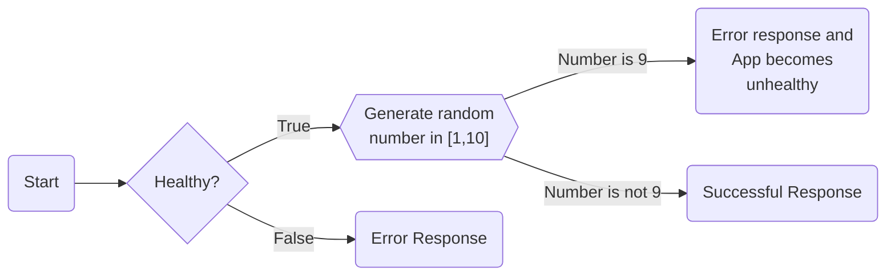

# Liveness Probe Demo

Keep in mind the following:

- Liveness probe indicates whether the container is still running and responding to requests.
- The probe is performed periodically until the container is terminated or the pod is deleted.
- If liveness probe fails, container is restarted.

<p align="center">
    
</p>

Let's see this in action!


## Docker Image

Here is the Docker Image used in this tutorial: [reyanshkharga/nodeapp]{:target="_blank"}

We'll be using the `liveness` tag of the image. [reyanshkharga/nodeapp:liveness]{:target="_blank"} is a node.js application that has a 10% chance of failure.


!!! note
    [reyanshkharga/nodeapp:liveness]{:target="_blank"} is a node application with following endpoints:

    - `GET /` Returns a JSON object containing `Host` and `Version`
    - `GET /health` Returns the health status of the application


Here's the flowchart to illustrate the working of `reyanshkharga/nodeapp:liveness` app:

<!-- <p align="left">
    
</p> -->




## Step 1: Create Deployment Without Liveness Probe

First, let's create a deployment without any liveness probe and observe the behaviour of the app:

=== ":octicons-file-code-16: `my-deployment.yml`"

    ```yaml linenums="1"
    apiVersion: apps/v1
    kind: Deployment
    metadata:
      name: my-deployment
    spec:
      replicas: 1
      selector:
        matchLabels:
          app: nodeapp
      template:
        metadata:
          labels:
            app: nodeapp
        spec:
          containers:
          - name: nodeapp
            image: reyanshkharga/nodeapp:liveness
            imagePullPolicy: Always
            ports:
              - containerPort: 5000
    ```

1. Create deployment:

    ```
    kubectl apply -f my-deployment.yml
    ```

2. Verify deployment and pods:

    ```
    # List deployments
    kubectl get deployments

    # List pods
    kubectl get pods
    ```


## Step 2: Expose Application Using a Service

Let's create a LoadBalancer service to expose our application:

=== ":octicons-file-code-16: `my-service.yml`"

    ```yaml linenums="1"
    apiVersion: v1
    kind: Service
    metadata:
      name: my-service
    spec:
      type: LoadBalancer
      selector:
        app: nodeapp
      ports:
        - port: 80
          targetPort: 5000
    ```

1. Create service:

    ```
    kubectl apply -f my-service.yml
    ```

2. Verify service:

    ```
    kubectl get svc
    ```


## Step 3: Access Application

Open three seperate terminals to monitor the following:

1. Watch pods:

    ```
    kubectl get pods -w
    ```

2. Stream logs:

    ```
    kubectl logs -f <pod-name>
    ```

3. Access application:

    ```
    # root endpoint
    curl <load-balancer-dns>/

    # health endpoint
    curl <load-balancer-dns>/health
    ```

    Hit the root endpoint again and again until you get an error. Now, when you try to access the `health` endpoint you'll see that the app is unhealthy.

!!! note "Observation"
    Because the process continues to run, by default kubernetes thinks that everything is fine and continues to send requests to the pod even when it is unhealthy.


## Step 4: Update the Deployment By Adding a Liveness Probe

Let's update the deployment by adding a liveness probe to the container.

The updated deployment should look like the following:

=== ":octicons-file-code-16: `my-deployment.yml`"

    ```yaml linenums="1"
    apiVersion: apps/v1
    kind: Deployment
    metadata:
      name: my-deployment
    spec:
      replicas: 1
      selector:
        matchLabels:
          app: nodeapp
      template:
        metadata:
          labels:
            app: nodeapp
        spec:
          containers:
          - name: nodeapp
            image: reyanshkharga/nodeapp:liveness
            imagePullPolicy: Always
            ports:
              - containerPort: 5000
            livenessProbe:
              httpGet:
                path: /health
                port: 5000
              initialDelaySeconds: 0
              periodSeconds: 5
              timeoutSeconds: 1
              successThreshold: 1
              failureThreshold: 1
    ```

Fields for liveness probes:

- `initialDelaySeconds`: Number of seconds after the container has started before liveness probe is initiated. Defaults to 0 seconds. Minimum value is 0.
- `periodSeconds`: How often (in seconds) to perform the probe. Default to 10 seconds. Minimum value is 1.
- `timeoutSeconds`: Number of seconds after which the probe times out. Defaults to 1 second. Minimum value is 1.
- `successThreshold`: Minimum consecutive successes for the probe to be considered successful after having failed. Defaults to 1. Must be 1 for liveness and startup probes because the container is restarted after the probe is failed. Minimum value is 1.
- `failureThreshold`: After a probe fails `failureThreshold` times in a row, kubernetes considers that the overall check has failed and the container is not ready, healthy, or live.

```
# Update deployment
kubectl apply -f my-deployment.yml
```

The deployment will be rolled out.


## Step 5: Access Application Again

Try to access the application again:

```
# root endpoint
curl <load-balancer-dns>/

# health endpoint
curl <load-balancer-dns>/health
```

Hit the root endpoint again and again until you get an error. At this point the app will become unhealthy.

This time, we have a liveness probe set up. Kubernetes can detect when the application becomes unhealthy and will stop sending traffic to unhealthy pods. Kubernetes will also automatically restart the container.

You can see the events by describing the pod:

```
kubectl describe pod <pod-name>
```

!!! note "Observation"
    Because the liveness probe fails, the container is restarted. (check `RESTARTS` field)

Play with it multiple times to gain a good understanding of how liveness probe works.


!!! note
    We currently have just a single replica in this deployment because my intention was to illustrate how a service behaves when it encounters an unhealthy pod. In a production environment, multiple pods will be available. The healthy pods will continue to handle traffic while any pods that do not pass the health probes will be taken out of the serving pool.


## Clean Up

Assuming your folder structure looks like the one below:

```
|-- manifests
│   |-- my-deployment.yml
│   |-- my-service.yml
```

Let's delete all the resources we created:

```
kubectl delete -f manifests/
```


<!-- Hyperlinks -->
[reyanshkharga/nodeapp:liveness]: https://hub.docker.com/r/reyanshkharga/nodeapp
[reyanshkharga/nodeapp]: https://hub.docker.com/r/reyanshkharga/nodeapp
