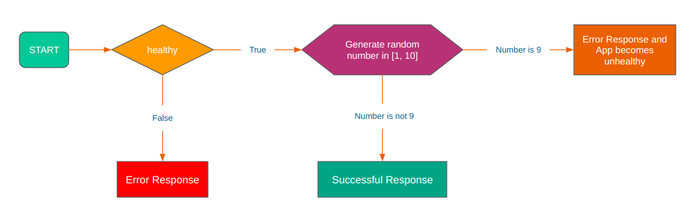
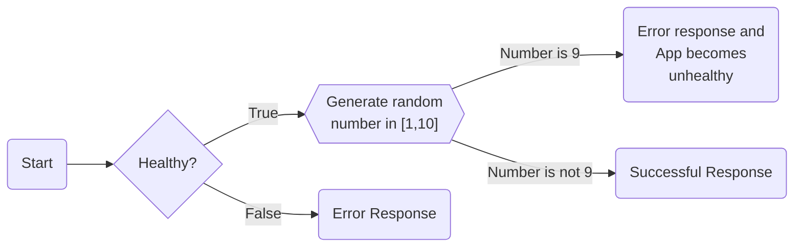

# Kubernetes Probes in Combination

Now that we have learned how the liveness, readiness, and startup probes work independently, let's explore how they function when used together.


## Probe Evaluation Order

1. If a startup probe is provided, all other probes are disabled until the startup probe succeeds.
2. There is no specific order for readiness and liveness probes in Kubernetes.


## Docker Image

Here is the Docker Image used in this tutorial: [reyanshkharga/nodeapp]{:target="_blank"}

We'll be using the `probes` tag of the image. [reyanshkharga/nodeapp:probes]{:target="_blank"} is a node.js application with the following features:

- The app has a 60 seconds startup delay.
- The app has a 10% chance of failure.


!!! note
    [reyanshkharga/nodeapp:probes]{:target="_blank"} is a node application with following endpoints:

    - `GET /` Returns a JSON object containing `Host` and `Version`
    - `GET /health` Returns the health status of the application


Here's the flowchart to illustrate the working of `reyanshkharga/nodeapp:probes` app:

<!-- <p align="left">
    
</p> -->





## Step 1: Expose Application Using a Service

Let's create a LoadBalancer service to expose our application we'll create in the next step:

=== ":octicons-file-code-16: `my-service.yml`"

    ```yaml linenums="1"
    apiVersion: v1
    kind: Service
    metadata:
      name: my-service
    spec:
      type: LoadBalancer
      selector:
        app: nodeapp
      ports:
        - port: 80
          targetPort: 5000
    ```

1. Create service:

    ```
    kubectl apply -f my-service.yml
    ```

2. Verify service:

    ```
    kubectl get svc
    ```

## Step 2: Create Deployment Without Any Probe

First, let's create a deployment without any probe and observe the behaviour of the app:

=== ":octicons-file-code-16: `my-deployment.yml`"

    ```yaml linenums="1"
    apiVersion: apps/v1
    kind: Deployment
    metadata:
      name: my-deployment
    spec:
      replicas: 1
      selector:
        matchLabels:
          app: nodeapp
      template:
        metadata:
          labels:
            app: nodeapp
        spec:
          containers:
          - name: nodeapp
            image: reyanshkharga/nodeapp:probes
            imagePullPolicy: Always
            ports:
              - containerPort: 5000
    ```

1. Create deployment:

    ```
    kubectl apply -f my-deployment.yml
    ```

2. Verify deployment and pods:

    ```
    # List deployments
    kubectl get deployments

    # List pods
    kubectl get pods
    ```

Once the pod starts running, you will observe that the container is marked as `READY (1/1)`. At this point, the service `my-service` will start sending traffic to the pod as all the containers in the pod are ready.

This situation is undesirable since the application experiences a delay of 60 seconds and cannot provide a prompt response. Also, the application might be unhealthy since it has a 10% chance of failure.


## Step 3: Access Application

Open three seperate terminals to monitor the following:

1. Watch pods:

    ```
    kubectl get pods -w
    ```

2. Stream logs:

    ```
    kubectl logs -f <pod-name>
    ```

3. Access application:

    ```
    # root endpoint
    curl <load-balancer-dns>/

    # health endpoint
    curl <load-balancer-dns>/health
    ```

    Hit the root endpoint again and again until you get an error. Now, when you try to access the `health` endpoint you'll see that the app is unhealthy.

!!! note "Observation"
    1. You'll see `curl: (52) Empty reply from server` error in the beginning
    2. After 60 seconds you'll start getting response from the app
    3. The service keeps sending traffic to the pod even when it is unhealthy

This behaviour is undesirable since the traffic is being served from an unhealthy pod.


## Step 4: Update the Deployment By Adding a Liveness Probe

Let's update the deployment by adding startup, readiness, and liveness probes to the container.

The updated deployment should look like the following:

=== ":octicons-file-code-16: `my-deployment.yml`"

    ```yaml linenums="1"
    apiVersion: apps/v1
    kind: Deployment
    metadata:
      name: my-deployment
    spec:
      replicas: 1
      selector:
        matchLabels:
          app: nodeapp
      template:
        metadata:
          labels:
            app: nodeapp
        spec:
          containers:
          - name: nodeapp
            image: reyanshkharga/nodeapp:probes
            imagePullPolicy: Always
            ports:
              - containerPort: 5000
            startupProbe:
              tcpSocket:
                port: 5000
              initialDelaySeconds: 70
              periodSeconds: 5
              timeoutSeconds: 1
              successThreshold: 1
              failureThreshold: 1
            readinessProbe:
              httpGet:
                path: /health
                port: 5000
              initialDelaySeconds: 0
              periodSeconds: 5
              timeoutSeconds: 1
              successThreshold: 1
              failureThreshold: 1
            livenessProbe:
              httpGet:
                path: /health
                port: 5000
              initialDelaySeconds: 0
              periodSeconds: 5
              timeoutSeconds: 1
              successThreshold: 1
              failureThreshold: 1
    ```

```
# Update deployment
kubectl apply -f my-deployment.yml
```

The deployment will be rolled out.

!!! tip

    For each type of probe you can choose any health check mechanism. It really depends on the application you are running and your use case.

    For example let's say you want to use readiness probe to check if `deployment.jar` file is present in the container at a specified location or not. 

    In that case your readiness probe may look something like this:

    ```yaml
    ...
    readinessProbe:
      exec:
        command:
        - sh
        - -c
        - test -e /usr/app/deployment.jar
    ```

    If `/usr/app/deployment.jar` doesn't exist, the readiness probe would retry the health check after a specified `periodSeconds`.


## Step 5: Access Application Again

Try to access the application again:

```
# root endpoint
curl <load-balancer-dns>/

# health endpoint
curl <load-balancer-dns>/health
```

Hit the root endpoint again and again.

You'll observe the following:

1. The service doesn't send traffic to pods until the startup probe succeeds.
2. The service doesn't send traffic to pods until readiness probe succeeds.
3. The container is restarted when liveness probe fails.
4. Livenss probe keeps checking app health and restarts the container when it becomes unhealthy.
5. When a container is restarted, it undergoes startup, readiness, and liveness probes again.


!!! note
    We currently have just a single replica in this deployment because my intention was to illustrate how a service behaves when it encounters an unhealthy pod. In a production environment, multiple pods will be available. The healthy pods will continue to handle traffic while any pods that do not pass the health probes will be taken out of the serving pool.


## Clean Up

Assuming your folder structure looks like the one below:

```
|-- manifests
│   |-- my-deployment.yml
│   |-- my-service.yml
```

Let's delete all the resources we created:

```
kubectl delete -f manifests/
```


<!-- Hyperlinks -->
[reyanshkharga/nodeapp:probes]: https://hub.docker.com/r/reyanshkharga/nodeapp
[reyanshkharga/nodeapp]: https://hub.docker.com/r/reyanshkharga/nodeapp
