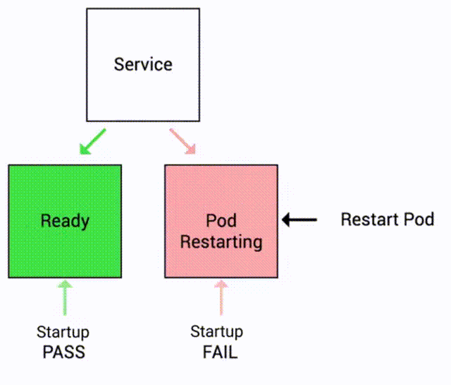

# Startup Probe Demo

Keep in mind the following:

- Startup probe indicates whether the application within the container is started.
- Once the container has started successfully, the startup probe is no longer used until the pod is restarted.
- If startup probe fails, container is restarted.

<p align="center">
    
</p>

Let's see this in action!


## Docker Image

Here is the Docker Image used in this tutorial: [reyanshkharga/nodeapp]{:target="_blank"}

We'll be using the `delayed` tag of the image. [reyanshkharga/nodeapp:delayed]{:target="_blank"} is a node.js application that has a 60 seconds startup delay.


!!! note
    [reyanshkharga/nodeapp:delayed]{:target="_blank"} is a node application with following endpoints:

    - `GET /` Returns a JSON object containing `Host` and `Version`
    - `GET /health` Returns the health status of the application
    - `GET /random` returns a randomly generated number in `[1, 10]`


## Step 1: Expose Application Using a Service

Let's create a LoadBalancer service to expose our application we'll create in the next step:

=== ":octicons-file-code-16: `my-service.yml`"

    ```yaml linenums="1"
    apiVersion: v1
    kind: Service
    metadata:
      name: my-service
    spec:
      type: LoadBalancer
      selector:
        app: nodeapp
      ports:
        - port: 80
          targetPort: 5000
    ```

1. Create service:

    ```
    kubectl apply -f my-service.yml
    ```

2. Verify service:

    ```
    kubectl get svc
    ```


## Step 2: Create Deployment Without Startup Probe

First, let's create a deployment without any readinesss probe and observe the behaviour of the app:

=== ":octicons-file-code-16: `my-deployment.yml`"

    ```yaml linenums="1"
    apiVersion: apps/v1
    kind: Deployment
    metadata:
      name: my-deployment
    spec:
      replicas: 1
      selector:
        matchLabels:
          app: nodeapp
      template:
        metadata:
          labels:
            app: nodeapp
        spec:
          containers:
          - name: nodeapp
            image: reyanshkharga/nodeapp:delayed
            imagePullPolicy: Always
            ports:
              - containerPort: 5000
    ```

1. Create deployment:

    ```
    kubectl apply -f my-deployment.yml
    ```

2. Verify deployment and pods:

    ```
    # List deployments
    kubectl get deployments

    # List pods
    kubectl get pods
    ```

Once the pod starts running, you will observe that the container is marked as `READY (1/1)`. At this point, the service `my-service` will start sending traffic to the pod as all the containers in the pod are ready.

This situation is undesirable since the application experiences a delay of 60 seconds and cannot provide a prompt response.


## Step 3: Access Application

Open two seperate terminals to monitor the following:

1. Watch pods:

    ```
    kubectl get pods -w
    ```

3. Access application:

    ```
    # root endpoint
    curl <load-balancer-dns>/

    # health endpoint
    curl <load-balancer-dns>/health

    # random endpoint
    curl <load-balancer-dns>/random
    ```

!!! note "Observation"
    - `curl: (52) Empty reply from server` error is received in the beginning since the application starts with a delay of 60 seconds.
    - It takes 60 seconds before we start receiving a successful response.


## Step 4: Update the Deployment By Adding a Startup Probe

Let's update the deployment by adding a startup probe to the container.

The updated deployment should look like the following:

=== ":octicons-file-code-16: `my-deployment.yml`"

    ```yaml linenums="1"
    apiVersion: apps/v1
    kind: Deployment
    metadata:
      name: my-deployment
    spec:
      replicas: 1
      selector:
        matchLabels:
          app: nodeapp
      template:
        metadata:
          labels:
            app: nodeapp
        spec:
          containers:
          - name: nodeapp
            image: reyanshkharga/nodeapp:delayed
            imagePullPolicy: Always
            ports:
              - containerPort: 5000
            startupProbe:
              tcpSocket:
                port: 5000
              initialDelaySeconds: 70
              periodSeconds: 5
              timeoutSeconds: 1
              successThreshold: 1
              failureThreshold: 1
    ```

Fields for startup probes:

- `initialDelaySeconds`: Number of seconds after the container has started before startup probe is initiated. Defaults to 0 seconds. Minimum value is 0.
- `periodSeconds`: How often (in seconds) to perform the probe. Default to 10 seconds. Minimum value is 1.
- `timeoutSeconds`: Number of seconds after which the probe times out. Defaults to 1 second. Minimum value is 1.
- `successThreshold`: Minimum consecutive successes for the probe to be considered successful after having failed. Defaults to 1. Must be 1 for liveness and startup probes because the container is restarted after the probe is failed. Minimum value is 1.
- `failureThreshold`: After a probe fails `failureThreshold` times in a row, kubernetes considers that the overall check has failed and the container is not ready, healthy, or live.

!!! note "Important Note"
    Note that we have set the `initialDelaySeconds` to 70 seconds because we know that the app has a startup delay of 60 seconds. If we keep `initialDelaySeconds` value to a lower value (say 10 seconds) the container will keep restarting again and again because the startup probe would fail again and again.

```
# Update deployment
kubectl apply -f my-deployment.yml
```

The deployment will be rolled out.

!!! note "Observation"
    This time, even though the pod is in running state, the container is not `READY` because the startup probe has not succeded yet.

    You can see the events by describing the pod:

    ```
    kubectl describe pod <pod-name>
    ```


## Step 5: Access Application Again

Try to access the application again:

```
# root endpoint
curl <load-balancer-dns>/

# health endpoint
curl <load-balancer-dns>/health

# random endpoint
curl <load-balancer-dns>/random
```

You won't receive any response because the service won't send the traffic to pods that are `NOT READY`.

This situation is desirable because we don't want to send traffic to a pod that is not ready to serve traffic.

But once all the containers in the pod are ready, you will notice that the service starts sending traffic to the pods and you get a successful response.

!!! note
    We currently have just a single replica in this deployment because my intention was to illustrate how a service behaves when it encounters an unhealthy pod. In a production environment, multiple pods will be available. The healthy pods will continue to handle traffic while any pods that do not pass the health probes will be taken out of the serving pool.


## Clean Up

Assuming your folder structure looks like the one below:

```
|-- manifests
│   |-- my-deployment.yml
│   |-- my-service.yml
```

Let's delete all the resources we created:

```
kubectl delete -f manifests/
```


<!-- Hyperlinks -->
[reyanshkharga/nodeapp:delayed]: https://hub.docker.com/r/reyanshkharga/nodeapp
[reyanshkharga/nodeapp]: https://hub.docker.com/r/reyanshkharga/nodeapp
