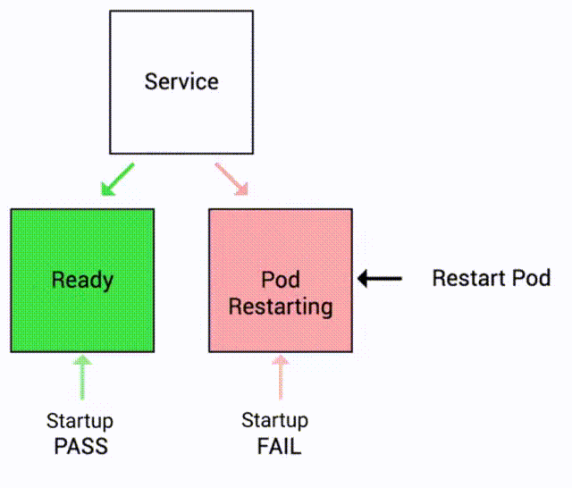

# Types of Probes in Kubernetes

There are three types of probes in kubernetes:

1. Liveness Probe
2. Readiness Probe
3. Startup Probe

## Liveness Probe

Liveness probe indicates whether the container is still running and responding to requests.

If the liveness probe fails, kubernetes assumes that the container is no longer working properly and will automatically restart the container to try and restore the desired state of the deployment.

For example let’s imagine a scenario where your app has a nasty case of deadlock, causing it to hang indefinitely and stop serving requests. Because the process continues to run, by default kubernetes thinks that everything is fine and continues to send requests to the broken pod. 

By using a liveness probe, kubernetes detects that the app is no longer serving requests and restarts the offending pod.

For instance, you can add a liveness probe to check if `HTTP GET` request to `/health` endpoint is successful.

Here's a visual representation of how liveness probes work:

    

## Readiness Probe

Readiness probe indicates whether the container is ready to start accepting traffic.

If the readiness probe fails, the kubernetes control plane assumes that the container is not ready to receive traffic and removes it from the service endpoints list. This means that the service won't send traffic to the pod until the readiness probe indicates that the container is ready again.

Let's say you have a web application that takes some time to start up and become ready to serve traffic. When a new instance of the application is deployed, kubernetes may start sending traffic to it before it is fully ready, resulting in errors or slow responses. 

By using a readiness probe, kubernetes can check if the application instance is fully ready to start serving traffic. Once the instance passes the readiness probe check, kubernetes starts sending traffic to it.

For instance, you can add a readiness probe to check if `HTTP GET` request to `/health` endpoint is successful.

Here's a visual representation of how readiness probes work:

    

## Startup Probe

Startup probe indicates whether the application within the container is started.

If a startup probe is provided, all other probes are disabled until the startup probe succeeds.

If the startup probe fails, kubernetes assumes that the container has failed to start properly and will restart the container. This is because kubernetes assumes that if the container has failed to start properly, it won't be able to function correctly and needs to be restarted.

Let's say you have a web application that takes some time to start up and become ready to serve traffic. When a new instance of the application is deployed, kubernetes may start sending traffic to it before it is started properly, resulting in errors or slow responses. 

By using a startup probe, kubernetes can check if the application instance is started properly. Once the instance passes the startup probe check, kubernetes starts sending traffic to it.

For example, you can add a startup probe to check if `TCP` connection on port `5000` succeeds.

Here's a visual representation of how startup probes work:

    

## Kitchen Analogy For Kubernetes Probes

Imagine you're running a restaurant kitchen with multiple gas stoves, and you want to make sure that all stoves are functioning properly and ready to cook dishes. In kubernetes, stoves can be thought of as pods, and dishes can be thought of as requests.

To ensure that the stoves are healthy and ready to cook, you can use probes, which are like kitchen timers that periodically check the health of each stove.

**Liveness Probe:**

A liveness probe is like a kitchen timer that periodically checks if a stove is still functioning properly. For example, you can set a timer to check the temperature of each stove every 5 minutes. If the temperature is within the expected range, the stove is considered healthy. If the temperature is too low or too high, the stove is considered unhealthy, and will be shut down and restarted.

**Readiness Probe:**

A readiness probe is like a kitchen timer that checks if a stove is ready to cook a dish. For example, you can check if the stove has reached the desired temperature before placing a pot on it. If the stove is not ready, you're notified to wait until it's ready before starting to cook. Similarly, in Kubernetes, a readiness probe checks if a pod is ready to serve requests. If a pod is not ready, kubernetes stops sending traffic to it until it passes the readiness check.

**Startup Probe:**

A startup probe is like a kitchen timer that checks if a stove has finished preheating and is ready to cook. For example, you can set a timer to check the temperature of a stove every 30 seconds for the first 2 minutes after it's turned on. If the stove reaches the desired temperature within that time, it's considered ready to cook. Similarly, in kubernetes, a startup probe checks if a pod has finished initializing and is ready to serve requests. If a pod is not ready, kubernetes restarts it until it passes the startup check.

By using these probes, you can ensure that all stoves (container) in your restaurant (kubernetes cluster) kitchen (pod) are healthy and ready to cook dishes (serve requests), providing a great dining experience for your customers.

!!! quote "References:"
    !!! quote ""
        * [Readiness and Liveness Probes - Google Article]{:target="_blank"}

<!-- Hyperlinks -->
[Readiness and Liveness Probes - Google Article]: https://cloud.google.com/blog/products/containers-kubernetes/kubernetes-best-practices-setting-up-health-checks-with-readiness-and-liveness-probes