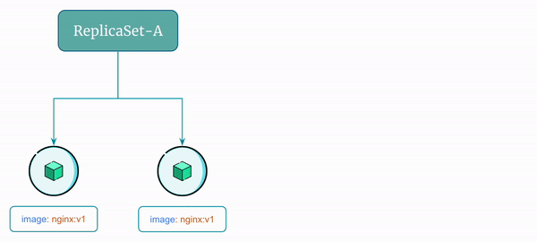
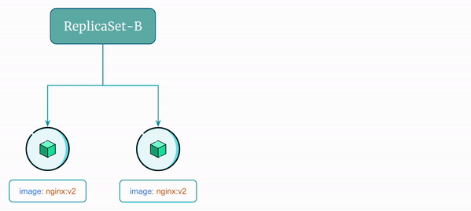

# Challenges With ReplicaSets

Although `ReplicaSets` in Kubernetes ensure high availability of applications, they lack certain critical features that are essential for production-level deployments.

The two main challenges with `ReplicaSets` are as follows:

1. Manual intervention is required to perform a rolling update of the application, which can be a time-consuming and error-prone process, especially for complex applications with multiple replicas.

2. Rollbacks can be challenging to manage since they require the user to manually update the `ReplicaSet` to the previous version. This can be a complex and error-prone process, particularly for large and complex applications.

## 1. Rolling Update Using ReplicaSet

In Kubernetes, a rolling update is a deployment strategy that allows updates to be made to a running application without downtime.

It involves updating a subset of instances at a time, while ensuring that the application remains available to users during the update process.

With `ReplicaSets` manual intervention is required to perform a rolling update of the application.

Here's an example:

Let's say you have a `ReplicaSet` named `ReplicaSet-A` running two identical pods and the name of pods are `Pod-A` and `Pod-B`. Let's say `Pod-A` and `Pod-B` are using image `nginx:v1`.

Now, what if you want to update your application to use a new version of the image, let's say `nginx:v2`? Also, you want the update to be a rolling update to ensure your application is running without any downtime.

With `ReplicaSet`, you don't have an easy option. You must perform the following operations to do the rolling update:

1. Create a new `ReplicaSet`, let's say `ReplicaSet-B` that uses the updated image `nginx:v2`
2. Scale up `ReplicaSet-B` to add one pod
3. Scale down `ReplicaSet-A` to remove one pod
4. Scale up `ReplicaSet-B` to add another pod
5. Scale down `ReplicaSet-A` to remove another pod
6. Delete `ReplicaSet-A`

Here's a visual representation of the rolling update flow using `ReplicaSet`:

    

You might say why not create `ReplicaSet-B` with 2 pods at once and then delete the `ReplicaSet-A`?

While this is a valid option and will update the application, you are using extra resources (4 pods at a time) and it is not a good practice. You must optimize the resource (Worker node CPU and Memorey) utilization.

In production you may have 50 replicas and it may not feasible to have 100 pods running at a time.

This is a tedious process and is error-prone. What if there was an automated way to do this rolling update?

And, that's exactly what a Kubernetes `Deployment` does.

## 2. Rollback Using ReplicaSet

In Kubernetes, a rollback is the process of reverting an application to a previous version in case of issues or failures with the current version.

It is a critical feature for ensuring high availability and reliability of applications in production environments.

In this case too, you need to create a new `ReplicaSet` and then do the rolling update.

In the previous example what is you need to rollback to the previous version of the application that was using the image `nginx:v1`?

With `ReplicaSet`, you don't have an easy option. You must perform a manual rolling update to do the rollback:

1. Create a new `ReplicaSet`, let's say `ReplicaSet-C` that uses the previous image `nginx:v1`
2. Scale up `ReplicaSet-C` to add one pod
3. Scale down `ReplicaSet-B` to remove one pod
4. Scale up `ReplicaSet-C` to add another pod
5. Scale down `ReplicaSet-B` to remove another pod
6. Delete `ReplicaSet-B`

Here's a visual representation of the rollback flow using `ReplicaSet`:

    

Again, this is a manual and tedious process that is error-prone. You shouldn't do this in production.

Kubernetes `Deployment` does it automatically! You just need to provide the version you need to rollback to. We'll see that later when we discuss kubernetes `Deployment`.