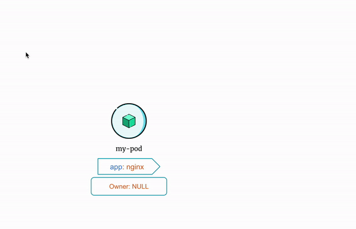

# How Does ReplicaSet Manage Pods?

Standalone pods are like orphans. Nobody cares even if they die. Your application will be unavailable if the pod dies.

On the other hand, pods managed by a `ReplicaSet` have a much better life. If for some reason they die, `ReplicaSet` will launch a new identical Pod. This ensures your application is available all the time.

But how does a `ReplicaSet` know which pods to manage so that it can restart a pod when required or kill the pods that are not needed?

A `ReplicaSet` uses labels to match the pods that it will manage.

## Example

Consider the following `ReplicaSet`:

=== ":octicons-file-code-16: `my-replicaset.yml`"

    ```yaml linenums="1"
    apiVersion: apps/v1
    kind: ReplicaSet
    metadata:
      name: my-replicaset
    spec:
      replicas: 2
      selector:
        matchLabels:
          app: nginx
      template:
        metadata:
          labels:
            app: nginx
            tier: backend
        spec:
          containers:
          - name: nginx
            image: reyanshkharga/nginx:v1
            imagePullPolicy: Always
            ports:
              - containerPort: 80
    ```


Here’s what happens when you apply the manifest to create the `ReplicaSet`:

1. The `ReplicaSet` controller checks for pods that match the labels defined in the `matchLabels` field of the `ReplicaSet` manifest. (`app=nginx` or `tier=backend`)
2. If such a pod is found then the `ReplicaSet` controller checks if the pod is already managed by another controller such as a `ReplicaSet` or a `Deployment`. (`ownerReferences` field in the pod manifest can be used to find the owner of the object.)
3. If the pod is not managed by any other controller, the `ReplicaSet` will start managing the pod. Subsequently, the `ownerReferences` field of the target pods will be updated to reflect the new owner’s data (The `ReplicaSet` in this case).
4. The `ReplicaSet` will also launch new pods if needed to maintain the stable set of replicas defined in the `ReplicaSet` manifest and update the `ownerReferences` field of those pods.

Here's a visual representation of the flow described above:

<p align="center">
    
</p>

Let's see this in action!

Here is the Docker Image used in this tutorial: [reyanshkharga/nginx]{:target="_blank"}


## Step 1: Create a Standalone Pod

First, create a standalone pod as follows:

=== ":octicons-file-code-16: `my-pod.yml`"

    ```yaml linenums="1"
    apiVersion: v1
    kind: Pod
    metadata:
      name: my-pod
      labels:
        app: nginx
    spec:
      containers:
      - name: nginx
        image: reyanshkharga/nginx:v2
        imagePullPolicy: Always
        ports:
        - containerPort: 80
    ```

Apply the manifest to create the pod:

```
# Create standalone pod
kubectl apply -f my-pod.yml
```

List pods to verify that the pod is running:

```
kubectl get pods
```

Verify that the pod doesn't have `ownerReferences` field in the metadata. You can do so by retrieving the detailed information about the pod and output in YAML format as follows:

```
kubectl get pod my-pod -o yaml
```


## Step 2: Create a ReplicaSet

Let's create a `ReplicaSet` as follows:

=== ":octicons-file-code-16: `my-replicaset.yml`"

    ```yaml linenums="1"
    apiVersion: apps/v1
    kind: ReplicaSet
    metadata:
      name: my-replicaset
    spec:
      replicas: 2
      selector:
        matchLabels:
          app: nginx
      template:
        metadata:
          labels:
            app: nginx
            tier: backend
        spec:
          containers:
          - name: nginx
            image: reyanshkharga/nginx:v1
            imagePullPolicy: Always
            ports:
              - containerPort: 80
    ```

Apply the manifest to create the ReplicaSet:

```
# Create replicaset
kubectl apply -f my-replicaset.yml
```

## Step 3: List Pods

Let's list all the pods:

```
kubectl get pods
```

You'll notice that only one new pod comes up even though `replica` is set to 2 in the ReplicaSet definition.

This is because `my-pod` has the label `app: nginx` that the `ReplicaSet` uses to manage pods. And it has no owner.

Therefore, the `ReplicaSet` starts managing `my-pod` and creates a new pod to maintain 2 replicas as defined in the `ReplicaSet` manifest.

Also, the `ReplicaSet` adds a `ownerReferences` metadata to `my-pod` that indicates that `my-replicaset` is the owner of the pod `my-pod`.

Verify that `my-pod` has a `ownerReferences` field in the metadata as follows:

```
kubectl get pod my-pod -o yaml
```

Verify the same for other pod that was created by `my-replicaset`.


## Step 4: Delete Pods

Now, let's see what happens when we delete one of the pods managed by the `ReplicaSet`.

Delete a pod:

```
kubectl delete pod <pod-name>
```

`ReplicaSet` will launch a new pod using the template defined in the `ReplicaSet` definition.

Now, let's delete the pod `my-pod`:

```
kubectl delete pod my-pod
```

`ReplicaSet` will again launch a new pod using the template defined in the `ReplicaSet` definition to maintain 2 replicas.


## Important Note

In real world you rarely create a standalone pod. pods are usually managed by a `ReplicaSet` or a `Deployment` object in kubernetes.

The idea of `ReplicaSets` is to manage identical Pods.

But standalone pods may be associated with `ReplicaSets` if it has labels that the `ReplicaSet` uses to manage pods even though the standalone Pod is an entirely different application.

So, even if you create standalone pods, make sure that it doesn't have a conflicting labels.


## Clean Up

```
# Delete pod
kubectl delete -f my-pod.yml

# Delete replicaset
kubectl delete -f my-replicaset.yml
```


<!-- Hyperlinks -->
[reyanshkharga/nginx]: https://hub.docker.com/r/reyanshkharga/nginx