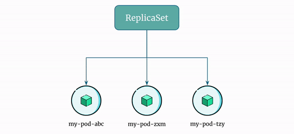

# Introduction to Kubernetes ReplicaSet

In kubernetes, a `ReplicaSet` is a controller whose purpose is to maintain a stable set of replica pods running at any given time.

Imagine you have a pod that needs to run multiple copies of itself in order to handle a high volume of requests. You can create a `ReplicaSet` object in Kubernetes that specifies how many replicas (copies) of the pod should be running at all times.

If a pod fails or is deleted for some reason, the `ReplicaSet` will automatically create a new pod to replace it, ensuring that the desired number of replicas is always maintained. This helps to ensure that your application is always available and responsive to incoming requests.

Overall, a `ReplicaSet` is an important tool for managing and scaling containerized applications in Kubernetes.

`ReplicaSet` uses labels to match the pods that it will manage.

## ReplicaSet Overview

Here's a GIF showing how a `ReplicaSet` maintains a stable set of replica pods:

    

1. The `ReplicaSet` manages a pod with a replica count of 3.
2. For some reason, the pod `my-pod-tzy` ceases to function.
3. The ReplicaSet detects the pod `my-pod-tzy` has stopped and launches a replica pod `my-pod-bhj` to ensure that 3 replicas of the pod are always running.
4. `my-pod-abc` experiences an unexpected failure, and the `ReplicaSet` once again detects this issue and deploys a replica pod `my-pod-xyz` to maintain 3 replicas of the pod.