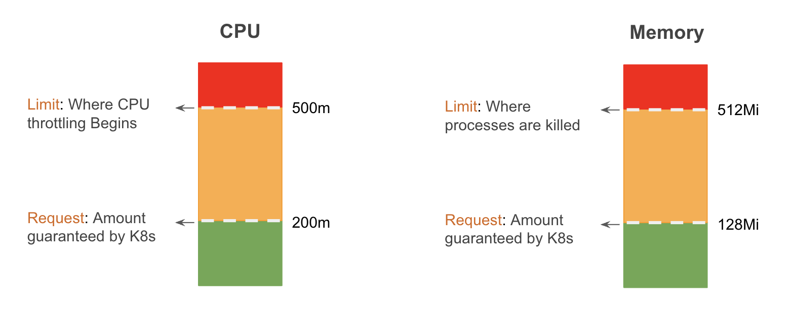

# Introduction to Requests and Limits

By default, containers run with unbounded compute resources on a kubernetes cluster.

When you create a pod, you can optionally specify how much of each resource a container needs. The most common resources to specify are `CPU` and `Memory`.

When you specify the resource `request` for containers in a pod, the `kube-scheduler` uses this information to decide which node to place the pod on.

When you specify a resource `limit` for a container, the `kubelet` enforces those limits so that the running container is not allowed to use more of that resource than the limit you set.

The `kubelet` also reserves at least the request amount of that system resource specifically for that container to use.

If the node where a pod is running has enough of a resource available, it's possible (and allowed) for a container to use more resource than its `request`. However, a container is not allowed to use more than its resource `limit`.

<p align="center">
    
</p>


## Unit of CPU and Memory Resources

In kubernetes, `CPU` resources are defined in `m` which stands for `millicores`. If your container needs two full cores to run, you would put the value `2000m`. If your container only needs one fourth of a core, you would put a value of `250m`.

```
1000m = 1 CPU Core
```

In kubernetes, `Memory` resources are defined in `Mi` which stands for `mebibytes`. 

`Megabyte` and `mebibyte` are close in size. (`1 Mi = 1.048576 MB`).

```
1 Megabyte (MB) = (1000)^2 bytes = 1000000 bytes
1 Mebibyte (Mi) = (1024)^2 bytes = 1048576 bytes
```


## Requests and Limits - An Example

Suppose you allocate a memory `request` of `256 MiB` to a container within a pod that is scheduled to a node with `8GiB` of memory, and there are no other pods on that node. In such a scenario, the container has the flexibility to utilize more RAM if necessary.

However, if you set a memory `limit` of `4GiB` for the same container, the `kubelet` (along with the container runtime) ensures that the `limit` is enforced. The container runtime takes measures to prevent the container from exceeding the specified resource `limit`.

For instance, if a process within the container attempts to consume more memory than the allowed `limit`, the system kernel terminates that process, triggering an out of memory `(OOM)` error.

!!! tip
    You can use `kubectl top` command to view memory and CPU usage of a pod. But you need to install `metrics server` before you can use the `kubectl top` command.


## Choosing CPU and Memory Requests and Limits

To determine the appropriate amount of CPU and Memory `requests` and `limits` for a pod, consider the following factors:

1. **Resource Requirements**

    Analyze the application's resource needs, such as CPU usage and memory consumption, based on its workload patterns and expected traffic. This information helps in determining the initial `requests` and `limits`.

2. **Performance and Scalability**

    Set CPU and memory `requests` to ensure the pod has enough resources to function properly. Consider the workload's scalability requirements and potential resource spikes to define appropriate `limits`.

3. **Monitoring and Analysis**

    Continuously monitor the pod's resource utilization and performance metrics. Adjust the `requests` and `limits` based on observed patterns and bottlenecks to optimize resource allocation.

4. **Testing and Validation**

    Conduct testing and performance profiling to validate the chosen CPU and memory settings, ensuring they meet the desired performance and stability requirements.

By considering these factors and regularly assessing the pod's resource utilization, you can determine the correct amount of CPU and Memory `requests` and `limits` to optimize performance and resource allocation.


!!! quote "References:"
    !!! quote ""
        * [Requests and Limits]{:target="_blank"}


<!-- Hyperlinks -->
[Requests and Limits]: https://kubernetes.io/docs/concepts/configuration/manage-resources-containers/#requests-and-limits