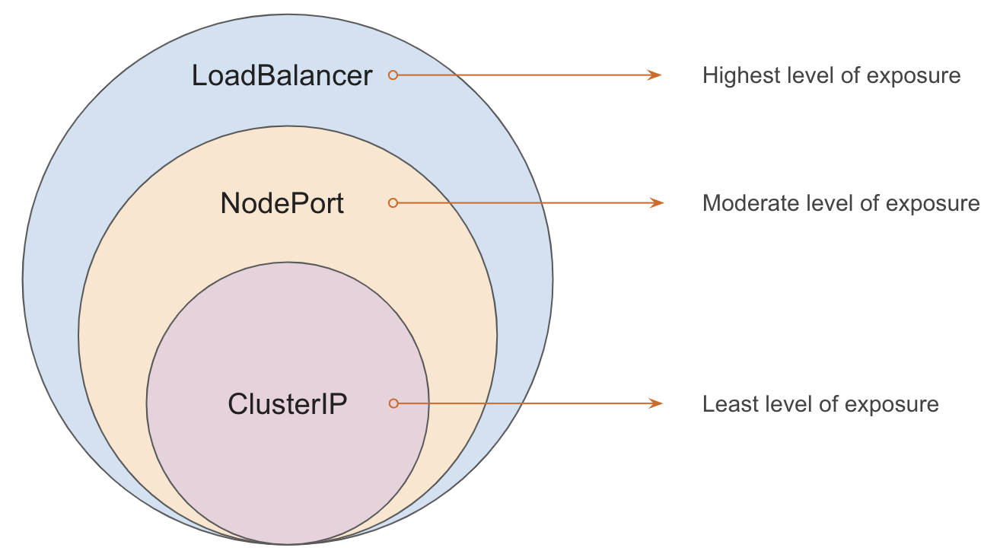

# Exposure Level of Different Service Types

In Kubernetes, there are different service types that can be used to expose your application to the outside world.

These service types differ in their exposure level, which refers to how accessible the service is to external users.

Here's a quick overview:

    

## 1. Exposure Level of ClusterIP Service

- This service type is the least exposed of all kubernetes services.
- It is only accessible within the cluster, which means that external users cannot access it.
- It is ideal for services that need to communicate with other services within the cluster, but do not need to be accessed by external users.

##  2. Exposure Level of NodePort Service

- This service type exposes the service on a specific port on all nodes in the cluster.
- This means that external users can access the service using the IP address of any node in the cluster, along with the specified port number.
- `NodePort` services are typically used for development or testing purposes.

## 3. Exposure Level of LoadBalancer Service

- This service type exposes the service through a load balancer that is provisioned by your cloud provider.
- The load balancer distributes traffic to the different nodes running your service, making it highly available and scalable.
- `LoadBalancer` services are ideal for applications that need to handle a large amount of traffic and require high availability.

## 4. Exposure Level of ExternalName Service

- This service type allows you to map an external DNS name to an internal service in your cluster.
- This means that external users can access the service using the external DNS name, but the service itself is still only accessible within the cluster.
- `ExternalName` services are typically used for applications that need to access external resources.