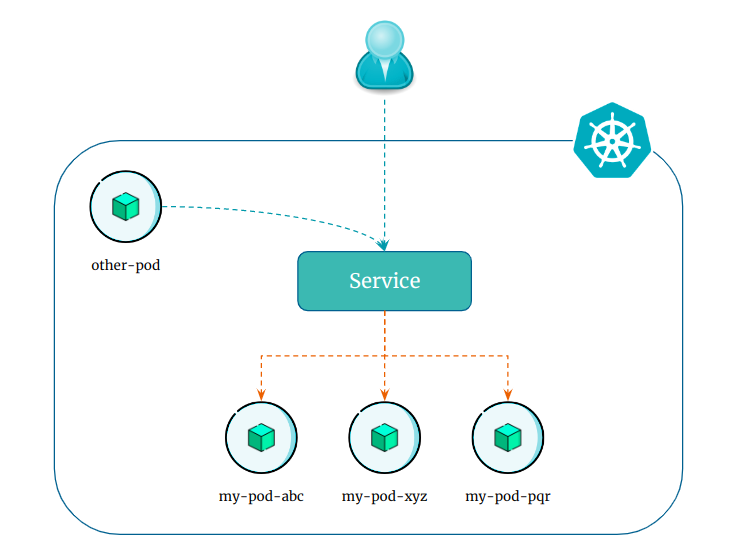

# Introduction to Kubernetes Service

Kubernetes `Service` is an abstract way to expose an application running on a set of pods as a network service.

    

In plain and simple language, it's a way to make a group of containers accessible to other applications or users outside of the kubernetes cluster.

Kubernetes creates DNS records for services. You can contact services with consistent DNS names instead of IP addresses.

Kubernetes service does load balancing by default. When you create a kubernetes service, it automatically distributes incoming network traffic among the pods that are part of the service.
