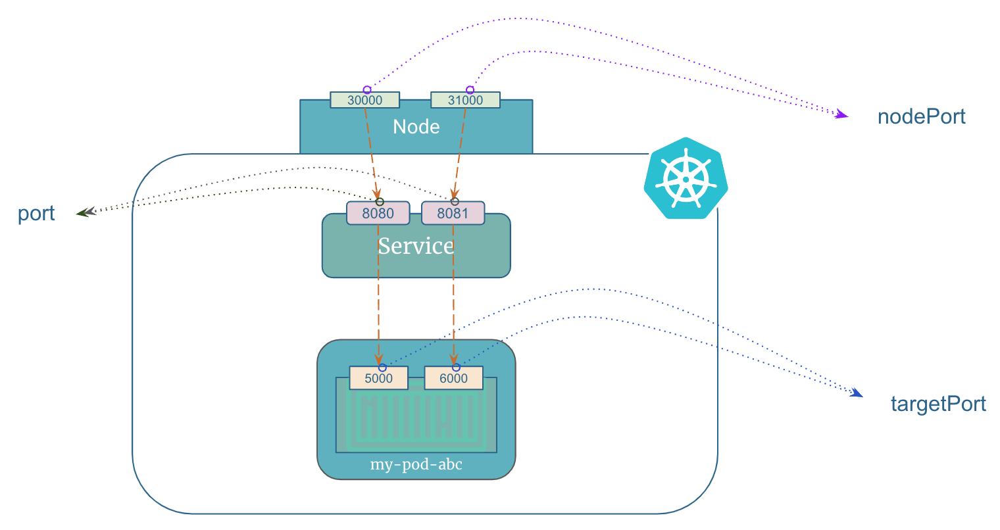

# Difference Between port, targetPort, And nodePort in Kubernetes Service

A kubernetes service can have different types of ports fields, including `port`, `targetPort`, and `nodePort`.

Here's a brief explanation of each:

- `port`: This is the port on which the service listens. When a client sends a request to the service, it connects to this port.

- `targetPort`: This is the port on which the pods in the service are listening. When the service forwards traffic to the pods, it uses this port.

- `nodePort`: This is a port that is exposed on each node in the cluster. When traffic comes to this port, it is forwarded to the service's port.


## port vs targetPort vs nodePort - An Example

Let's understand the difference between `port`, `targetPort`, and `nodePort` in more detail with an example.


Remember that an application can run multiple services on different ports in a container. (Refer to the image below)

Suppose we have a Node.js application running inside a container that serves the API requests on port `5000`. Also, the container has a metrics service running on port `6000` to expose application metrics.

<p align="left">
    
</p>

The kubernetes service manifest would look something like this:

=== ":octicons-file-code-16: `my-service.yml`"

    ```yaml linenums="1"
    kind: Service
    apiVersion: v1
    metadata:
      name: my-service
    spec:
      selector:
        app: MyApp
      ports:
        - name: http
          nodePort: 30000
          port: 8080
          targetPort: 5000
        - name: metrics
          nodePort: 31000
          port: 8081
          targetPort: 6000
    ```

If you access `my-service:8080` the traffic is routed to `5000` of the container. Similarly, if you access `my-service:8081` then it is redirected to `6000` of the container.

To access the service from outside the kubernetes cluster someone needs to expose the port on worker nodes so that the traffic is redirected to a port of the container. This is node port(port exposed on the worker node).

In the example above, you can access the service from outside the cluster using `<node-ip-address>:<nodePort>`.

Suppose IP address of one of the worker nodes is `3.109.154.210`. You can access the `http` and `metrics endpoint` using `3.109.154.210:30000` and `3.109.154.210:31000` respectively.