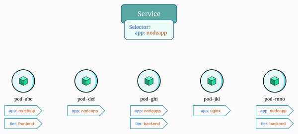
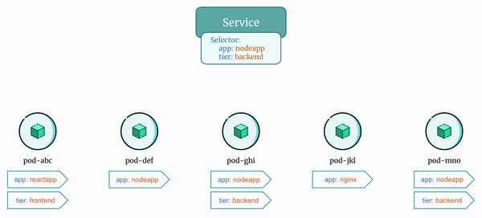

# Understanding the Role of Selector in Kubernetes Service

The selector is used by the kubernetes service to identify the target pods to forward the incoming network traffic to. By matching the selector labels defined in the service with the corresponding labels defined in the pod, the service can route the traffic to the correct set of pods.

Important points to keep in mind:

- The service sends traffic to the pods that has all the labels defined in `spec.selector` field of the service definition.
- The service has nothing to do with the `Deployments`. Services send traffic directly to the pods matching the labels defined in `spec.selector` field of the service definition.

## Example 1: Selector With Single Label

<p align="center">
    
</p>

In the above example you will notice that the service sends traffic only to pods that has the label "`app=nodeapp`".


## Example 2: Selector With Multiple Labels

<p align="center">
    
</p>

In the above example you will notice that the service sends traffic only to pods that has both the labels "`app=nodeapp`" and "`tier=backend`".


## Docker Image

Let's see the examples we discussed in action!

Here is the Docker Image used in this tutorial: [reyanshkharga/nodeapp]{:target="_blank"}


## Step 1: Create a Service

Let's create a service that selects pods with label "`app=nodeapp`" as follows:

=== ":octicons-file-code-16: `my-service.yml`"

    ```yaml linenums="1"
    apiVersion: v1
    kind: Service
    metadata:
      name: my-service
    spec:
      type: ClusterIP
      selector:
        app: nodeapp
      ports:
        - port: 80
          targetPort: 5000
    ```

Create service:

```
kubectl apply -f my-service.yml
```

Verify the service:

```
kubectl get svc -o wide
```


## Step 2: Create Pods

Let's create two pods as follows:

=== ":octicons-file-code-16: `first-pod.yml`"

    ```yaml linenums="1"
    apiVersion: v1
    kind: Pod
    metadata:
      name: first-pod
      labels:
        app: nodeapp
    spec:
      containers:
      - name: nodeapp
        image: reyanshkharga/nodeapp:v1
        imagePullPolicy: Always
        ports:
        - containerPort: 5000
    ```

=== ":octicons-file-code-16: `second-pod.yml`"

    ```yaml linenums="1"
    apiVersion: v1
    kind: Pod
    metadata:
      name: second-pod
      labels:
        app: nodeapp
        tier: backend
    spec:
      containers:
      - name: nodeapp
        image: reyanshkharga/nodeapp:v1
        imagePullPolicy: Always
        ports:
        - containerPort: 5000
    ```

```
# Create first-pod
kubectl apply -f first-pod.yml

# Create second-pod
kubectl apply -f second-pod.yml
```

Note the following:

- The first-pod has a label "`app=nodeapp`"
- The second-pod has labels "`app=nodeapp`" and "`tier=backend`"

List pods showing labels:

```
kubectl get pods --show-labels
```

## Step 3: Access the Service

Let's create a simple pod and try to access the service.

1. Create a pod:

    ```
    # Create nginx pod
    kubectl run nginx --image=nginx
    ```

2. Start a shell session inside the nginx container in the pod:

    ```
    kubectl exec -it nginx -- bash
    ```

3. Access the service endpoint:

    ```
    curl my-service:80
    ```

You'll notice that the traffic is being served from both `first-pod` and `second-pod` because both have the label "`app=nodeapp`" the the service use to select pods.


## Step 4: Update the Service

Let's update the service by adding one more label "`tier=backend`" in the selector.

The updated service should look like the following:

=== ":octicons-file-code-16: `my-service.yml`"

    ```yaml linenums="1"
    apiVersion: v1
    kind: Service
    metadata:
      name: my-service
    spec:
      type: ClusterIP
      selector:
        app: nodeapp
        tier: backend
      ports:
        - port: 80
          targetPort: 5000
    ```

Apply the manifest again to update the service:

```
kubectl apply -f my-service.yml
```


## Step 5: Access the Service Again


1. Start a shell session inside the nginx container in the pod:

    ```
    kubectl exec -it nginx -- bash
    ```

2. Access the service endpoint:

    ```
    curl my-service:80
    ```

This time you'll notice that the traffic is being served only from the `second-pod` because only `second-pod` has both "`app=nodeapp`" and "`tier=backend`" labels that the service use to select pods.


## Clean Up

Assuming your folder structure looks like the one below:

```
|-- manifests
│   |-- my-service.yml
│   |-- first-pod.yml
|   |-- second-pod.yml
```

Let's delete all the resources we created:

```
# Delete deployment and service
kubectl delete -f manifests/

# Delete nginx pod
kubectl delete pod nginx
```


<!-- Hyperlinks -->
[reyanshkharga/nodeapp]: https://hub.docker.com/r/reyanshkharga/nodeapp