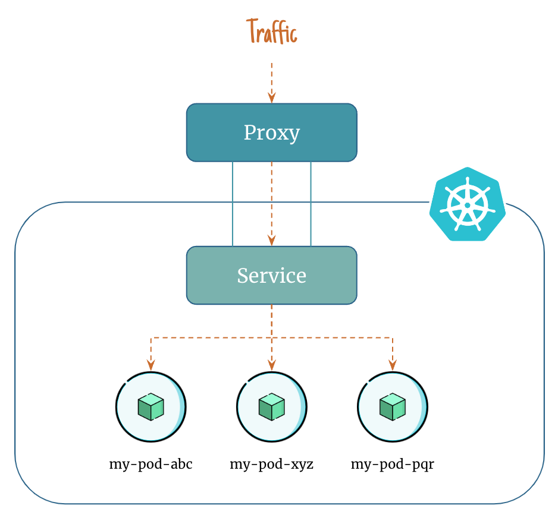
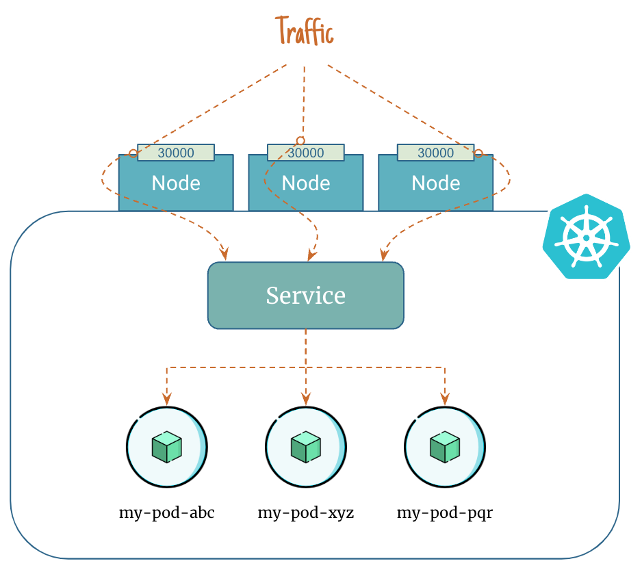
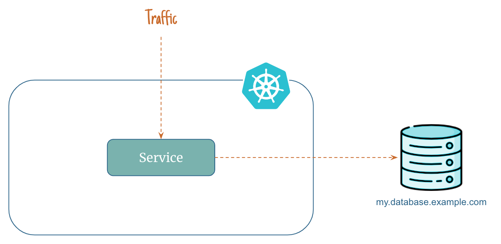

# Service Types in Kubernetes

In Kubernetes, there are several different types of services that can be used to make your application accessible to other parts of your cluster or to external users.

Here are the `Service` types available in kubernetes:

1. `ClusterIp`
2. `NodePort`
3. `LoadBalancer`
4. `ExternalName`

## 1. ClusterIp Service

    

- `ClusterIP` exposes the service on a cluster-internal IP.
- Choosing this value makes the service only reachable from within the cluster.
- This is the default value if you don't explicitly specify a type for a service.
- `ClusterIP` servie can be accessed as `<clusterIP>:<service-port>`

## 2. NodePort Service

    

- `NodePort` exposes the service on each Node's IP at a static port (the `NodePort`).
- `NodePort` service can be accessed as `<NodeIp>:<nodePort>`

## 3. LoadBalancer Service

    

- `LoadBalancer` exposes the service externally using a cloud provider's load balancer.
- For example AWS Application Load Balancer (ALB)
- `LoadBalancer` service can be accessed using Load balancer URL

## 4. ExternalName Service

    

- An `ExternalName` service is a special case of service that does not have `selectors`.
- It does not define any ports or endpoints.
- It serves as a way to return an alias to an external service residing outside the cluster.