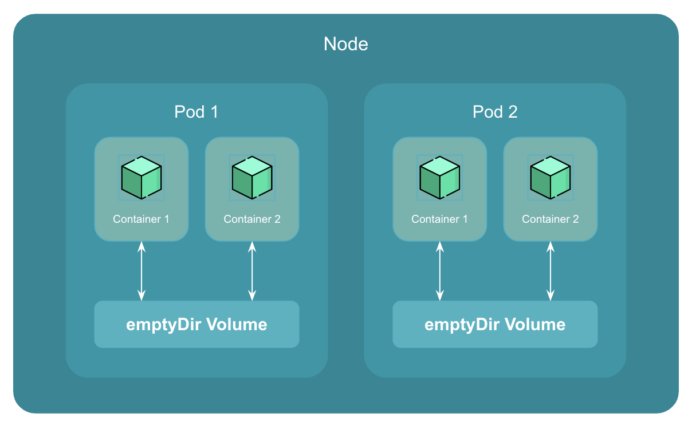

# Introduction to emptyDir Volume

An `emptyDir` volume is first created when a pod is assigned to a node, and exists as long as that pod is running on that node.

As the name says, the `emptyDir` volume is initially empty.

All containers in the pod can read and write the same files in the `emptyDir` volume, though that volume can be mounted at the same or different paths in each container.

    

When a pod is removed from a node for any reason, the data in the `emptyDir` is deleted permanently.

`emptyDir` volume falls into the ephemeral storage category.

## Use Cases of emptyDir Volume

Here are a few use cases of `emptyDir` volume:

1. **Temporary storage**

    `emptyDir` volumes can be used as temporary storage for containers that need to store data temporarily. For example, if you have a container that generates a report, you can store the report in an `emptyDir` volume until it is ready to be sent to a database or displayed to users.

2. **Sharing data between containers in the same pod**

    `emptyDir` volumes can be used to share data between containers running in the same pod. For example, if you have a pod running two containers, one of which generates data and the other processes it, you can use an `emptyDir` volume to share the data between the two containers.

3. **Caching data**

    `emptyDir` volumes can be used to cache data that is frequently accessed by containers. For example, if you have a container that frequently accesses a large dataset, you can store a copy of the dataset in an `emptyDir` volume to speed up access times.

!!! quote "References:"
    !!! quote ""
        * [emptyDir Volume in Kubernetes]{:target="_blank"}

<!-- Hyperlinks -->
[emptyDir Volume in Kubernetes]: https://kubernetes.io/docs/concepts/storage/volumes/#emptydir