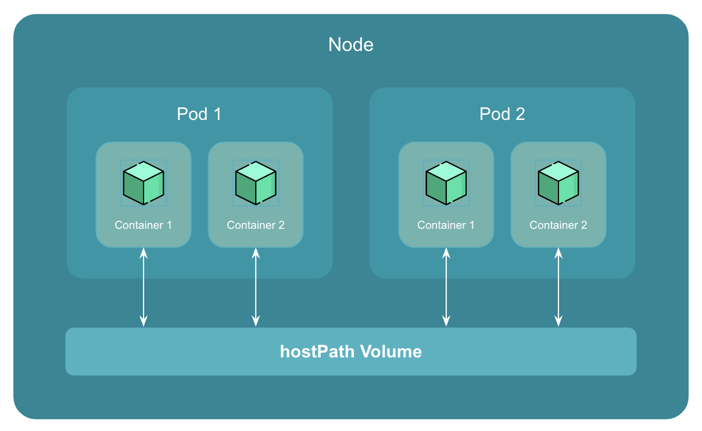

# Introduction to hostPath Volume

A `hostPath` volume is a type of volume that allows a pod to mount a directory or file from the host node's filesystem into the pod.

This means that the contents of the host directory are exposed to the pod as if they were part of the pod's own filesystem.

    

Any file or directory created by `hostPath` persists even when the pod is terminated.

However, the `hostPath` volume will be deleted when the node itself is deleted, which means that any data stored within the `hostPath` volume will also be deleted.

`hostPath` volume falls into persistent storage category.

!!! warning
    `hostPath` volumes pose security risks; it's best practice to minimize their use. They grant container access to the host file system, potentially leading to unauthorized access and data breaches. Opt for more secure storage solutions when possible.

## Use Cases of hostPath Volume

Here are a few use cases of `hostPath` volume:

1. **Development and testing**

    `hostPath` volumes can be used during development and testing to mount source code, configuration files, or other development assets that are stored on the host node's filesystem into the pod. This can help speed up the development process and reduce the time required for containerization.

2. **Data persistence**

    `hostPath` volumes can be used to store data that needs to persist across pod restarts, such as databases or log files. This can be particularly useful in stateful applications where data needs to be stored and accessed across multiple containers or pods.

3. **System-level access**

    `hostPath` volumes can be used to provide system-level access to the pod, allowing it to access and modify files on the host node's filesystem.

!!! quote "References:"
    !!! quote ""
        * [hostPath Volume in Kubernetes]{:target="_blank"}

<!-- Hyperlinks -->
[hostPath Volume in Kubernetes]: https://kubernetes.io/docs/concepts/storage/volumes/#hostpath
