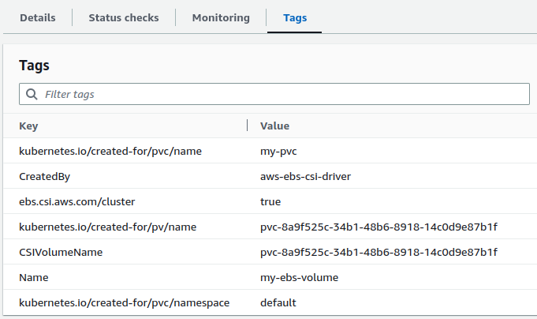

# Dynamic Provisioning of Persistent Volume Using EBS

Let's create a `StorageClass` that specifies the properties of the storage that will be dynamically provisioned for a Persistent Volume.

=== ":octicons-file-code-16: `my-sc.yml`"

    ```yaml linenums="1"
    apiVersion: storage.k8s.io/v1
    kind: StorageClass
    metadata:
      name: my-sc
    provisioner: ebs.csi.aws.com
    volumeBindingMode: Immediate
    parameters:
      type: gp3
      tagSpecification_1: "Name=my-ebs-volume"
      tagSpecification_2: "CreatedBy=aws-ebs-csi-driver"
    reclaimPolicy: Delete
    ```

Observe the following:

- The `EBS CSI Driver` is used as the provisioner to provision EBS volume dynamically
- The `parameters` field specifies the properties of the storage provisioned
- We have set the `reclaimPolicy` to `Delete`. This means that the EBS volume will be deleted when the associated Persistent Volume is deleted.
- The `tagSpecification_<i>` is used to specify the tags of EBS volume that will be provisioned

For the `ebs.csi.aws.com` (EBS CSI Driver) storage provisioner, the following are some of the additional fields that can be added to the parameters field:

1. `fsType`: The file system type to use for the volume. For example, `ext4` or `xfs`.
2. `encrypted`: A boolean value that indicates whether to create an encrypted volume. Default is `false`.
3. `kmsKeyId`: The ID of the KMS key to use for encryption. This field is only used if encrypted is set to `true`.
4. `iopsPerGB`: The number of IOPS per GiB for the volume. This field is only used for specific volume types, such as `io1`.
5. `throughput`: The throughput in `MiB/s` for the volume. This field is only used for specific volume types, such as `gp3`.


You can check the documentation of the specific storage provisioner you're using to see what other parameters can be added to the parameters field.

The `volumeBindingMode` field in a kubernetes `StorageClass` object specifies how `PersistentVolumeClaims` (PVCs) should be bound to `PersistentVolumes` (PVs) when using this `StorageClass`.

The possible values for the `volumeBindingMode` field are:

- `Immediate`: The PVC is bound to a PV as soon as it is created. This is the default value.
- `WaitForFirstConsumer`: The PV is only bound to a PVC when a pod using the PVC is scheduled to a node. This is useful when resources are scarce and you only want to provision storage when a pod is actually using it.

In summary, if the `volumeBindingMode` is set to `Immediate`, the PV will be created immediately and bound to the PVC. If the value is set to `WaitForFirstConsumer`, the PV will be created only when a pod using the PVC is scheduled to a node.


Apply the manifest to create StorageClass:

```
kubectl apply -f my-sc.yml
```

List and verify StorageClass:

```
kubectl get sc
{OR}
kubectl get storageclass
{OR}
kubectl get storageclasses
```

!!! note
    This won't provision any EBS volume. The `StorageClass` only specifies the property of the EBS volume.


## Step 2: Create a Persistent Volume Claim (PVC)

Now that we have a `StorageClass` created, we can create a `Persistent Volume Claim` (PVC) that will provision the `Persistent Volume` (PV) dynamically.

Create PVC as follows:

=== ":octicons-file-code-16: `my-pvc.yml`"

    ```yaml linenums="1"
    apiVersion: v1
    kind: PersistentVolumeClaim
    metadata:
      name: my-pvc
    spec:
      accessModes:
        - ReadWriteOnce
      storageClassName: my-sc
      resources:
        requests:
          storage: 5Gi
    ```

Observe the following:

1. The PVC uses the StorageClass `my-sc` and, therefore, the storage that will be provisioned dynamically will have the properties defined in `my-sc`.

2. The access mode is set to `ReadWriteOnce` and, therefore, the PV that will be created will have the access mode set to `ReadWriteOnce`.

3. The storage that will be provisioned dynamically will have `5Gi` storage available.

Apply the manifest to create the Persistent Volume Claim:

```
kubectl apply -f my-pvc.yml
```

Once the PVC is created, the following actions are automatically taken:

1. A new EBS volume will be provisioned
2. A PV will be created that references the newly provisioned EBS volume
3. The PVC is bound to the newly created PV

Please note that if the `volumeBindingMode` field in the StorageClass (`my-sc` in this case) used by the PVC is set to `WaitForFirstConsumer`, the EBS volume and PV will not be created until a new pod that uses the PVC is scheduled on a node. But in this case we have set it to `Immediate` and, therefore, the EBS and PV will be created as soon as the PVC is created.

Go to AWS console and verify the newly created EBS volume. Check for tags that was used in `StorageClass` definition. The EBS volume will also have additional tags indicating that it was dynamically provisioned using the EBS CSI driver.

<p align="left">
    
</p>

Also, the Amazon EBS volume state will be `Available`. The status will change to `in-use` only when the EBS volume is mounted on a worker node.

Verify the Persistent Volume Claim (PVC):

```
kubectl get pvc
```

Verify the automatically created Persistent Volume (PV):

```
# List PVs
kubectl get pv

# Describe PV
kubectl describe pv <pv-name>

# View PV in yaml format
kubectl get pv <pv-name> -o yaml
```

Check the `VolumeHandle` field. You'll find that it references the newly created EBS volume.


## Step 3: Create Pods That Uses the Persistent Volume Claim

Let's create pods that uses the Persistent Volume Claim we created in the previous step. We'll use a deployment to create pods:

=== ":octicons-file-code-16: `my-deployment.yml`"

    ```yaml linenums="1"
    apiVersion: apps/v1
    kind: Deployment
    metadata:
      name: my-deployment
    spec:
      replicas: 1
      selector:
        matchLabels:
          app: nginx
      template:
        metadata:
          labels:
            app: nginx
        spec:
          containers:
          - name: nginx
            image: reyanshkharga/nginx:v1
            imagePullPolicy: Always
            command: ["/bin/sh"]
            args: ["-c", "while true; do echo $(date -u) >> /my-data/my-persistent-data.txt; sleep 5; done"]
            volumeMounts:
            - name: my-volume
              mountPath: /my-data
          volumes:
          - name: my-volume
            persistentVolumeClaim:
              claimName: my-pvc
    ```

Obeserve the following:

- The deployment creates pods with 1 replica
- The pod has one container named `nginx`
- A volume named `my-volume` is created using the PVC `my-pvc` we created in the previous step
- The volume `my-volume` is mounted on `/my-data` directory of the `nginx` container

Apply the manifest to create the deployment:

```
kubectl apply -f my-deployment.yml
```

Verify the EBS volume state in AWS console. You'll observe that as soon as the pod is scheduled on a node, the EBS volume is mounted on that node and the state changes from `Available` to `in-use`.

You can see the `Attached instances` field in the EBS details section in the AWS console.

!!! note
    In the deployment described above, if the number of replicas is set to a value greater than one, only one pod will be created and scheduled due to the limitations of EBS volumes, which cannot be mounted on multiple nodes and, therefore, multiple pods.

    This limitation can be overcome by using StatefulSets, which allow for dynamic provisioning of storage for each pod in the deployment, ensuring that each pod has its own unique storage that persists even if the pod is terminated or rescheduled.

## Step 4: Verify Deployment and Pods

```
# List deployments
kubectl get deployments

# List pods
kubectl get pods -o wide
```


## Step 5: Verify Volume Mount and Data

1. Open a shell session inside the nginx container:

    ```
    kubectl exec -it <pod-name> -- bash
    ```

2. View data:

    ```
    tail -f /my-data/my-persistent-data.txt
    ```

## Step 6: Delete the Deployment and Persistent Volume Claim (PVC)

You need to delete the deployment before you can delete the PVC because pods uses the claim as volume.

1. Delete the deployment:

    ```
    kubectl delete -f my-deployment.yml
    ```

2. Delete the PVC:

    ```
    kubectl delete -f my-pvc.yml
    ```

As soon as the PVC is deleted the PV will also be deleted. The EBS volume will be retained or deleted based on the `reclaimPolicy` that was set for the `StorageClass`. In our case, the EBS volume will be deleted.

Verify that the PV is deleted and doesn't exist anymore:

```
kubectl get pv
```

Go to AWS console and verify if the EBS volume was deleted.


## Clean Up


Assuming your folder structure looks like the one below:

```
|-- manifests
│   |-- my-deployment.yml
│   |-- my-pv.yml
│   |-- my-pvc.yml
```

Let's delete all the resources we created:

```
kubectl delete -f manifests/
```


!!! quote "References:"
    !!! quote ""
        * [StorageClass Parameters for EBS CSI Driver]{:target="_blank"}


<!-- Hyperlinks -->
[StorageClass Parameters for EBS CSI Driver]: https://github.com/kubernetes-sigs/aws-ebs-csi-driver/blob/master/docs/parameters.md