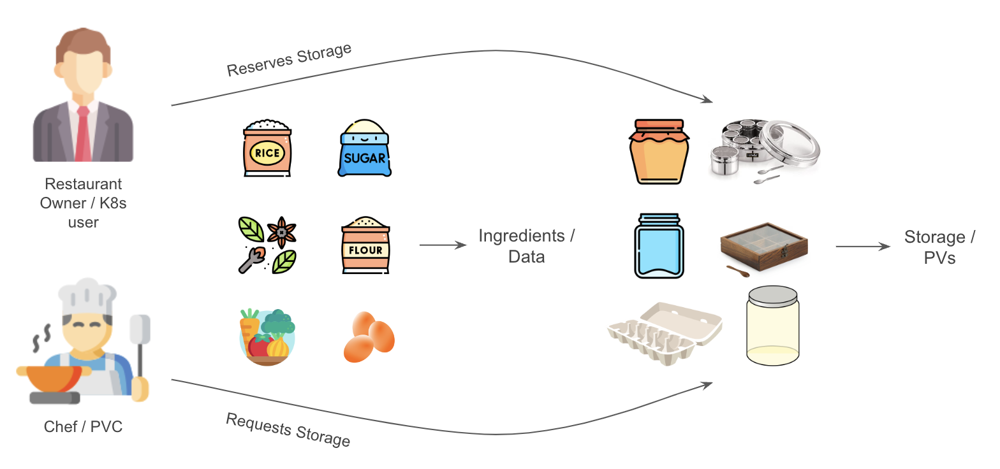
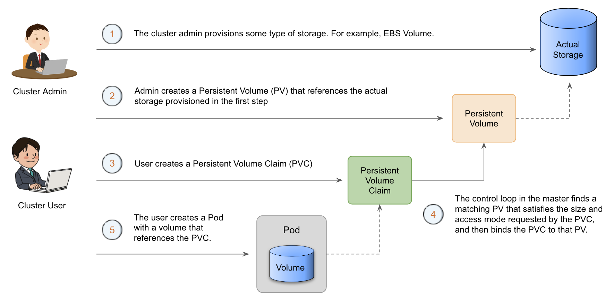
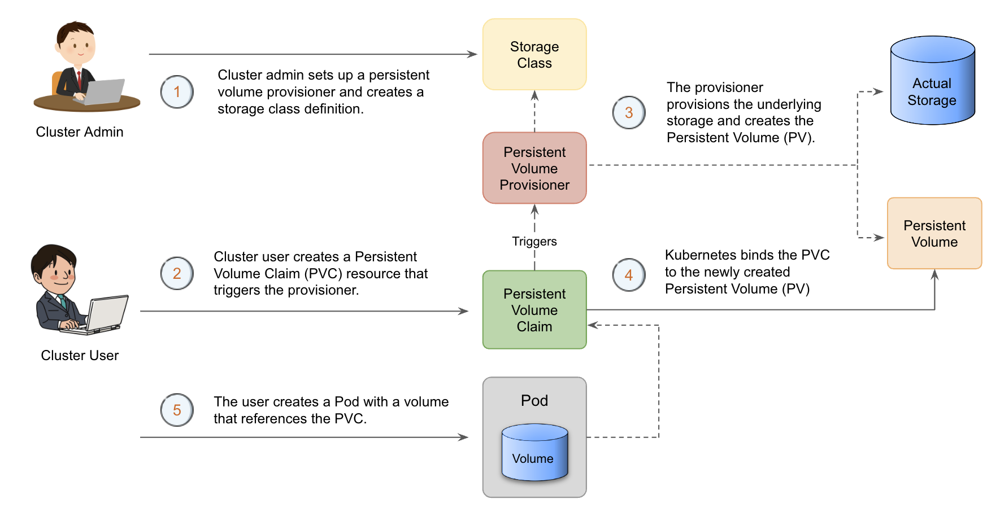
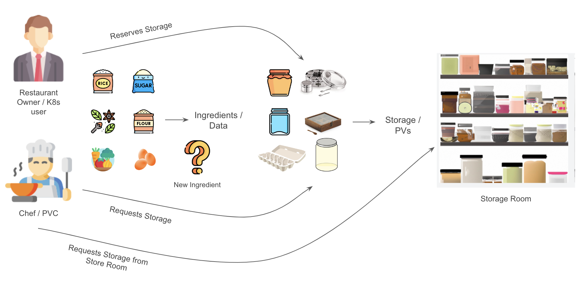

# Introduction to Persistent Volumes

A `PersistentVolume` (PV) is a piece of storage in the cluster that has been provisioned by an administrator or dynamically provisioned using `Storage Classes`.

A `Storage Class` in kubernetes is a definition that specifies the properties of the storage that will be dynamically provisioned for a `PersistentVolume`. For example, it could be an Amazon EBS volume of type `gp3`.

`PersistentVolume` is a resource in the cluster just like a node is a cluster resource. PVs have a lifecycle independent of any individual pod that uses the PV.

Kubernetes does not restrict PVs to a namespace, which means that a pod in any namespace can claim a PV for storage.

## What is a Persistent Volume Claim?

A `PersistentVolumeClaim` (PVC) is a request for storage by a user. It is similar to a pod. Pods consume node resources and PVCs consume PV resources.

By using `PersistentVolumeClaim` (PVCs) together with `StorageClass`, users can dynamically provision and use storage resources from various storage providers, such as AWS EBS or GCE PD, in a kubernetes cluster.

## Kitchen Analogy to Understand PV and PVC

Imagine you are a restaurant owner who needs to store ingredients for your dishes. The ingredients are like data in a kubernetes cluster. You can store the ingredients in different types of containers, such as a fridge, a freezer, or a pantry. Similarly, in kubernetes, you can store data in different types of storage, such as local storage, network-attached storage (NAS), or storage area network (SAN).

Now, let's say you want to reserve a specific container to store a certain type of ingredient. This container is like a `Persistent Volume` (PV) in Kubernetes. It's a pre-allocated storage resource that is available for use by your applications. Just like you can reserve a container to store specific ingredients, you can reserve a PV to store specific data.

However, you don't want to manage the containers yourself. Instead, you want your kitchen staff to be able to request specific containers when they need them. In Kubernetes, this is done through a `Persistent Volume Claim` (PVC). A PVC is a request for a specific amount and type of storage that an application needs. It's like your kitchen staff requesting a specific container to store a specific ingredient.

In summary, a `Persistent Volume` (PV) is a pre-allocated storage resource, while a `Persistent Volume Claim` (PVC) is a request for a specific type and amount of storage. They work together to provide a way for applications to access and manage data storage resources in kubernetes.

    

## Static vs Dynamic Provisioning of Persistent Volume

PVs may be provisioned in two different ways:

1. Statically
2. Dynamically

### Static Provisioning of Persistent Volume

Static provisioning of PVs is when you pre-create a PV and it is available for use by applications in the cluster.

This method is useful when you know in advance the amount and type of storage resources that your applications will need.

To use a statically provisioned PV, an application needs to make a request for that specific PV by name.

Static Provisioning Flow:

    

### Dynamic Provisioning of Persistent Volume

Dynamic provisioning of PVs, on the other hand, is when PVs are created on-demand as applications make requests for storage resources.

With dynamic provisioning, you don't need to pre-create PVs, which can be helpful when you have changing storage requirements or when you don't know in advance how much storage you will need.

Dynamic provisioning is made possible by the use of `Storage Classes`, which define the type and configuration of storage that will be used to create the PV.

A `Persistent Volume Provisioner` in kubernetes is a component that dynamically creates and manages `Persistent Volumes` (PVs) in response to the creation of `Persistent Volume Claims` (PVCs) by users.

The provisioner acts as a plugin to the kubernetes API server, intercepting PVC creation events and responding by dynamically creating or deleting the requested volumes.

This allows users to easily request and use storage resources in a dynamic and scalable way, without having to manually provision or manage storage resources themselves.

Some popular examples of kubernetes Persistent Volume Provisioners include AWS EBS, Azure Disk, and NFS.

To use dynamically provisioned PVs, an application needs to make a request for storage by creating a `Persistent Volume Claim` (PVC). The PVC specifies the amount and type of storage required by the application. When a PVC is created, kubernetes checks the available storage resources and provisions a new PV that meets the requirements specified in the PVC.

Dynamic Provisioning Flow:

    

## Kitchen Analogy to Understand Static and Dynamic Provisioning of Storage

Let's say you have two types of ingredients that you need to store: flour and sugar. You know that you'll need a fixed amount of storage for each of them. For example, you might need a 10-liter container for flour and a 5-liter container for sugar. In kubernetes, this is like a static provisioning of storage.

Static provisioning is when you pre-allocate a specific amount of storage in advance, just like you pre-allocate specific containers for specific ingredients. In kubernetes, you can pre-allocate storage by creating `Persistent Volumes` (PVs) with a specific size and type of storage.

Now, Suppose you have introduced a new dish to your menu that requires a new ingredient, but you don't know how much storage this ingredient will require. In the restaurant context, this might be a new spice that you want to use in a limited number of dishes.

To store this new ingredient, you could dynamically provision a new container for it as needed. For example, when the kitchen staff needs to prepare a dish that requires this new spice, they could request a new container from the storage room to store the spice temporarily. Once the dish is prepared, the container can be returned to the storage room for later use.

In kubernetes, this dynamic provisioning of storage works in a similar way. When an application needs to store data and makes a request through a PVC, kubernetes can automatically provision a new `Persistent Volume` (PV) to store the data if one isn't already available. This new PV is dynamically created to meet the requirements specified in the PVC.

Just like the kitchen staff in the restaurant can request a new container to store the new spice, applications in kubernetes can request dynamic storage provisioning for new data through PVCs. This helps to ensure that the application has the necessary storage resources available to it without having to pre-allocate resources that may go unused.

In summary, static provisioning is like pre-allocating specific containers for specific ingredients, while dynamic provisioning is like allocating new containers on demand for new ingredients that you haven't used before.

Static provisioning is useful when you know in advance how much storage you need, while dynamic provisioning is useful when you don't know in advance and need to allocate storage on demand.

    

## Lifecycle of a Persistent Volume and Claim

The interaction between PVs and PVCs follows this lifecycle:

1. **Provisioning**

    `Persistent Volume` (PV) is provisioned. The PV can be provisioned statically or dynamically.

2. **Binding**

    A user creates, or in the case of dynamic provisioning, has already created, a `PersistentVolumeClaim` with a specific amount of storage requested.

    A control loop in the master watches for new PVCs, finds a matching PV (if possible), and binds them together. If a PV was dynamically provisioned for a new PVC, the loop will always bind that PV to the PVC.

    Once bound, `PersistentVolumeClaim` binds are exclusive, regardless of how they were bound. A PVC to PV binding is a one-to-one mapping.

3. **Using**

    Pods use claims as volumes. The cluster inspects the claim to find the bound volume and mounts that volume for a pod.

    Once a user has a claim and that claim is bound, the bound PV belongs to the user for as long as they need it. Users schedule pods and access their claimed PVs by including a `persistentVolumeClaim` section in a pod's volumes block.

## Persistent Volume Access Modes

The access mode is set during PV creation and tells kubernetes how the volume should be mounted.

There are three access modes available:

- `ReadWriteOnce (RWO)`: The volume can be mounted as read-write by a single node in the cluster.

- `ReadOnlyMany (ROX)`: The volume can be mounted as read-only by many nodes in the cluster.

- `ReadWriteMany (RWX)`: The volume can be mounted as read-write by many nodes in the cluster.

## Persistent Volume Reclaim Policy

The reclaim policy for a `PersistentVolume` tells the cluster what to do with the volume after it has been released of its claim.

Currently, volumes can either be `Retained`, `Recycled`, or `Deleted`.

- `Retain` - The volume will not be automatically deleted or scrubbed, and it will remain available for use.
- `Recycle` - Basic scrub (`rm -rf /thevolume/*`) is performed on the volume and is made available again for a new claim.
- `Delete` - Associated storage asset such as AWS EBS, GCE PD, Azure Disk, or OpenStack Cinder volume is deleted

Currently, only `NFS` and `hostPath` volumes support recycling.

The supported `Persistent Volume` (PV) reclaim policies for AWS EBS, GCE PD, Azure Disk, and Cinder volumes are limited to `Retain` and `Delete`, meaning that the underlying storage asset can either be kept for future use or permanently deleted when the PV is released.

## Use Cases of Persistent Volumes

1. **Storage for Database applications**

    `Persistent Volumes` provide a reliable and scalable storage solution for stateful database applications running in kubernetes, ensuring data persistence even during node failures or pod restarts.

2. **Storage for application logs**

    By storing application logs on `Persistent Volumes`, kubernetes enables centralized log management, improves troubleshooting and debugging, and ensures that logs persist even after a pod restart or scaling event.

3. **Storage for stateful applications**

    Stateful applications, which require persistent storage can benefit from `Persistent Volumes` to ensure data durability, consistency, and availability throughout the application lifecycle in kubernetes.

!!! quote "References:"
    !!! quote ""
        * [Persistent Volumes]{:target="_blank"}
        * [Storage Classes]{:target="_blank"}

<!-- Hyperlinks -->
[Persistent Volumes]: https://kubernetes.io/docs/concepts/storage/persistent-volumes/
[Storage Classes]: https://kubernetes.io/docs/concepts/storage/storage-classes/
