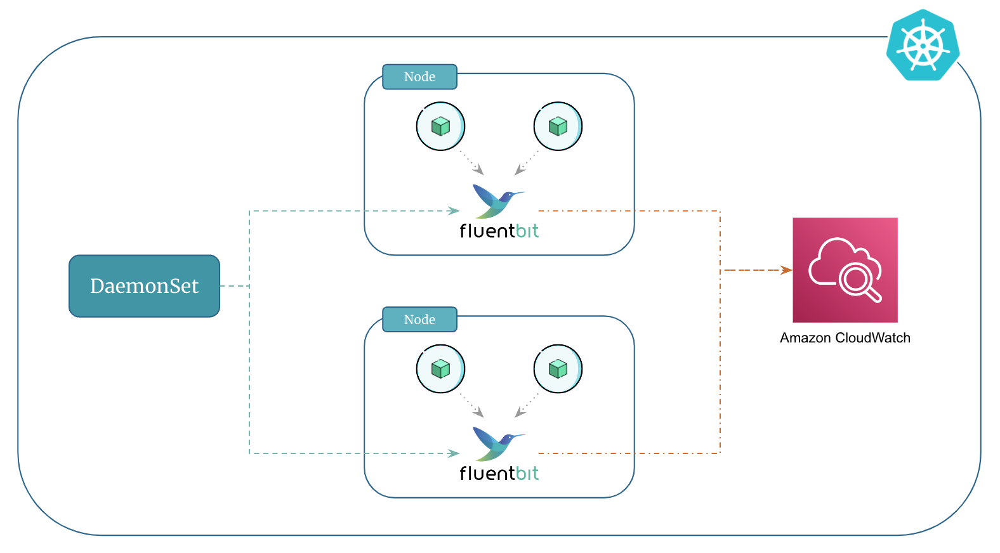

# Kubernetes Logging Using Fluent Bit and Amazon CloudWatch

To send logs from your containers running in kubernetes to Amazon CloudWatch, you can use `Fluent Bit` or `Fluentd`.

`Fluentd` is a versatile log collector that gathers logs from different places and sends them to databases or other tools like Kafka, Elasticsearch, CloudWatch, InfluxDB, etc. It's highly adaptable and works well in complex setups.

`Fluent Bit` is a lightweight counterpart to `Fluentd` ideal for places where resources are limited, like in edge computing or kubernetes environments. It efficiently processes and sends logs while using very little memory.

In this course we will use Fluent Bit for logging due to the following reasons:

1. `Fluent Bit` has a smaller resource footprint and is more resource efficient with memory and CPU usage than `FluentD`
2. The `Fluent Bit` image is developed and maintained by AWS. This gives AWS the ability to adopt new Fluent Bit image features and respond to issues much quicker.

Additionally, Amazon CloudWatch will serve as the output for Fluent Bit. This means that Fluent Bit, running as a [DaemonSet]{:target="_blank"}, will collect logs from containers on each node and then send them to CloudWatch.

<p align="center">
    
</p>


## Prerequisites

The IAM role that is attached to the worker nodes must have sufficient permissions which allows Fluent Bit to ship logs to CloudWatch.

In our case the worker nodes already have the required permissions. Remember the `cloudwatch` IAM add-on policies that we used when we created the EKS cluster using `eksctl`.


## Set Up and Deploy Fluent Bit

1. Create Namespace:

    First, create a namespace called `amazon-cloudwatch` as follows:

    ```
    kubectl apply -f https://raw.githubusercontent.com/aws-samples/amazon-cloudwatch-container-insights/latest/k8s-deployment-manifest-templates/deployment-mode/daemonset/container-insights-monitoring/cloudwatch-namespace.yaml
    ```

2. Create ConfigMap for Fluent Bit:

    Run the following command to create a ConfigMap named `cluster-info` with the cluster name and the Region to send logs to. Replace `cluster-name` and `cluster-region` with your EKS cluster's name and Region.

    ```
    # Set variables
    ClusterName=<cluster-name>
    RegionName=<cluster-region>
    FluentBitHttpPort='2020'
    FluentBitReadFromHead='Off'
    [[ ${FluentBitReadFromHead} = 'On' ]] && FluentBitReadFromTail='Off'|| FluentBitReadFromTail='On'
    [[ -z ${FluentBitHttpPort} ]] && FluentBitHttpServer='Off' || FluentBitHttpServer='On'

    # Create ConfigMap
    kubectl create configmap fluent-bit-cluster-info \
    --from-literal=cluster.name=${ClusterName} \
    --from-literal=http.server=${FluentBitHttpServer} \
    --from-literal=http.port=${FluentBitHttpPort} \
    --from-literal=read.head=${FluentBitReadFromHead} \
    --from-literal=read.tail=${FluentBitReadFromTail} \
    --from-literal=logs.region=${RegionName} -n amazon-cloudwatch
    ```

    Verify if the ConfigMap was created as expected:

    ```
    # List configmaps in amazon-cloudwatch namespace 
    kubectl get configmap -n amazon-cloudwatch

    # View the content of the configmap
    kubectl get configmap fluent-bit-cluster-info -n amazon-cloudwatch -o yaml
    ```

3. Deploy Fluent Bit DaemonSet to the Cluster:

    ```
    kubectl apply -f https://raw.githubusercontent.com/aws-samples/amazon-cloudwatch-container-insights/latest/k8s-deployment-manifest-templates/deployment-mode/daemonset/container-insights-monitoring/fluent-bit/fluent-bit.yaml
    ```

    Validate the deployment by entering the following command. Each node should have one pod named `fluent-bit-*`:

    ```
    kubectl get pods -n amazon-cloudwatch
    ```

## Verify the Fluent Bit setup

1. Open the CloudWatch console.

2. In the navigation pane, choose Log groups.

3. Make sure that you're in the Region where you deployed Fluent Bit.

4. Check the list of log groups in the Region. You should see the following:

    - `/aws/containerinsights/Cluster_Name/application`
    - `/aws/containerinsights/Cluster_Name/host`
    - `/aws/containerinsights/Cluster_Name/dataplane`

5. Navigate to one of these log groups and check the Last Event Time for the log streams. If it is recent relative to when you deployed Fluent Bit, the setup is verified.

    !!! note
        There might be a slight delay in creating the `/dataplane` log group. This is normal as these log groups only get created when Fluent Bit starts sending logs for that log group.


## Filter Log Events From a Particular Namespace

1. Navigate to the log group named `/aws/containerinsights/Cluster_Name/application` in CloudWatch console.

2. In the Filter events search bar add the following filter to view logs from a particular namespace (`backend` in this case).

    ```
    { $.kubernetes.namespace_name = "backend" }
    ```

!!! tip
    Make sure the [microservices]{:target="_blank"} from the previous section are up and running in your cluster. These microservices will generate logs that you can subsequently access and view in CloudWatch.


## Filter Log Events From a Multiple Namespaces

1. Navigate to the log group named `/aws/containerinsights/Cluster_Name/application` in CloudWatch console.

2. In the Filter events search bar add the following filter to view logs from a multiple namespaces (`mongodb`, `backend`, and `frontend` in this case).

    ```
    { $.kubernetes.namespace_name = "mongodb" || $.kubernetes.namespace_name = "backend" || $.kubernetes.namespace_name = "frontend" }
    ```


!!! quote "References:"
    !!! quote ""
        * [Send logs to CloudWatch Logs]{:target="_blank"}
        * [Set up Fluent Bit as a DaemonSet to send logs to CloudWatch Logs]{:target="_blank"}


<!-- Hyperlinks -->
[DaemonSet]: https://kloudkoncepts.com/kubernetes-on-eks/kubernetes-fundamentals/daemonset/introduction-to-daemonset/
[Send logs to CloudWatch Logs]: https://docs.aws.amazon.com/AmazonCloudWatch/latest/monitoring/Container-Insights-EKS-logs.html
[Set up Fluent Bit as a DaemonSet to send logs to CloudWatch Logs]: https://docs.aws.amazon.com/AmazonCloudWatch/latest/monitoring/Container-Insights-setup-logs-FluentBit.html
[GitHub - aws-samples/amazon-cloudwatch-container-insights]: https://github.com/aws-samples
[microservices]: https://kloudkoncepts.com/kubernetes-on-eks/microservices/deploy-microservices-in-kubernetes/