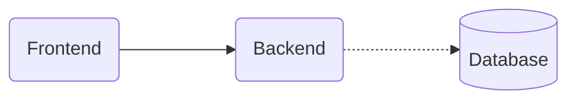
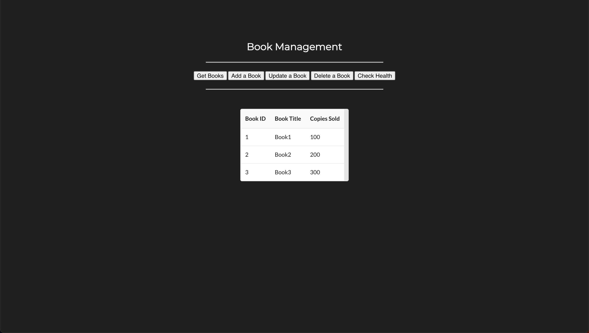
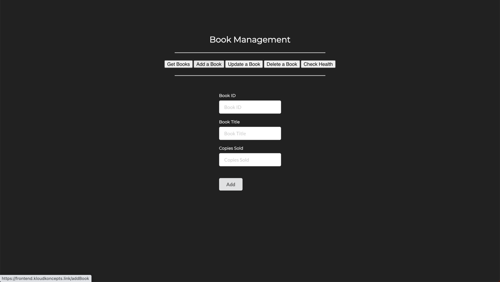
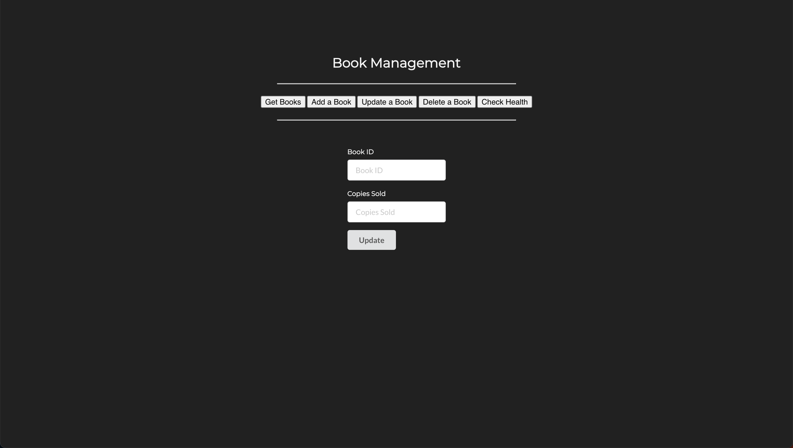
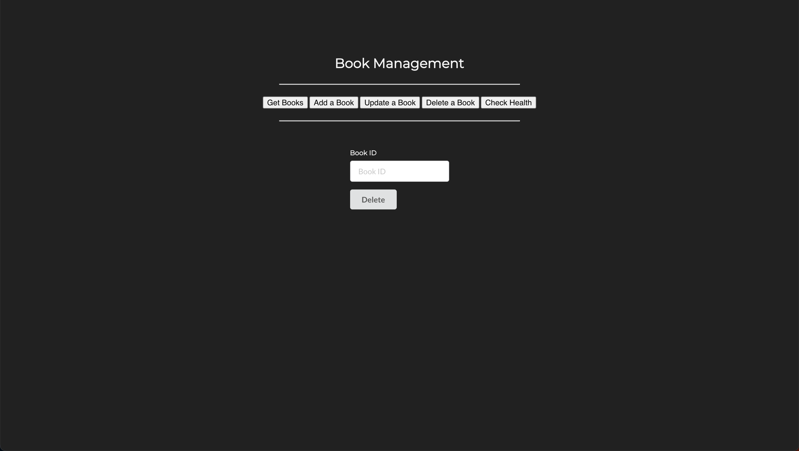
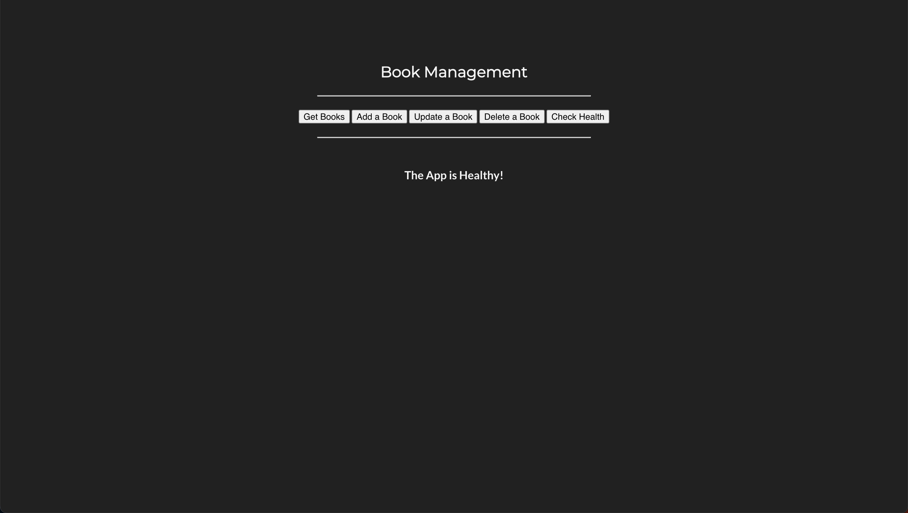

# Deploy Microservices in Kubernetes

Now that we have a good understanding of kubernetes and related AWS services, let's deploy a few microservices in our EKS kubernetes cluster.


## Prerequisite

To follow this tutorial, you'll require a domain and, additionally, an SSL certificate for the domain and its subdomains.

1. Register a Route 53 Domain

    Go to AWS Console and register a Route 53 domain. You can opt for a cheaper TLD (top level domain) such as `.link`

    !!! note
        It usually takes about 10 minutes but it might take about an hour for the registered domain to become available.

2. Request a Public Certificate

    Visit AWS Certificate Manager in AWS Console and request a public certificate for your domain and all the subdomains. For example, if you registered for a domain `example.com` then request certificate for `example.com` and `*.example.com`

    !!! note
        Make sure you request the certificate in the region where your EKS cluster is in.

3. Validate the Certificate

    Validate the requested certificate by adding `CNAME` records in Route 53. It is a very simple process. Go to the certificate you created and click on `Create records in Route 53`. The `CNAMEs` will be automatically added to Route 53.

    !!! note
        It usually takes about 5 minutes but it might take about an hour for the certificate to be ready for use.


Now that you have everything you need, let's move on to the demonstration.


## Docker Images

Here are the Docker Images used in this tutorial:

- [reyanshkharga/nodeapp:mongo]{:target="_blank"}
- [reyanshkharga/reactapp:v1]{:target="_blank"}
- [mongo:5.0.2]{:target="_blank"}

!!! note
    1. `reyanshkharga/nodeapp:mongo` is a Node.js backend application that uses MongoDB to store and retrieve data.

        Environment Variables:

        - `MONGODB_URI` (Required)
        - `POD_NAME` (Optional)
        
        Tha app has the following routes:

        - `GET /` Returns a JSON object containing `Host` and `Version`. If the `POD_NAME` environment variable is set, the value of the `Host` will be the value of the variable.
        - `GET /health` Returns health status of the app
        - `GET /random` Returns a randomly generated number between 1 and 10
        - `GET /books` Returns the list of books
        - `POST /addBook` Adds a book
        - `POST /updateBook` Updates the `copies_sold` value for the given book `id`.
        - `POST /deleteBook` Deletes the book record that matches the given id.

        Sample body for `POST /addBook`:

        ```json
        {
          "id": 1,
          "title": "Book1",
          "copies_sold": 0
        }
        ```

        Sample body for `POST /updateBook`:

        ```json
        {
          "id": 1,
          "copies_sold": 100
        }
        ```

        Sample body for `POST /deleteBook`:

        ```json
        {
          "id": 1
        }
        ```
    2. `reyanshkharga/reactapp:v1` is a React application. It's a frontend application that interacts with `reyanshkharga/nodeapp:mongo` backend to perform the CRUD operation.

        Environment variables:

        - `REACT_APP_API_ENDPOINT` (Optional)

        The environment variable `REACT_APP_API_ENDPOINT` is optional. If provided, you will be able to do the CRUD operations.

    3. `mongo:5.0.2` is MongoDB database. Our backend will use it to store and retrieve data to perform CRUD operations.


## Objective

We are going to deploy the following microservices on our EKS kubernetes cluster:

1. `MongoDB Database microservice`: uses docker image `mongo:5.0.2`
2. `Node.js Backend microservice`: uses docker image `reyanshkharga/nodeapp:mongo`
3. `React Frontend microservice`: uses docker image `reyanshkharga/reactapp:v1`


The following diagram illustrates the communication between microservices:




!!! note
    We will use the same load balancer for both backend and frontend microservices because using more load balancers will be expensive since load balancers are charged hourly. We can achieve this using [IngressGroup]{:target="_blank"}.


## Step 1: Deploy MongoDB Database Microservice

Let's create the kubernetes objects for our MongoDB database microservice as follows:

=== ":octicons-file-code-16: `00-namespace.yml`"

    ```yaml linenums="1"
    apiVersion: v1
    kind: Namespace
    metadata:
      name: mongodb
    ```

=== ":octicons-file-code-16: `storageclass.yml`"

    ```yaml linenums="1"
    apiVersion: storage.k8s.io/v1
    kind: StorageClass
    metadata:
      name: mongodb-storageclass
    provisioner: ebs.csi.aws.com
    parameters:
      type: gp3
      tagSpecification_1: "Name=eks-mongodb-storage"
      tagSpecification_2: "CreatedBy=aws-ebs-csi-driver"
    reclaimPolicy: Delete
    ```

=== ":octicons-file-code-16: `pvc.yml`"

    ```yaml linenums="1"
    apiVersion: v1
    kind: PersistentVolumeClaim
    metadata:
      name: mongodb-pvc
      namespace: mongodb
    spec:
      accessModes:
        - ReadWriteOnce
      storageClassName: mongodb-storageclass
      resources:
        requests:
          storage: 4Gi
    ```

=== ":octicons-file-code-16: `deployment-and-service.yml`"

    ```yaml linenums="1"
    # Deployment
    apiVersion: apps/v1
    kind: Deployment
    metadata:
      name: mongodb-deployment
      namespace: mongodb
    spec:
      replicas: 1
      selector:
        matchLabels:
          app: mongodb
      template:
        metadata:
          labels:
            app: mongodb
        spec:
          containers:
          - name: mongodb
            image: mongo:5.0.2
            ports:
              - containerPort: 27017
            volumeMounts:
            - name: mongodb-storage
              mountPath: /data/db
          volumes:
          - name: mongodb-storage
            persistentVolumeClaim:
              claimName: mongodb-pvc
    ---
    # Service
    apiVersion: v1
    kind: Service
    metadata:
      name: mongodb-service
      namespace: mongodb
    spec:
      type: ClusterIP
      selector:
        app: mongodb
      ports:
        - port: 27017
          targetPort: 27017
    ```

Assuming your folder structure looks like the one below:

```
|-- manifests
|   |-- mongodb
│   |   |-- 00-namespace.yml
│   |   |-- deployment-and-service.yml
│   |   |-- storageclass.yml
│   |   |-- pvc.yml
```

Let's apply the manifests to create the kubernetes objects for MongoDB database microservice:

```
kubectl apply -f mongodb/
```

This will create the following kubernetes objects:

1. A namespace named `mongodb`
2. A `StorageClass` (SC) for [dynamic provisioning]{:target="_blank"} of persistent volume
3. A `PersistentVolumeClaim` (PVC) in the `mongodb` namespace
4. MongoDB deployment in the `mongodb` namespace
5. MongoDB service in the `mongodb` namespace

!!! note
    The order in which yaml files are applied doesn't matter since every relation except namespace is handled by label selectors, so it fixes itself once all resources are deployed.

We are using Amazon EBS to persist the MongoDB data. EBS is provisioned dynamically using AWS EBS-CSI driver.

With [persistent volume]{:target="_blank"} even if the MongoDB pod goes down the data will remain intact. When the new pod comes up we'll have the access to the same data.


Verify if the resources were created successfully:

```
# List all resources in mongodb namespace
kubectl get all -n mongodb

# List StorageClass
kubectl get sc

# List PersistentVolume
kubectl get pv

# List PersistenvVolumeClaim
kubectl get pvc -n mongodb
```

Verify if MongoDB is working as expected:

```
# Start a shell session inside the mongodb container
kubectl exec -it <mongodb-pod-name> -n mongodb -- bash

# Start the mongo Shell to interact with MongoDB
mongo

# List Databases
show dbs

# Switch to a Database
use <db-name>

# List collections
show collections
```


## Step 2: Deploy Node.js Backend Microservice

Let's create the kubernetes objects for our Node.js backend microservice as follows:

=== ":octicons-file-code-16: `00-namespace.yml`"

    ```yaml linenums="1"
    apiVersion: v1
    kind: Namespace
    metadata:
      name: backend
    ```

=== ":octicons-file-code-16: `deployment-and-service.yml`"

    ```yaml linenums="1"
    # Deployment
    apiVersion: apps/v1
    kind: Deployment
    metadata:
      name: backend-deployment
      namespace: backend
    spec:
      replicas: 1
      selector:
        matchLabels:
          app: backend
      template:
        metadata:
          labels:
            app: backend
        spec:
          containers:
          - name: nodeapp
            image: reyanshkharga/nodeapp:mongo
            imagePullPolicy: Always
            ports:
              - containerPort: 5000
            env:
            - name: MONGODB_URI
              # <service-name>.<namespace>.svc.cluster.local
              value: mongodb://mongodb-service.mongodb.svc.cluster.local:27017
    ---
    # Service
    apiVersion: v1
    kind: Service
    metadata:
      name: backend-service
      namespace: backend
    spec:
      type: ClusterIP
      selector:
        app: backend
      ports:
        - port: 5000
          targetPort: 5000
    ```

=== ":octicons-file-code-16: `ingress.yml`"

    ```yaml linenums="1"
    apiVersion: networking.k8s.io/v1
    kind: Ingress
    metadata:
      name: backend-ingress
      namespace: backend
      annotations:
        # Load Balancer Annotations
        alb.ingress.kubernetes.io/scheme: internet-facing
        alb.ingress.kubernetes.io/load-balancer-name: my-load-balancer
        alb.ingress.kubernetes.io/target-type: ip
        # Health Check Annotations
        alb.ingress.kubernetes.io/healthcheck-protocol: HTTP
        alb.ingress.kubernetes.io/healthcheck-port: traffic-port
        alb.ingress.kubernetes.io/healthcheck-path: /health
        alb.ingress.kubernetes.io/healthcheck-interval-seconds: '5'
        alb.ingress.kubernetes.io/healthcheck-timeout-seconds: '2'
        alb.ingress.kubernetes.io/success-codes: '200'
        alb.ingress.kubernetes.io/healthy-threshold-count: '2'
        alb.ingress.kubernetes.io/unhealthy-threshold-count: '2'
        # Listerner Ports Annotation
        alb.ingress.kubernetes.io/listen-ports: '[{"HTTP": 80}, {"HTTPS": 443}]'
        # SSL Redicrect Annotation
        alb.ingress.kubernetes.io/ssl-redirect: '443'
        # IngressGroup
        alb.ingress.kubernetes.io/group.name: my-group
    spec:
      ingressClassName: alb
      rules:
      - host: backend.example.com
        http:
          paths:
          - path: /
            pathType: Prefix
            backend:
              service:
                name: backend-service
                port:
                  number: 5000
    ```


Assuming your folder structure looks like the one below:

```
|-- manifests
|   |-- backend
│   |   |-- 00-namespace.yml
│   |   |-- deployment-and-service.yml
│   |   |-- ingress.yml
```

Let's apply the manifests to create the kubernetes objects for Node.js backend microservice:

```
kubectl apply -f backend/
```

This will create the following kubernetes objects:

1. A namespace named `backend`
2. Backend deployment in the `backend` namespace
3. Backend service in the `backend` namespace
4. Ingress for backend service


The ingress creates an internet-facing load balancer and the SSL certificate is attached to the load balancer.

Note that the certificate is automatically discovered with hostnames from the ingress resource. Also, a Route 53 record is added for the host. This is all done by the [AWS Load Balancer Controller]{:target="_blank"} and [ExternalDNS]{:target="_blank"}.

Verify if the resources were created successfully:

```
# List all resources in backend namespace
kubectl get all -n backend

# List ingress in backend namespace
kubectl get ing -n backend
```

Go to AWS console and verify if the load balancer was created and a record was added to Route 53 for the host specified in ingress.

Open any browser on your local host machine and hit the URL to access the backend service:

```
https://backend.example.com
```

!!! note
    In real world it is best to have authorization and authentication in place for the backend services that is accessible on the internet. But for the sake of simplicity we have not used any authorization or authentication for the backend service.


## Step 3: Deploy React Frontend Microservice

Let's create the kubernetes objects for our React frontend microservice as follows:

=== ":octicons-file-code-16: `00-namespace.yml`"

    ```yaml linenums="1"
    apiVersion: v1
    kind: Namespace
    metadata:
      name: frontend
    ```

=== ":octicons-file-code-16: `deployment-and-service.yml`"

    ```yaml linenums="1"
    # Deployment
    apiVersion: apps/v1
    kind: Deployment
    metadata:
      name: frontend-deployment
      namespace: frontend
    spec:
      replicas: 1
      selector:
        matchLabels:
          app: frontend
      template:
        metadata:
          labels:
            app: frontend
        spec:
          containers:
          - name: reactapp
            image: reyanshkharga/reactapp:v1
            imagePullPolicy: Always
            ports:
              - containerPort: 3000
            env:
            - name: REACT_APP_API_ENDPOINT
              value: https://backend.example.com
    ---
    # Service
    apiVersion: v1
    kind: Service
    metadata:
      name: frontend-service
      namespace: frontend
    spec:
      type: ClusterIP
      selector:
        app: frontend
      ports:
        - port: 3000
          targetPort: 3000
    ```

=== ":octicons-file-code-16: `ingress.yml`"

    ```yaml linenums="1"
    apiVersion: networking.k8s.io/v1
    kind: Ingress
    metadata:
      name: frontend-ingress
      namespace: frontend
      annotations:
        # Load Balancer Annotations
        alb.ingress.kubernetes.io/scheme: internet-facing
        alb.ingress.kubernetes.io/load-balancer-name: my-load-balancer
        alb.ingress.kubernetes.io/target-type: ip
        # Health Check Annotations
        alb.ingress.kubernetes.io/healthcheck-protocol: HTTP
        alb.ingress.kubernetes.io/healthcheck-port: traffic-port
        alb.ingress.kubernetes.io/healthcheck-path: /
        alb.ingress.kubernetes.io/healthcheck-interval-seconds: '5'
        alb.ingress.kubernetes.io/healthcheck-timeout-seconds: '2'
        alb.ingress.kubernetes.io/success-codes: '200'
        alb.ingress.kubernetes.io/healthy-threshold-count: '2'
        alb.ingress.kubernetes.io/unhealthy-threshold-count: '2'
        # Listerner Ports Annotation
        alb.ingress.kubernetes.io/listen-ports: '[{"HTTP": 80}, {"HTTPS": 443}]'
        # SSL Redicrect Annotation
        alb.ingress.kubernetes.io/ssl-redirect: '443'
        # IngressGroup
        alb.ingress.kubernetes.io/group.name: my-group
    spec:
      ingressClassName: alb
      rules:
      - host: frontend.example.com
        http:
          paths:
          - path: /
            pathType: Prefix
            backend:
              service:
                name: frontend-service
                port:
                  number: 3000
    ```


Assuming your folder structure looks like the one below:

```
|-- manifests
|   |-- frontend
│   |   |-- 00-namespace.yml
│   |   |-- deployment-and-service.yml
│   |   |-- ingress.yml
```

Let's apply the manifests to create the kubernetes objects for React frontend microservice:

```
kubectl apply -f frontend/
```

This will create the following kubernetes objects:

1. A namespace named `frontend`
2. Frontend deployment in the `frontend` namespace
3. Frontend service in the `frontend` namespace
4. Ingress for frontend service


The ingress creates an internet-facing load balancer and the SSL certificate is attached to the load balancer.

Note that the certificate is automatically discovered with hostnames from the ingress resource. Also, a Route 53 record is added for the host. This is all done by the [AWS Load Balancer Controller]{:target="_blank"} and [ExternalDNS]{:target="_blank"}.

!!! note
    The frontend microservice uses the API provided by the backend microservice to perform the CRUD operations.

Verify if the resources were created successfully:

```
# List all resources in frontend namespace
kubectl get all -n frontend

# List ingress in frontend namespace
kubectl get ing -n frontend
```

Go to AWS console and verify if the load balancer was created and a record was added to Route 53 for the host specified in ingress.

Open any browser on your local host machine and hit the URL to access the frontend service:

```
https://frontend.example.com
```


## Step 4: Perform CRUD Operations and Verify Data in MongoDB

Access the frontend service from your browser and perform some CRUD operations as follows:

1. Get Books
2. Add a Book
3. Update a Book
4. Delete a Book
5. Check Health

=== ":octicons-image-16: `Get Books`"
    <p align="center">
        
    </p>

=== ":octicons-image-16: `Add Book`"
    <p align="center">
        
    </p>

=== ":octicons-image-16: `Update Book`"
    <p align="center">
        
    </p>

=== ":octicons-image-16: `Delete Book`"
    <p align="center">
        
    </p>

=== ":octicons-image-16: `Check Health`"
    <p align="center">
        
    </p>

Verify if the records have been inserted into the MongoDB database:

```
# Start a shell session inside the mongodb container
kubectl exec -it <mongodb-pod-name> -n mongodb -- bash

# Start the mongo Shell to interact with MongoDB
mongo

# List Databases
show dbs

# Switch to mydb database
use mydb

# List collections
show collections

# List items in the books collection
db.books.find()
```


## Clean Up

Assuming your folder structure looks like the one below:

```
|-- manifests
|   |-- mongodb
│   |   |-- 00-namespace.yml
│   |   |-- deployment-and-service.yml
│   |   |-- storageclass.yml
│   |   |-- pvc.yml
|   |-- backend
│   |   |-- 00-namespace.yml
│   |   |-- deployment-and-service.yml
│   |   |-- ingress.yml
|   |-- frontend
│   |   |-- 00-namespace.yml
│   |   |-- deployment-and-service.yml
│   |   |-- ingress.yml
```

Let's delete all the resources we created:

```
kubectl delete -f manifests/
```

All AWS resources, such as load balancers, Route 53 records, etc., created by AWS Load Balancer Controller via ingress or service objects, will also be deleted.


!!! quote "References:"
    !!! quote ""
        * [Kubernetes Resource Creation Order]{:target="_blank"}


<!-- Hyperlinks -->
[reyanshkharga/nodeapp:mongo]: https://hub.docker.com/r/reyanshkharga/nodeapp
[reyanshkharga/reactapp:v1]: https://hub.docker.com/r/reyanshkharga/reactapp
[mongo:5.0.2]: https://hub.docker.com/_/mongo
[IngressGroup]: https://kloudkoncepts.com/kubernetes-on-eks/ingress/ingress-with-ingressgroup/
[dynamic provisioning]: https://kloudkoncepts.com/kubernetes-on-eks/kubernetes-fundamentals/storage-in-kubernetes/persistent-volume-using-amazon-ebs/dynamic-provisioning-of-pv-using-ebs/
[Kubernetes Resource Creation Order]: https://stackoverflow.com/a/56009748/10065458
[persistent volume]: https://kloudkoncepts.com/kubernetes-on-eks/kubernetes-fundamentals/storage-in-kubernetes/persistent-volumes/introduction-to-persistent-volumes/
[AWS Load Balancer Controller]: https://kloudkoncepts.com/kubernetes-on-eks/ingress/aws-load-balancer-controller/introduction-to-aws-load-balancer-controller/
[ExternalDNS]: https://kloudkoncepts.com/kubernetes-on-eks/external-dns/introduction-to-external-dns/