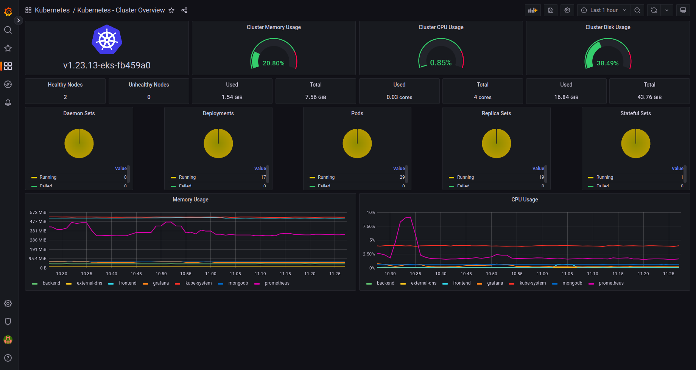
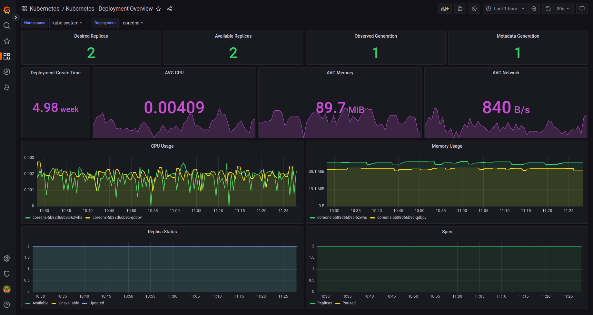
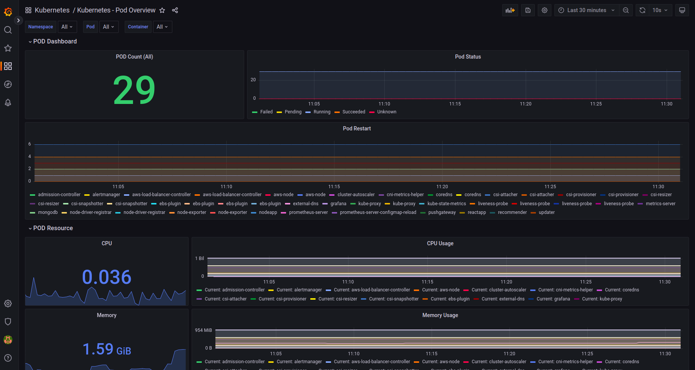
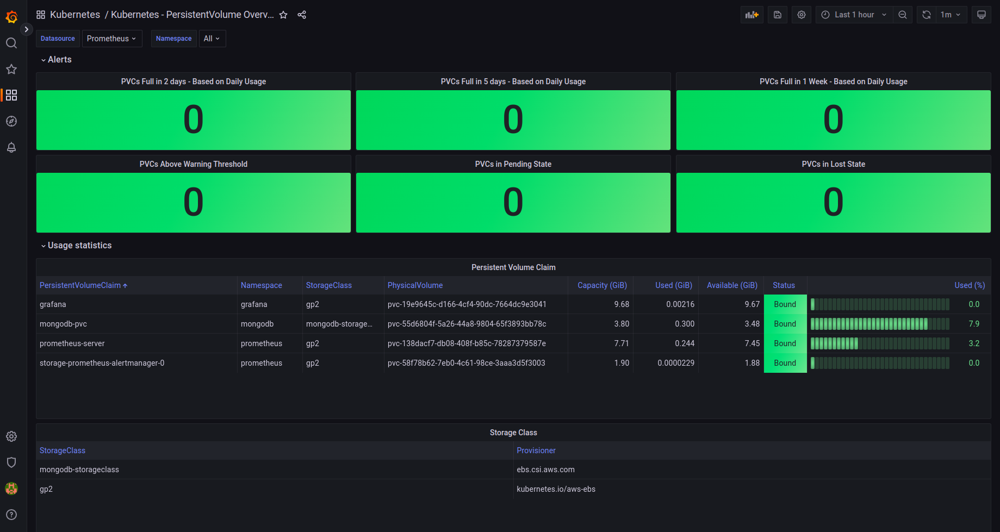
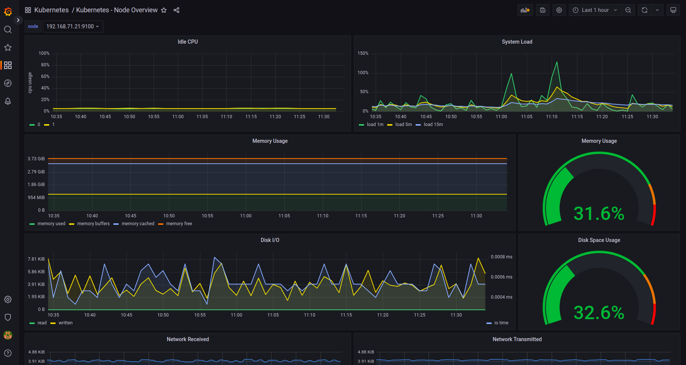

# Create Grafana Dashboards to Monitor Kubernetes

Now that we have Prometheus and Grafana set up properly. Let's create a few dashboards to visualize kubernetes metrics.

We will import community created dashboards.


## Import Dashboards Using Script

I have written a bash script that you can use to import all the required dashboards without manual effort.

=== ":octicons-file-code-16: `import-kubernetes-grafana-dashboards.sh`"

    ```bash linenums="1"
    # Address of Grafana
    GRAFANA_HOST="https://grafana.example.com"
    # Login credentials, if authentication is used
    GRAFANA_CRED="admin:RP6xkxD"
    # The name of the Prometheus data source to use
    GRAFANA_DATASOURCE="Prometheus"
    # Import all Kubernetes dashboards
    for DASHBOARD in 17682 17683 17684 17685 17686; do
        REVISION="$(curl -s https://grafana.com/api/dashboards/${DASHBOARD}/revisions -s | jq ".items[] | .revision")"
        curl -s https://grafana.com/api/dashboards/${DASHBOARD}/revisions/${REVISION}/download > /tmp/dashboard.json
        echo "Importing $(cat /tmp/dashboard.json | jq -r '.title') (revision ${REVISION}, id ${DASHBOARD})..."
        curl -s -k -u "$GRAFANA_CRED" -XPOST \
            -H "Accept: application/json" \
            -H "Content-Type: application/json" \
            -d "{\"dashboard\":$(cat /tmp/dashboard.json),\"overwrite\":true, \
                \"inputs\":[{\"name\":\"DS_PROMETHEUS\",\"type\":\"datasource\", \
                \"pluginId\":\"prometheus\",\"value\":\"$GRAFANA_DATASOURCE\"}]}" \
            $GRAFANA_HOST/api/dashboards/import
        echo -e "\nDone\n"
    done
    ```

Make sure to replace the values of `GRAFANA_HOST` and `GRAFANA_CRED` variables with the values specific to your Grafana set up.

Now, run the script to import dashboards to your Grafana:

```bash
# Give execute permission to the script
chmod +x import-kubernetes-grafana-dashboards.sh

# Execute the script
./import-kubernetes-grafana-dashboards.sh
```

Go to grafana console to verify if the dashboards were imported successfully. Also, it would be better to move these dashboards to a seperate folder called Kubernetes.


## Import Dashboards Manually

Follow the below procedures if you would like to import individual dashboards manually.

First, login to Grafana using credentials supplied during configuration. Use the username `admin` and get the `password` by running the following command:

```
kubectl get secret --namespace grafana grafana -o jsonpath="{.data.admin-password}" | base64 --decode ; echo
```

### Import Kubernetes Cluster Overview Dashboard

Follow the instructions below to create a grafana dashboard to monitor the kubernetes cluster:

1. Click on Dashboards on left panel and click `+ Import`
2. Enter [17686]{:target="_blank"} to import the dashboard
3. Click Load
4. Enter `Kubernetes - Cluster Overview` as the Dashboard name
5. Enter `Kubernetes` as the folder name. It will create the folder if it doesn't exist.
6. Select `Prometheus` as the endpoint under prometheus data sources drop down
7. Click `Import`
8. Save the dashboard by clicking the `Save dashboard` icon on the top right corner

This will dispaly an overview of the kubernetes cluster. The dashboard should look something like this:

<p align="center">
    
</p>


### Import Kubernetes Deployment Overview Dashboard

Follow the instructions below to create a grafana dashboard to monitor the kubernetes cluster:

1. Click on Dashboards on left panel and click `+ Import`
2. Enter [17685]{:target="_blank"} to import the dashboard
3. Click Load
4. Enter `Kubernetes - Deployment Overview` as the Dashboard name
5. Enter `Kubernetes` as the folder name. It will create the folder if it doesn't exist.
6. Select `Prometheus` as the endpoint under prometheus data sources drop down
7. Click `Import`
8. Save the dashboard by clicking the `Save dashboard` icon on the top right corner

This will dispaly an overview of the kubernetes deployments in the cluster. The dashboard should look something like this:

<p align="center">
    
</p>


### Import Kubernetes Pod Overview Dashboard

Follow the instructions below to create a grafana dashboard to monitor the kubernetes pods:

1. Click on Dashboards on left panel and click `+ Import`
2. Enter [17684]{:target="_blank"} to import the dashboard
3. Click Load
4. Enter `Kubernetes - Pod Overview` as the Dashboard name
5. Enter `Kubernetes` as the folder name. It will create the folder if it doesn't exist.
6. Select `Prometheus` as the endpoint under prometheus data sources drop down
7. Click `Import`
8. Save the dashboard by clicking the `Save dashboard` icon on the top right corner

This will dispaly an overview of the kubernetes pods in the cluster. The dashboard should look something like this:

<p align="center">
    
</p>


### Import Kubernetes PersistentVolume Overview Dashboard

Follow the instructions below to create a grafana dashboard to monitor the kubernetes persistent volumes:

1. Click on Dashboards on left panel and click `+ Import`
2. Enter [17682]{:target="_blank"} to import the dashboard
3. Click Load
4. Enter `Kubernetes - PersistentVolume Overview` as the Dashboard name
5. Enter `Kubernetes` as the folder name. It will create the folder if it doesn't exist.
6. Select `Prometheus` as the endpoint under prometheus data sources drop down
7. Click `Import`
8. Save the dashboard by clicking the `Save dashboard` icon on the top right corner

This will dispaly an overview of the kubernetes persistent volumes in the cluster. The dashboard should look something like this:

<p align="center">
    
</p>


### Import Kubernetes Node Overview Dashboard

Follow the instructions below to create a grafana dashboard to monitor the kubernetes nodes:

1. Click on Dashboards on left panel and click `+ Import`
2. Enter [17683]{:target="_blank"} to import the dashboard
3. Click Load
4. Enter `Kubernetes - Node Overview` as the Dashboard name
5. Enter `Kubernetes` as the folder name. It will create the folder if it doesn't exist.
6. Select `Prometheus` as the endpoint under prometheus data sources drop down
7. Click `Import`
8. Save the dashboard by clicking the `Save dashboard` icon on the top right corner

This will dispaly an overview of the kubernetes nodes in the cluster. The dashboard should look something like this:

<p align="center">
    
</p>


!!! quote "References:"
    !!! quote ""
        * [Grafana Dashboards for Kubernetes - By Reyansh Kharga]{:target="_blank"}
        * [Kubernetes Persistent Volume Dashboard Credit]{:target="_blank"}
        * [Kubernetes Nodes Overview Dashboard Credit]{:target="_blank"}


<!-- Hyperlinks -->
[17682]: https://grafana.com/grafana/dashboards/17682
[17683]: https://grafana.com/grafana/dashboards/17683
[17684]: https://grafana.com/grafana/dashboards/17684
[17685]: https://grafana.com/grafana/dashboards/17685
[17686]: https://grafana.com/grafana/dashboards/17686
[Grafana Dashboards for Kubernetes - By Reyansh Kharga]: https://grafana.com/orgs/reyanshkharga/dashboards
[Kubernetes Persistent Volume Dashboard Credit]: https://grafana.com/orgs/navsharma0491
[Kubernetes Nodes Overview Dashboard Credit]: https://grafana.com/orgs/kiddouk