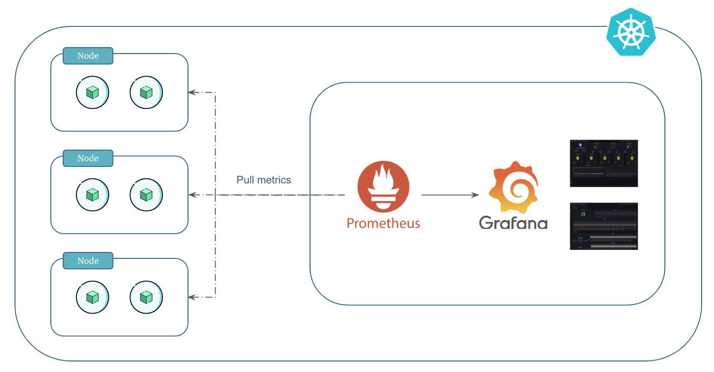
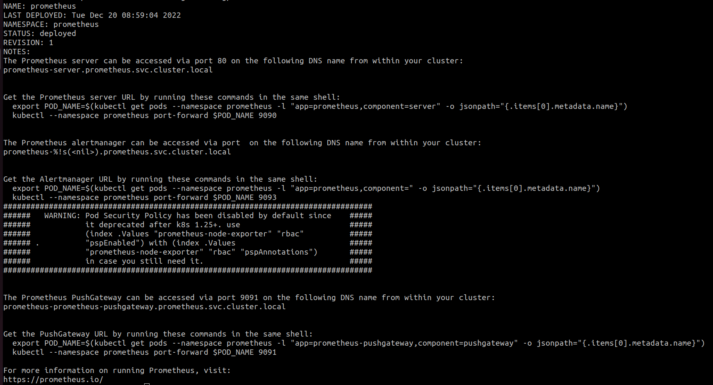
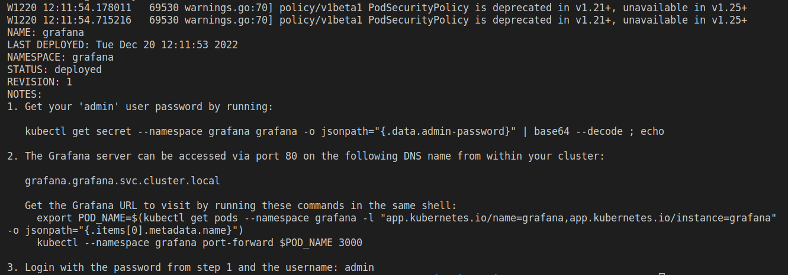

# Monitoring Kubernetes Using Prometheus and Grafana

We can use Prometheus and Grafana to monitor kubernetes resources, workloads and other metrics.

Prometheus and Grafana form a powerful duo for monitoring Kubernetes. They aid in tracking resource utilization, workload performance, and diverse metrics critical for maintaining cluster health.


## What is Prometheus?

Prometheus is a monitoring solution for storing time series data like metrics. It operates by periodically scraping metrics from configured targets using a pull-based model.

The core components of Prometheus include the `Prometheus Server`, which stores time-series data, a multidimensional data model, `service discovery` for dynamic target identification, and an `Alert Manager` for alerting based on predefined rules.

Using `PromQL`, users query and analyze metrics, while exporters facilitate the exposure of specific metrics from various systems.


## What is Grafana?

Grafana is a visualization and monitoring tool, offering a user-friendly interface to create dashboards and analyze data from various sources, including Prometheus.

Its key components include versatile dashboard creation, data source integration (like Prometheus), and a rich library of plugins for extended functionality.

Grafana simplifies complex data visualization, enabling users to build insightful, customizable dashboards that display metrics from multiple sources.


## Metrics and Exporters

Kubernetes exposes some basic metrics by default through an endpoint named `/metrics`. These metrics include information about the state of the kubernetes components and resources, such as the number of running pods, CPU and memory usage, API server latency, and more. 

the `/metrics` endpoint is accessible on the kubernetes API server and provides valuable insights into the cluster's health and performance. These metrics can be utilized by monitoring tools like Prometheus to gather information and create visualizations for better cluster management.

<p align="center">
    
</p>

You can also set up custom exporters in kubernetes to capture custom metrics from your applications or services. These tailored tools expand monitoring capabilities, providing detailed insights beyond the standard metrics, addressing your specific monitoring needs.


## Prerequisites

We will use `helm` to install Prometheus and Grafana monitoring tools. So, make sure `helm` is installed on your local machine.


## Step 1: Add Prometheus and Grafana Helm Repository

```
# Add prometheus Helm repo
helm repo add prometheus-community https://prometheus-community.github.io/helm-charts

# Add grafana Helm repo
helm repo add grafana https://grafana.github.io/helm-charts
```


## Step 2: Deploy Prometheus

Let's deploy Prometheus in our EKS kubernetes cluster.

### 1. Install Prometheus

In this example, we are primarily going to use the standard configuration. In production you might want to override default [prometheus values]{:target="_blank"} using `--set` command.

```
# Create namespace
kubectl create namespace prometheus

# Install prometheus
helm install prometheus prometheus-community/prometheus --namespace prometheus --set server.persistentVolume.size=20Gi --set server.retention=15d
```

The output should look something like this:

<p align="center">
    
</p>

Make note of the prometheus endpoint in helm response (you will need this later). It should look similar to below:

```
The Prometheus server can be accessed via port 80 on the following DNS name from within your cluster:
prometheus-server.prometheus.svc.cluster.local
```


### 2. Verify Prometheus Components

Verify if Prometheus components were deployed as expected:

```
# List helm installations
helm list -n prometheus

# List all resources
kubectl get all -n prometheus
```


### 3. Verify EBS Volumes

When you install prometheus using helm, it dynamically provisions two EBS volumes as follows:

1. EBS volume of size `8 Gi` for `prometheus-server`
2. EBS volume of size `2 Gi` for `prometheus-alertmanager`

Go to AWS console and verify if the EBS volumes were created. You can also add `Name` tags manually to the EBS volumes to make it easier to reconize the purpose of the voumes.

Note that in our installation we have overriden the default `8 Gi` setting for `prometheus-server` to `20 Gi` using the `--set` command.


### 4. Access Prometheus Server

Let's use the `kubectl port-forward` command to access Prometheus on our local host machine as follows:

```
kubectl port-forward -n prometheus deploy/prometheus-server 8080:9090
```

This forwards the port `9090` of the container to port `8080` on local host machine.

Open any browser on your local host machine and hit `localhost:8080`. You will see the Prometheus UI.

Prometheus collects node, pods, and service metrics automatically using Prometheus service discovery configurations.

Click on `Status -> Targets` to view the targets that Prometheus registered. You can see the following targets:

- `kubernetes-nodes`
- `kubernetes-pods`
- `kubernetes-service-endpoints`


### 5. Create Ingress for Prometheus

We will use AWS load balancer and subdomain to access Prometheus. For that we are going to create an ingress resource.

=== ":octicons-file-code-16: `prometheus-ingress.yml`"

    ```yaml linenums="1"
    apiVersion: networking.k8s.io/v1
    kind: Ingress
    metadata:
      name: prometheus-ingress
      namespace: prometheus
      annotations:
        # Load Balancer Annotations
        alb.ingress.kubernetes.io/scheme: internet-facing
        alb.ingress.kubernetes.io/load-balancer-name: my-load-balancer
        alb.ingress.kubernetes.io/target-type: ip
        # Health Check Annotations
        alb.ingress.kubernetes.io/healthcheck-protocol: HTTP
        alb.ingress.kubernetes.io/healthcheck-port: traffic-port
        alb.ingress.kubernetes.io/healthcheck-path: /
        alb.ingress.kubernetes.io/healthcheck-interval-seconds: '5'
        alb.ingress.kubernetes.io/healthcheck-timeout-seconds: '2'
        alb.ingress.kubernetes.io/success-codes: '200'
        alb.ingress.kubernetes.io/healthy-threshold-count: '2'
        alb.ingress.kubernetes.io/unhealthy-threshold-count: '2'
        # Listerner Ports Annotation
        alb.ingress.kubernetes.io/listen-ports: '[{"HTTP": 80}, {"HTTPS": 443}]'
        # SSL Redicrect Annotation
        alb.ingress.kubernetes.io/ssl-redirect: '443'
        # IngressGroup
        alb.ingress.kubernetes.io/group.name: my-group
    spec:
      ingressClassName: alb
      rules:
      - host: prometheus.example.com
        http:
          paths:
          - path: /
            pathType: Prefix
            backend:
              service:
                name: prometheus-server
                port:
                  number: 80
    ```

Apply the manifest to create ingress for Prometheus:

```
kubectl apply -f prometheus-ingress.yml
```

Verify ingress:

```
kubectl get ingress -n prometheus
```

!!! note
    We are using an ingress group for load balancer to have a shared load balancer because using more load balancers will be expensive since load balancers are charged hourly.

The ingress uses an existing internet-facing load balancer from another ingress in the same group. If there isn't one, it'll create a new load balancer and attach the SSL certificate to it.

Note that the certificate is automatically discovered with hostnames from the ingress resource. Also, a Route 53 record is added for the host. This is all done by the [AWS Load Balancer Controller]{:target="_blank"} and [ExternalDNS]{:target="_blank"}.

Open any browser on your local host machine and hit the Prometheus host URL to access prometheus:

```
https://prometheus.example.com
```

## Step 3: Deploy Grafana

Now that Prometheus is ready, let's deploy Grafana for visualization.

In this example, we are primarily going to use the default values but we are also overriding several parameters. In production you might want to override other [grafana values]{:target="_blank"} using `--set` command.

### 1. Create Prometheus Data Source for Grafana

First, create a YAML file called `grafana.yaml` as follows:

=== ":octicons-file-code-16: `grafana.yaml`"

    ```yaml linenums="1"
    datasources:
      datasources.yaml:
        apiVersion: 1
        datasources:
        - name: Prometheus
          type: prometheus
          url: http://prometheus-server.prometheus.svc.cluster.local
          access: proxy
          isDefault: true
    ```

The `grafana.yaml` defines the data source that Grafana would use. In this case it is the Prometheus we deployed.

!!! note
    When services communicate in kubernetes, they need to provide the Fully Qualified Domain Name (FQDN) which has the following syntax:

    ```yaml
    <service-name>.<namespace>.svc.cluster.local
    ```
    If services are in the same namespace, using just `<service-name>` suffices for communication within the cluster.


### 2. Install Grafana

```
# Create namespace
kubectl create namespace grafana

# Install grafana
helm install grafana grafana/grafana \
    --namespace grafana \
    --set persistence.enabled=true \
    --set adminPassword='RP6xkxD' \
    --set plugins='{grafana-piechart-panel}' \
    --values grafana.yaml
```

The output should look something like this:

<p align="center">
    
</p>


### 3. Verify Grafana Installation

```
# List helm installations
helm list -n grafana

# List all resources
kubectl get all -n grafana
```

### 4. Access Grafana

Let's use the `kubectl port-forward` command to access Grafana on our local host machine as follows:

```
kubectl port-forward -n grafana deploy/grafana 8081:3000
```

This forwards the port `3000` of the container to port `8081` on local host machine.

Open any browser on your local host machine and hit `localhost:8081`. You will see the Grafana UI.

When logging in, use the username `admin` and get the `password` by running the following command:

```
kubectl get secret --namespace grafana grafana -o jsonpath="{.data.admin-password}" | base64 --decode ; echo
```

### 5. Create Ingress for Grafana

We will use AWS load balancer and subdomain to access Grafana. For that we are going to create an ingress resource.

=== ":octicons-file-code-16: `grafana-ingress.yml`"

    ```yaml linenums="1"
    apiVersion: networking.k8s.io/v1
    kind: Ingress
    metadata:
      name: grafana-ingress
      namespace: grafana
      annotations:
        # Load Balancer Annotations
        alb.ingress.kubernetes.io/scheme: internet-facing
        alb.ingress.kubernetes.io/load-balancer-name: my-load-balancer
        alb.ingress.kubernetes.io/target-type: ip
        # Health Check Annotations
        alb.ingress.kubernetes.io/healthcheck-protocol: HTTP
        alb.ingress.kubernetes.io/healthcheck-port: traffic-port
        alb.ingress.kubernetes.io/healthcheck-path: /
        alb.ingress.kubernetes.io/healthcheck-interval-seconds: '5'
        alb.ingress.kubernetes.io/healthcheck-timeout-seconds: '2'
        alb.ingress.kubernetes.io/success-codes: '200'
        alb.ingress.kubernetes.io/healthy-threshold-count: '2'
        alb.ingress.kubernetes.io/unhealthy-threshold-count: '2'
        # Listerner Ports Annotation
        alb.ingress.kubernetes.io/listen-ports: '[{"HTTP": 80}, {"HTTPS": 443}]'
        # SSL Redicrect Annotation
        alb.ingress.kubernetes.io/ssl-redirect: '443'
        # IngressGroup
        alb.ingress.kubernetes.io/group.name: my-group
    spec:
      ingressClassName: alb
      rules:
      - host: grafana.example.com
        http:
          paths:
          - path: /
            pathType: Prefix
            backend:
              service:
                name: grafana
                port:
                  number: 80
    ```

Apply the manifest to create ingress for Grafana:

```
kubectl apply -f grafana-ingress.yml
```

Verify ingress:

```
kubectl get ingress -n grafana
```

!!! note
    We are using an ingress group for load balancer to have a shared load balancer because using more load balancers will be expensive since load balancers are charged hourly.

The ingress uses an existing internet-facing load balancer from another ingress in the same group. If there isn't one, it'll create a new load balancer and attach the SSL certificate to it.

Note that the certificate is automatically discovered with hostnames from the ingress resource. Also, a Route 53 record is added for the host. This is all done by the [AWS Load Balancer Controller]{:target="_blank"} and [ExternalDNS]{:target="_blank"}.

Open any browser on your local host machine and hit the Grafana host URL to access Grafana:

```
https://grafana.example.com
```


## Clean Up

If you no longer need Prometheus and Grafana, you can use the following commands to uninstall them:

```
# Uninstall prometheus
helm uninstall prometheus -n prometheus

# Uninstall grafana
helm uninstall grafana -n grafana

# Delete namespace prometheus
kubectl delete ns prometheus

# Delete namespace grafana
kubectl delete ns grafana
```

Deleting a namespace will delete all the resources in the namespace.


## Increase Prometheus Server Persistent Volume Size

If you need more storage for `prometheus-server`, you can increase it by following the instructions below.

First we need to make sure the storageclass that the `prometheus-server` uses allows volume expansion:

```
# set nano as kube editor
export KUBE_EDITOR=nano

# Open the editor
kubectl edit sc gp2

# Edit the storageclass by adding the following line at the end
allowVolumeExpansion: true
```

Now, we can increase the prometheus server persistent volume by upgrading the helm chart:

```
# Increase prometheus-server persistent volume size
helm upgrade prometheus prometheus-community/prometheus --namespace prometheus --set server.persistentVolume.size=50Gi
```


!!! quote "References:"
    !!! quote ""
        * [Monitoring using Prometheus and Grafana]{:target="_blank"}
        * [Prometheus values.yml]{:target="_blank"}
        * [Grafana values.yml]{:target="_blank"}


<!-- Hyperlinks -->
[prometheus values]: https://github.com/prometheus-community/helm-charts/blob/main/charts/prometheus/values.yaml
[AWS Load Balancer Controller]: https://kloudkoncepts.com/kubernetes-on-eks/ingress/aws-load-balancer-controller/introduction-to-aws-load-balancer-controller/
[ExternalDNS]: https://kloudkoncepts.com/kubernetes-on-eks/external-dns/introduction-to-external-dns/
[grafana values]: https://github.com/grafana/helm-charts/blob/main/charts/grafana/values.yaml
[Monitoring using Prometheus and Grafana]: https://www.eksworkshop.com/intermediate/240_monitoring/
[Grafana values.yml]: https://github.com/grafana/helm-charts/blob/main/charts/grafana/values.yaml
[Prometheus values.yml]: https://github.com/prometheus-community/helm-charts/blob/main/charts/prometheus/values.yaml