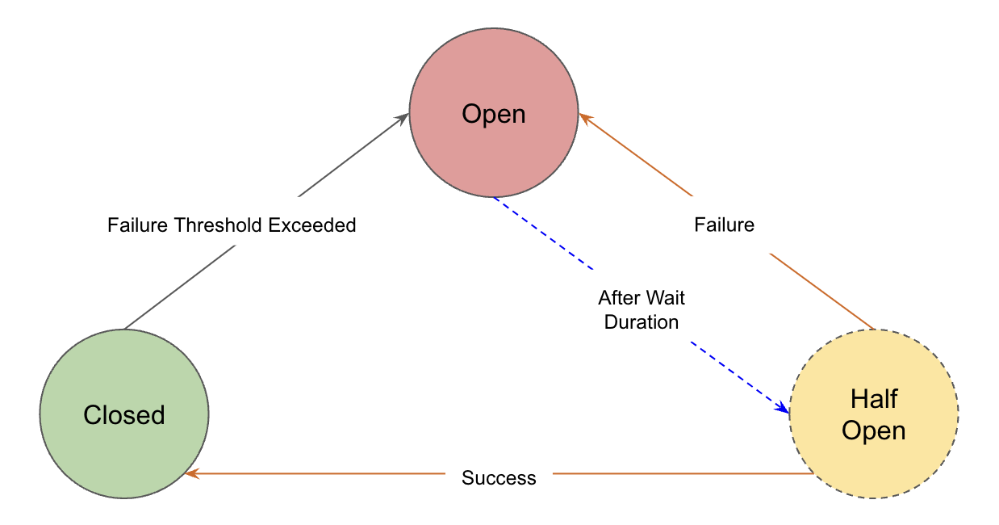

# Circuit Breaking Using Istio

Circuit breaking is an important pattern for creating resilient microservice applications. Circuit breaking allows you to write applications that limit the impact of failures, latency spikes, and other undesirable effects of network peculiarities.

circuit breaking in Istio is handled by `DestinationRule`.


## How Does Circuit Breaker Work?

A circuit breaker typically operates in three main states: `Closed`, `Open`, and `Half-Open`.

<p align="center">
    
</p>

1. **Closed**

    Normal operation, requests pass through, system monitors for issues.

    If requests are successful, it remains in the `Closed` state. However, if the Failure Threshold is exceeded, it transitions to the `Open` state.

2. **Open**

    Detected issue, blocks all incoming requests immediately.

    Once in the `Open` state, the circuit breaker undergoes a reset after a pre-defined delay. Following the reset, it transitions to the `Half-Open` state.

3. **Half-Open**

    Testing phase, allows limited requests to check if the issue is resolved before deciding to fully reopen or stay closed.

    If the request is successful, it transitions to the `Closed` state; if unsuccessful, it transitions back to the `Open` state.

Let's see it in action!


## Step 1: Deploy Application

First, let's deploy the application and other Istio components:

=== ":octicons-file-code-16: `00-namespace.yml`"

    ```yaml linenums="1"
    apiVersion: v1
    kind: Namespace
    metadata:
      name: circuit-breaker
      labels:
        istio-injection: enabled
    ```

=== ":octicons-file-code-16: `nodeapp-deployment.yml`"

    ```yaml linenums="1"
    apiVersion: apps/v1
    kind: Deployment
    metadata:
      name: nodeapp-deployment
      namespace: circuit-breaker
    spec:
      replicas: 1
      selector:
        matchLabels:
          app: nodeapp
          version: v1
      template:
        metadata:
          labels:
            app: nodeapp
            version: v1
        spec:
          containers:
          - name: nodeapp
            image: reyanshkharga/nodeapp:buggy
            imagePullPolicy: Always
            ports:
              - containerPort: 5000
    ```

=== ":octicons-file-code-16: `nodeapp-service.yml`"

    ```yaml linenums="1"
    apiVersion: v1
    kind: Service
    metadata:
      name: nodeapp-service
      namespace: circuit-breaker
    spec:
      type: ClusterIP
      selector:
        app: nodeapp
      ports:
        - port: 80
          targetPort: 5000
          name: http
    ```

=== ":octicons-file-code-16: `gateway.yml`"

    ```yaml linenums="1"
    apiVersion: networking.istio.io/v1alpha3
    kind: Gateway
    metadata:
      name: nodeapp-gateway
      namespace: circuit-breaker
    spec: 
      selector:
        istio: ingressgateway # use Istio default gateway implementation
      servers:
      - port:
          number: 80
          name: http
          protocol: HTTP
        hosts:
        - "nodeapp.example.com"
    ```

=== ":octicons-file-code-16: `destination-rule.yml`"

    ```yaml linenums="1"
    apiVersion: networking.istio.io/v1alpha3
    kind: DestinationRule
    metadata:
      name: nodeapp-destinationrule
      namespace: circuit-breaker
    spec:
      host: nodeapp-service
      trafficPolicy:
        connectionPool:
          tcp:
            maxConnections: 10             # Maximum number of HTTP1/TCP connections to a destination host. Default 2^32-1.
          http:
            http1MaxPendingRequests: 10   # Maximum number of requests that will be queued while waiting for a ready connection pool connection. Default 1024
        outlierDetection:
          consecutive5xxErrors: 1         # 1 consecutive upstream 5xx error
          interval: 1s
          baseEjectionTime: 1m            # Eject upstream host for 1 minute
          maxEjectionPercent: 100         # Eject 100% of the upstream hosts
    ```

=== ":octicons-file-code-16: `virtual-service.yml`"

    ```yaml linenums="1"
    apiVersion: networking.istio.io/v1alpha3
    kind: VirtualService
    metadata:
      name: nodeapp-virtualservice
      namespace: circuit-breaker
      annotations:
        external-dns.alpha.kubernetes.io/target: "istio-load-balancer-1556246780.ap-south-1.elb.amazonaws.com"
    spec: 
      hosts:
      - "nodeapp.example.com"
      gateways:
      - nodeapp-gateway
      http:
      - route:
        - destination:
            host: nodeapp-service
    ```

Make sure to replace the value of `external-dns.alpha.kubernetes.io/target` annotation in virtual service with the istio load balancer DNS.

!!! note
    The `reyanshkharga/nodeapp:buggy` application intermittently throws an intentional error with HTTP status code `502`.

Assuming your folder structure looks like the one below:

```
|-- manifests
│   |-- 00-namespace.yml
│   |-- nodeapp-deployment.yml
│   |-- nodeapp-service.yml
│   |-- gateway.yml
│   |-- destination-rule.yml
│   |-- virtual-service.yml
```

Let's apply the manifests to create the kubernetes and istio objects:

```
kubectl apply -f manifests/
```

Verify if the istio proxies are created for the application:

```
# Retrieve proxy configuration
istioctl proxy-config routes svc/istio-ingressgateway -n istio-system
```


## Step 2: Generate Traffic Using Fortio

Fortio is a fast, small (4Mb docker image, minimal dependencies), reusable, embeddable go library as well as a command line tool and server process, the server includes a simple web UI and REST API to trigger run and see graphical representation of the results (both a single latency graph and a multiple results comparative min, max, avg, qps and percentiles graphs).

Deploy a fortio pod as follows:

=== ":octicons-file-code-16: `fortio-traffic-generator.yml`"

    ```yaml linenums="1"
    apiVersion: v1
    kind: Pod
    metadata:
      name:  traffic-generator
      namespace: circuit-breaker
      labels:
        app: traffic-generator
        version: v1
    spec:
      containers:
      - name: fortio
        image: fortio/fortio
    ```

```
kubectl apply -f fortio-traffic-generator.yml
```

Now, let's generate traffic on our nodeapp service using fortio as follows:

```
# Set fortio pod name
export FORTIO_POD=traffic-generator

# Call nodeapp service using fortio pod (Try this multiple times)
kubectl exec $FORTIO_POD -n circuit-breaker -c fortio -- /usr/bin/fortio curl -quiet http://nodeapp-service
```

You'll notice that as soon as the application throws a `5xx` error (`502` in this case), the circuit breaker outlier detector ejects the pod from the load balancing pool for specified `baseEjectionTime` and in that time period all the requests fail. This is circuit breaking in action.

Wait for `baseEjectionTime` and try again.


## Step 3: View Prometheus Metrics

You can see the `UO (upstream overflow)` metric in prometheus using the following query:

```
sum(istio_requests_total{destination_app="nodeapp", source_app="traffic-generator"}) by (response_code, response_flags, source_app)
```

`U0` flag indicates that requests were rejected due to circuit breaker configuration.


## Clean Up

Assuming your folder structure looks like the one below:

```
|-- manifests
│   |-- 00-namespace.yml
│   |-- nodeapp-deployment.yml
│   |-- nodeapp-service.yml
│   |-- gateway.yml
│   |-- destination-rule.yml
│   |-- virtual-service.yml
│   |-- fortio-traffic-generator.yml
```

Let's delete all the kubernetes and istio resources we created:

```
kubectl delete -f manifests/
```