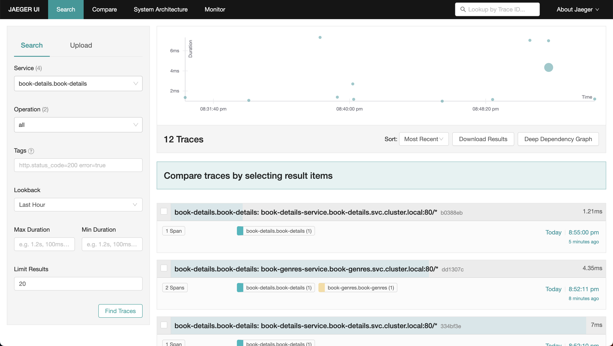

# Install Jaegar

Jaeger is an open source end to end distributed tracing system, allowing users to monitor and troubleshoot transactions in complex distributed systems.


## Step 1: Prepare YAML Manifest for Jaegar

Copy `samples/addons/jaegar.yml` manifest from Istio download package.


## Step 2: Deploy the Manifest to Install Jaegar

Let's apply the modified manifest to install Jaegar:

```
kubectl apply -f jaegar.yml
```


## Step 3: Access Jaegar Dashboard Locally

Let's use `kubectl port-forward` to access Jaegar dashboard locally:

```
# Check the port jaegar is exposed at
kubectl get svc -n istio-system | grep tracing

# Forward port 80 of jaegar service on port 20002 of the local host machine
kubectl port-forward svc/tracing 20002:80 -n istio-system
```

Open any browser on your local host machine and visit `localhost:20002`. You should see the Jaegar dashboard.


## Step 4: Deploy Ingress for Jaegar

We'll use an ingress to access Jaegar externally using a load balancer.

=== ":octicons-file-code-16: `jaegar-ingress.yml`"

    ```yaml linenums="1"
    apiVersion: networking.k8s.io/v1
    kind: Ingress
    metadata:
      name: jaegar-ingress
      namespace: istio-system
      annotations:
        # Load Balancer Annotations
        alb.ingress.kubernetes.io/scheme: internet-facing
        alb.ingress.kubernetes.io/load-balancer-name: my-load-balancer
        alb.ingress.kubernetes.io/target-type: ip
        # Health Check Annotations
        alb.ingress.kubernetes.io/healthcheck-protocol: HTTP
        alb.ingress.kubernetes.io/healthcheck-port: traffic-port
        alb.ingress.kubernetes.io/healthcheck-path: /
        alb.ingress.kubernetes.io/healthcheck-interval-seconds: '5'
        alb.ingress.kubernetes.io/healthcheck-timeout-seconds: '2'
        alb.ingress.kubernetes.io/success-codes: '200'
        alb.ingress.kubernetes.io/healthy-threshold-count: '2'
        alb.ingress.kubernetes.io/unhealthy-threshold-count: '2'
        # Listerner Ports Annotation
        alb.ingress.kubernetes.io/listen-ports: '[{"HTTP": 80}, {"HTTPS": 443}]'
        # SSL Redicrect Annotation
        alb.ingress.kubernetes.io/ssl-redirect: '443'
        # IngressGroup
        alb.ingress.kubernetes.io/group.name: my-group
    spec:
      ingressClassName: alb
      rules:
      - host: jaegar.example.com
        http:
          paths:
          - path: /
            pathType: Prefix
            backend:
              service:
                name: tracing
                port:
                  number: 80
    ```

Apply the manifest to create ingress for Jaegar:

```
kubectl apply -f jaegar-ingress.yml
```


## Step 5: Verify Jaegar Installation

Visit the Jaegar host (`jaegar.example.com`) to verify whether you can access the Jaegar Dashboard and view traces.

<p align="center">
    
</p>


!!! quote "References:"
    !!! quote ""
        * [Jaegar]{:target="_blank"}


<!-- Hyperlinks -->
[Jaegar]: https://istio.io/latest/docs/ops/integrations/jaeger/