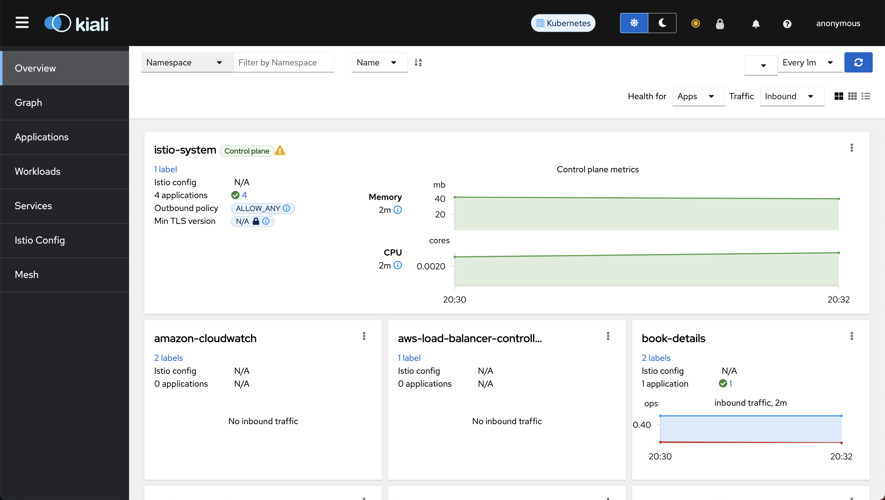

# Install Kiali

Kiali is an observability console for Istio with service mesh configuration and validation capabilities. It helps you understand the structure and health of your service mesh by monitoring traffic flow to infer the topology and report errors.


## Step 1: Prepare YAML Manifest for Kiali

Copy `samples/addons/kiali.yml` manifest from Istio download package. We will make some modification to this file before deploying.

Edit the `kiali.yml` by adding grafana and prometheus url in the kiali configmap. It should look like the below:

```yaml
external_services:
  ...
  grafana:
    enabled: true
    in_cluster_url: http://grafana.grafana:80
    url: https://grafana.example.com
  prometheus:
    url: http://prometheus-server.prometheus:80
  jaegar:
    url: http://tracing.istio-system:80
```


## Step 2: Deploy the Manifest to Install Kiali

Let's apply the modified manifest to install Kiali:

```
kubectl apply -f kiali.yml
```


## Step 3: Access Kiali Dashboard Locally

Let's use `kubectl port-forward` to access Kiali dashboard locally:

```
# Check the port kiali is exposed at
kubectl get svc -n istio-system | grep kiali

# Forward port 20001 of kiali service on port 20001 of the local host machine
kubectl port-forward svc/kiali 20001:20001 -n istio-system
```

Open any browser on your local host machine and visit `localhost:20001`. You should see the Kiali dashboard.


## Step 4: Deploy Ingress for Kiali

We'll use an ingress to access Kiali externally using a load balancer.

=== ":octicons-file-code-16: `kiali-ingress.yml`"

    ```yaml linenums="1"
    apiVersion: networking.k8s.io/v1
    kind: Ingress
    metadata:
      name: kiali-ingress
      namespace: istio-system
      annotations:
        # Load Balancer Annotations
        alb.ingress.kubernetes.io/scheme: internet-facing
        alb.ingress.kubernetes.io/load-balancer-name: my-load-balancer
        alb.ingress.kubernetes.io/target-type: ip
        # Health Check Annotations
        alb.ingress.kubernetes.io/healthcheck-protocol: HTTP
        alb.ingress.kubernetes.io/healthcheck-port: traffic-port
        alb.ingress.kubernetes.io/healthcheck-path: /
        alb.ingress.kubernetes.io/healthcheck-interval-seconds: '5'
        alb.ingress.kubernetes.io/healthcheck-timeout-seconds: '2'
        alb.ingress.kubernetes.io/success-codes: '200'
        alb.ingress.kubernetes.io/healthy-threshold-count: '2'
        alb.ingress.kubernetes.io/unhealthy-threshold-count: '2'
        # Listerner Ports Annotation
        alb.ingress.kubernetes.io/listen-ports: '[{"HTTP": 80}, {"HTTPS": 443}]'
        # SSL Redicrect Annotation
        alb.ingress.kubernetes.io/ssl-redirect: '443'
        # IngressGroup
        alb.ingress.kubernetes.io/group.name: my-group
    spec:
      ingressClassName: alb
      rules:
      - host: kiali.example.com
        http:
          paths:
          - path: /
            pathType: Prefix
            backend:
              service:
                name: kiali
                port:
                  number: 20001
    ```

Apply the manifest to create ingress for Kiali:

```
kubectl apply -f kiali-ingress.yml
```


## Step 5: Verify Kiali Installation

Visit the Kiali host (`kiali.example.com`) to verify whether you can access the Kiali Dashboard and observe the interaction between microservices.

=== ":octicons-image-16: `Kiali Overview`"
    <p align="center">
        
    </p>

=== ":octicons-image-16: `Kiali Graph`"
    <p align="center">
        
    </p>

=== ":octicons-image-16: `Kiali Applications`"
    <p align="center">
        
    </p>

=== ":octicons-image-16: `Kiali Services`"
    <p align="center">
        
    </p>


At this moment, the Kiali graph might seem unclear because we're currently utilizing kubernetes ingress for our microservices instead of the native gateway and virtual service in Istio. Once we update our microservices to use the Istio gateway and virtual service, you'll see a more accurate graph illustrating the interactions between our microservices.

Here's a glimpse of how kiali service graph will look like when we update our microservices:

<p align="center">
    
</p>


Notice how `book-details-service` calls `book-genres-service` and both services independently calls their respective databases.

You won't see `book-web-service` calling `book-details-service` in the graph because `book-web-service` uses the public API to call `book-details-service`.

!!! quote "References:"
    !!! quote ""
        * [Kiali]{:target="_blank"}
        * [Kiali - Modify external_services ConfigMap]{:target="_blank"}
        * [Kiali - Prometheus Configuration]{:target="_blank"}


<!-- Hyperlinks -->
[Kiali]: https://istio.io/latest/docs/ops/integrations/kiali/
[Kiali - Modify external_services ConfigMap]: https://stackoverflow.com/a/63383291/10065458
[Kiali - Prometheus Configuration]: https://kiali.io/docs/configuration/p8s-jaeger-grafana/prometheus/#prometheus-configuration