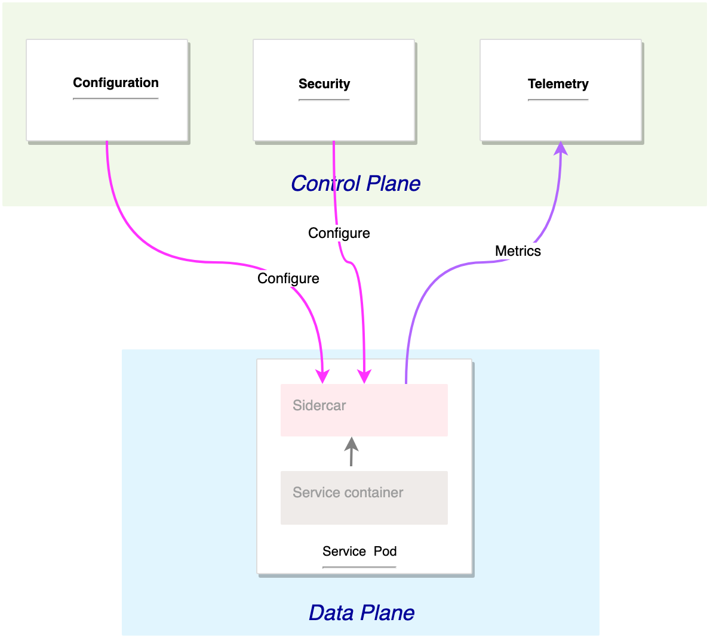
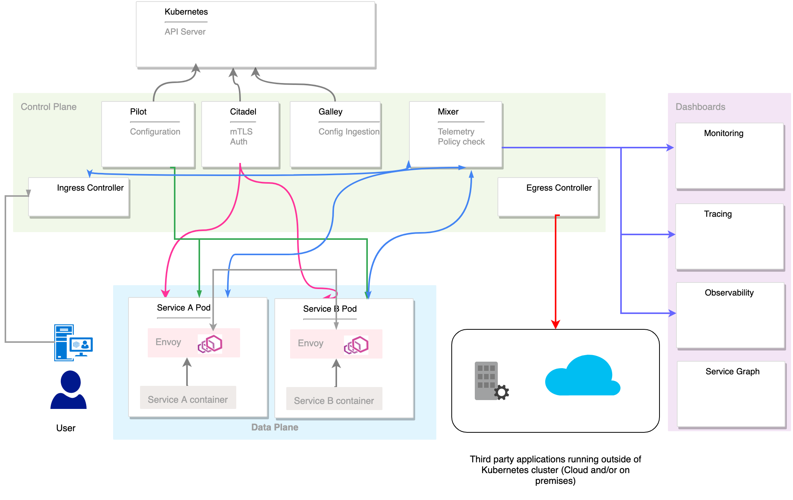
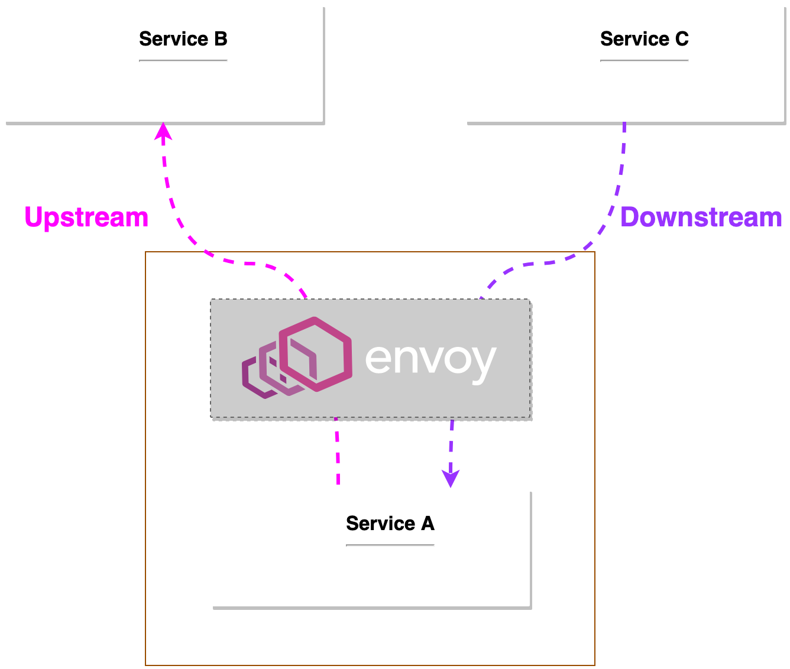
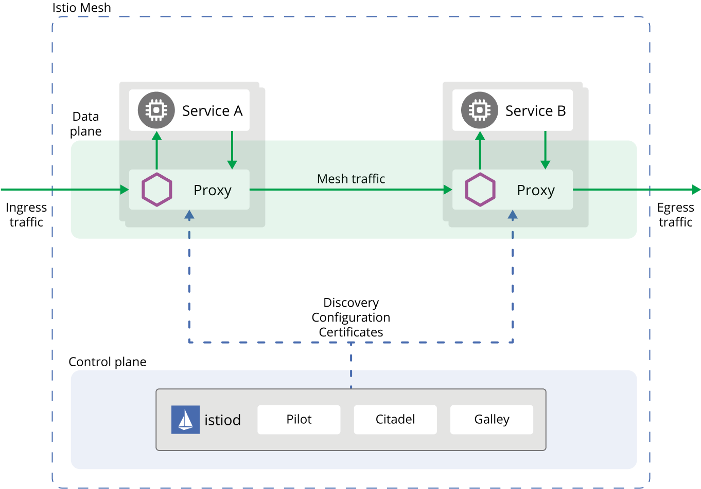

# Introduction to Istio

Istio is an implementation of [service mesh]{:target="_blank"} for observability, security in depth, and management that speeds deployment cycles.

It is an open source service mesh that layers transparently onto existing distributed applications.

## Istio Architecture

Istio is logically splitted into a `control plane` and a `data plane`.

    

### Control Plane

The control plane is the brain of the main network that manages, controls, and supervises the network of microservies.

The control plane manages and configures the proxies to route traffic. Additionally, the control plane configures `Mixers` to enforce policies and collect telemetry.

### Data Plane

The data plane is composed of a set of intelligent proxies (Envoy) deployed as sidecars.

These proxies mediate and control all network communication between microservices along with `Mixer`, a general-purpose policy and telemetry hub.

The sidecars deployed within the services and acting as proxy form the service mesh network.

## Building Blocks of Istio

    

| Component | Description | Group |
|-----------|-------------|-------|
| <a>`Pilot`</a> | Responsible for service discovery and configuring envoy sidecar proxies | Control plane |
| <a>`Galley`</a> | Configuration ingestion for Istio components | Control plane |
| <a>`Sidecar injector`</a> | Inside envoy sidecar for enabled namespaces | Control plane |
| <a>`Citadel`</a> | Automated key and certificate management | Control plane |
| <a>`Policy`</a> | Policy enforcement | Control plane |
| <a>`Telemetry`</a> | Gather telemetry data | Control plane |
| <a>`Ingresss Gateway`</a> | Manage inbound connection to the service mesh | Control plane |
| <a>`Egress Gateway`</a> | Manage outbound connection from the service mesh | Control plane |
| <a>`Istio CNI`</a> | Network initialisation | Control plane |
| <a>`Prometheus`</a> | Metrics collections | Control plane |
| <a>`Core DNS`</a> | DNS resolution in a multicluster gateways deployment | Control plane |
| <a>`Cert Manager`</a> | Issuance and renewal of TLS certificates | Control plane |
| <a>`Grafana`</a> | Grafana	Monitoring dashboard | Dashboard |
| <a>`Jaeger`</a> | Distributed tracing | Dashboard |
| <a>`Kiali`</a> | Observability dashboard | Dashboard |
| <a>`Envoy proxy`</a> | Proxy injected as a sidecar | Data plane |

- The `ingress controller` is responsible for allowing and redirecting the inbound traffic to the services running inside the service mesh.

- The `egress controller` is responsible for allowing outbound traffic from the service mesh. If an application should connect, for example, to an external database or service, such configuration should be explicitly defined for the egress controller.

- `Pilot` and `Galley` are responsible for the mesh configuration. They pull data from Kubernetes API Server and mix it with the local configuration defined within the mesh then push the configuration to different proxies forming the mesh.

- `Citadel` push tls certificate to services enabling mutual TLS.

- `Mixer` has two roles: gather metrics from the different components and enforce policy by double checking each request. In a high level deployment scenario Telemetry and Policy check should be deployed separately.

- `Dashboards` gather metrics from the telemetry service and display it in a user friendly format.

## Upstream vs Downstream

`Upstream` connections are the service Envoy is initiating the connection to, while `Downstream` connections are the client that is initiating a request through Envoy.

    

## What is Envoy?

Envoy is a high-performance, open-source proxy designed for cloud-native applications. It's built to be a universal data plane and is commonly used in Service Mesh architectures. Envoy acts as an intermediary for all network communication between microservices within a system.

It's highly configurable and excels at handling tasks like load balancing, routing, authentication, monitoring, and more. Envoy is known for its reliability, observability, and extensive features that help manage and secure communication between services in complex, distributed systems.

## How Does Istio Work?

Istio uses a proxy to intercept all your network traffic, allowing a broad set of application-aware features based on configuration you set.

An Envoy proxy is deployed along with each service that you start in your cluster, or runs alongside services running on VMs.

The control plane takes your desired configuration, and its view of the services, and dynamically programs the proxy servers, updating them as the rules or the environment changes.

    

!!! quote "References:"
    !!! quote ""
        * [What is Istio?]{:target="_blank"}
        * [Istio Architecture]{:target="_blank"}

<!-- Hyperlinks -->
[What is Istio?]: https://istio.io/latest/about/service-mesh/#what-is-istio
[service mesh]: https://kloudkoncepts.com/kubernetes-on-eks/service-mesh/introduction-to-service-mesh/
[Istio Architecture]: https://www.istioworkshop.io/03-servicemesh-overview/istio-architecture/