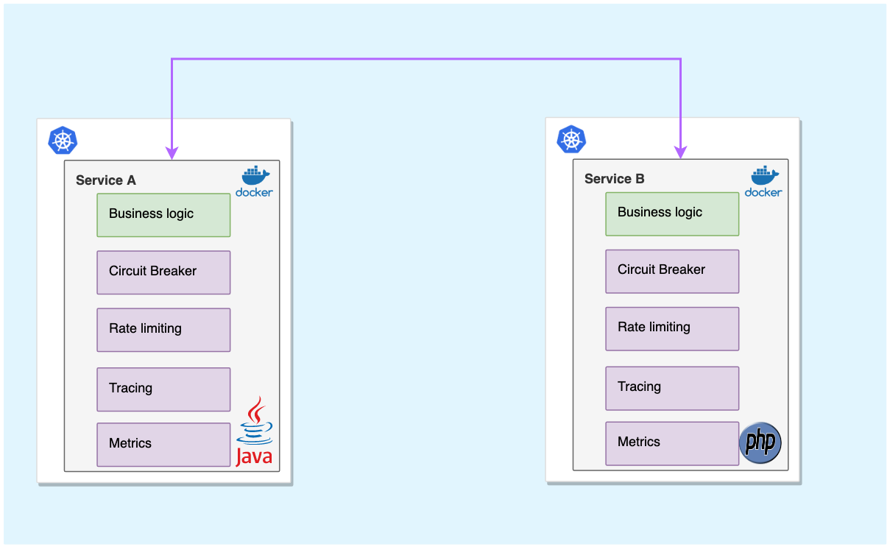
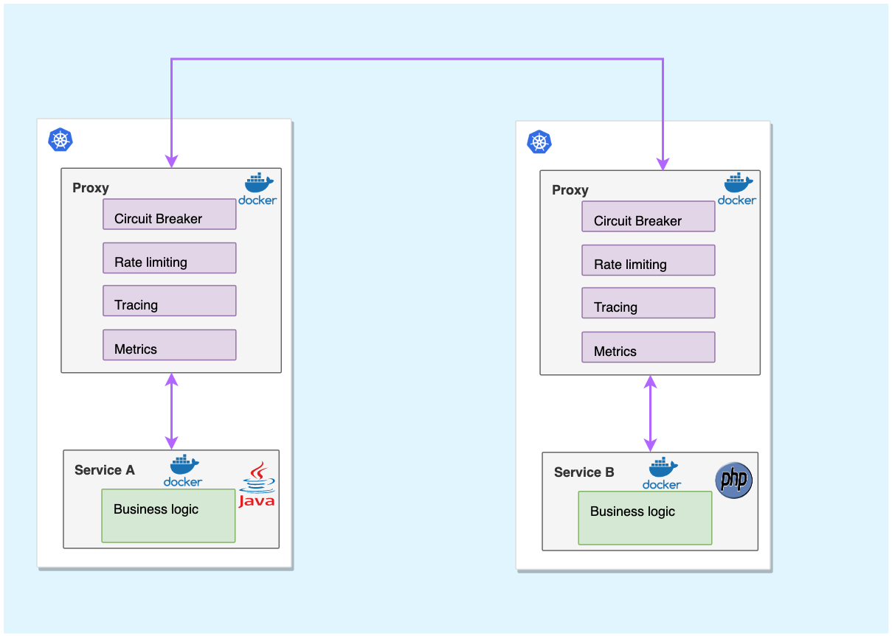

# Introduction to Service Mesh

A service mesh is a dedicated infrastructure layer that you can add to your applications. It allows you to transparently add capabilities like observability, traffic management, and security, without adding them to your own code.

## Life Before Service Mesh

Let's say you are building a service-based architecture consisting of multiple microservices. Any given microservice may interact with many other microservices.

For service to service communication between microservices the developers must implement the following:

1. **Retry Logic and Circuit Breaking**

    Let's say service `A` makes a call to service `B`.

    - If the call to service `B` fails, service `A` may want to retry
    - Service `A` must have retry logic in the codebase (frequency, interval etc.)
    - The retry logic may depend on the microservices involved in the picture
    - Service `A` must detect failures and encapsulate the logic of preventing a failure from constantly recurring (Circuit Breaking)

2. **Authentication and Authorization**

    Let's say service `A` makes a call to service `B`.

    - You may want authentication between service `A` and `B`
    - Service `A` and service `B` must have authentication logic in the codebase

3. **Mutual TLS**

    Let's say service `A` makes a call to service `B`.

    - You may want service `A` and service `B` to interact over `HTTPS` instead of `HTTP`
    - The certificate for each service should be issued, maintained, and rotated for each service

4. **Monitoring**

    Let's say service `A` makes a call to service `B`.

    - You may want to know the number of requests/sec the service `A` sends
    - You may also want to know the number of requests/sec the service `B` receives
    - You may want to know metrics like latency, HTTP 200, 4xx, and 5xx count
    - The developer must write logic to expose these metrics

5. **Distributed Tracing**

    Let's say service `A` makes a call to service `B` and service `B` in turn call service `C` and `D`.

    - You may want to trace requests down to each service to figure out where the latency may be
    - You may want to visualize the flow of requests between microservices

6. **Traffic Splitting**

    Let's say service `A` makes a call to service `B`. Service `B` has two versions `B1` and `B2`.

    - You may want to send only 10% of the traffic to `B1` and rest 90% to `B2`

    

There are many other features like load balancing, rate limiting, service registry/discovery that the developer should implement.

Consider implementing these features for all microservices. This is the [Code Oriented Pattern]{:target="_blank"} which is very painful and not an easy task. The complexity grows as more and more microservices are added. And of course, this is not scalable for the following reasons:

- Since each microservice might be written in different programming languages, implementing these features for each microservice becomes language-specific.
- Prone to errors during implementation.
- Difficult to upgrade each microservice as the system grows.
- Different teams within the same organization may adopt different implementations.

That's where service mesh comes into the picture!

Service mesh commonly uses sidecar pattern and provides you these features out of the box without adding any additional code in your microservices.

## Sidecar Pattern

Sidecar pattern enables applications to be composed of heterogeneous components and technologies. This pattern is named Sidecar because it resembles a sidecar attached to a motorcycle.

In the pattern, the sidecar is attached to a parent application and provides supporting features for the application. Thus, all microservices concerns will be handled by the sidecar in homogenous way and injected on the fly by platform when deploying the application.

    

!!! quote "References:"
    !!! quote ""
        * [What is a Service Mesh?]{:target="_blank"}

<!-- Hyperlinks -->
[Code Oriented Pattern]: https://www.istioworkshop.io/03-servicemesh-overview/introduction-service-mesh/#code-oriented-pattern
[What is a Service Mesh?]: https://istio.io/latest/about/service-mesh/#what-is-a-service-mesh