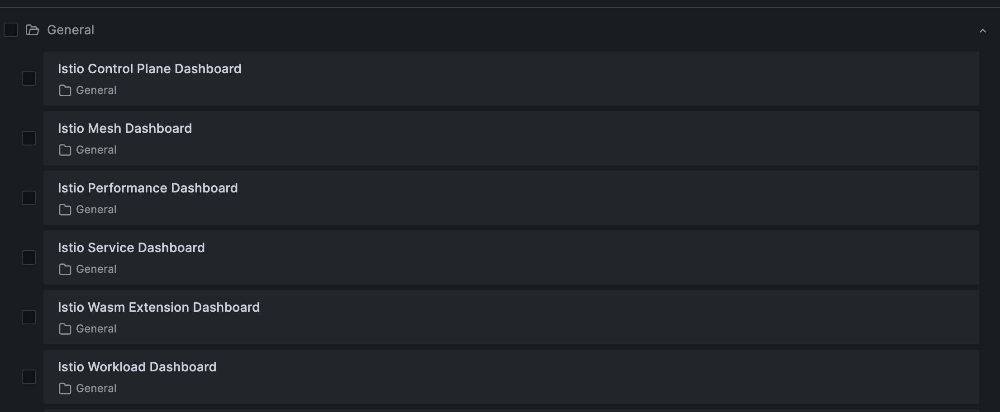

# Istio Metrics and Monitoring

Proxies that are running as sidecar containers in our application exposes rich telemetry about all the network traffic between these services.

We can visualize these metrics using Prometheus, Grafana, Kiali, and Jaegar. Istio provide these tools as addons and can be simply installed using the following command:

```
kubectl apply -f samples/addons/<tool-name>.yaml
```

Since we already have Prometheus and Grafana installed in our cluster, we are going to use that and not install it via Istio.

!!! note
    If you don't already have prometheus and grafana installed in your cluster, you can install them from istio addons as follows:

    ```
    # Install grafana istio addon
    kubectl apply -f samples/addons/prometheus.yaml

    # Install grafana istio addon
    kubectl apply -f samples/addons/grafana.yaml
    ```

    This will have the required dashboards pre-installed. You don't need to import them as we had to do in our existing grafana deployment.


## Step 1: Update Prometheus

In order for prometheus to pick istio metrics correctly, we need to make a small change to our prometheus deployment.

Edit `prometheus-server` configmap as follows:

```
# Set kubectl editor to nano
export KUBE_EDITOR=nano

# Edit the configmap
kubectl edit configmap prometheus-server -n prometheus
```

Make the following changes in `prometheus.yml` section:

1. Replace all occurances of `(.+?)(?::\d+)?;(\d+)` with `([^:]+)(?::\d+)?;(\d+)`
2. Change the `scrape_interval` to `15s`

Now, restart the `prometheus-server` deployment:

```
kubectl rollout restart deploy/prometheus-server -n prometheus
```

Verify if the pods are running without error:

```
kubectl get pods -n prometheus
```


## Step 2: Import Istio Dashboards in Grafana

Next, let's import Istio dashboards in our Grafana deployment. We'll use a script to that.

=== ":octicons-file-code-16: `import-istio-grafana-dashboards.sh`"

    ```bash linenums="1"
    # Address of Grafana
    GRAFANA_HOST="https://grafana.example.com"
    # Login credentials, if authentication is used
    GRAFANA_CRED="admin:RP6xkxD"
    # The name of the Prometheus data source to use
    GRAFANA_DATASOURCE="Prometheus"
    # The version of Istio to deploy
    VERSION=1.20.0
    # Import all Istio dashboards
    for DASHBOARD in 7639 11829 7636 7630 7645 13277; do
        REVISION="$(curl -s https://grafana.com/api/dashboards/${DASHBOARD}/revisions -s | jq ".items[] | select(.description | contains(\"${VERSION}\")) | .revision")"
        curl -s https://grafana.com/api/dashboards/${DASHBOARD}/revisions/${REVISION}/download > /tmp/dashboard.json
        echo "Importing $(cat /tmp/dashboard.json | jq -r '.title') (revision ${REVISION}, id ${DASHBOARD})..."
        curl -s -k -u "$GRAFANA_CRED" -XPOST \
            -H "Accept: application/json" \
            -H "Content-Type: application/json" \
            -d "{\"dashboard\":$(cat /tmp/dashboard.json),\"overwrite\":true, \
                \"inputs\":[{\"name\":\"DS_PROMETHEUS\",\"type\":\"datasource\", \
                \"pluginId\":\"prometheus\",\"value\":\"$GRAFANA_DATASOURCE\"}]}" \
            $GRAFANA_HOST/api/dashboards/import
        echo -e "\nDone\n"
    done
    ```

Make sure to replace the values of `GRAFANA_HOST` and `GRAFANA_CRED` variables with the values specific to your Grafana set up.

Now, run the script to import dashboards to your Grafana:

```bash
# Give execute permission to the script
chmod +x import-istio-grafana-dashboards.sh

# Execute the script
./import-istio-grafana-dashboards.sh
```

Go to Grafana console and verify if Istio related dashboards were imported successfully.

<p align="center">
    
</p>


## Step 3: Generate Traffic to Gather Istio Metrics

Let's generate traffic for our book management microservices to gather sufficient Istio metrics that we can visualize in Grafana. We'll use selenium to simulate and generate traffic.

First, create a python script as follows:

=== ":octicons-file-code-16: `main.py`"

    ```python linenums="1"
    from selenium import webdriver
    import time

    driver = webdriver.Chrome()
    for i in range(1000):
        driver.get("https://book-web.example.com/books")
        time.sleep(0.5)
        driver.get("https://book-web.example.com/books/genre/1")
        time.sleep(0.5)
        driver.get("https://book-web.example.com/books/genre/2")
        time.sleep(0.5)
        driver.get("https://book-web.example.com/books/genre/3")
        time.sleep(0.5)

    driver.close()
    ```

Next, create a virtual environment and install selenium using pip3:

```
# Create virtual environment
virtualenv venv

# Activate virtual environment
source venv/bin/activate

# Install selenium
pip3 install selenium
```

Now, run the traffic generator:

```
python3 main.py
```

Now, head to Grafana and check the Istio dashboards to confirm if you can view Istio metrics.


!!! quote "References:"
    !!! quote ""
        * [Import Istio Dashboards Script]{:target="_blank"}


<!-- Hyperlinks -->
[Import Istio Dashboards Script]: https://istio.io/latest/docs/ops/integrations/grafana/#option-2-import-from-grafanacom-into-an-existing-deployment