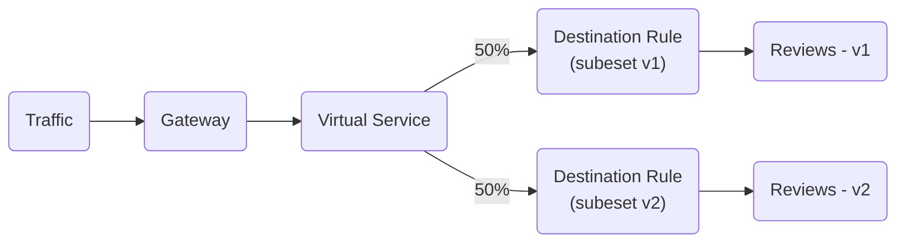
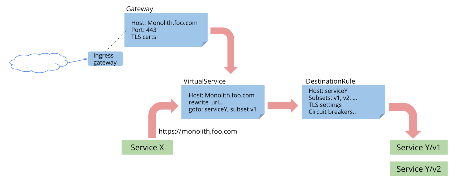

# Traffic Management in Istio

Before we go and install Istio with AWS application load balancer, it is important to understand the traffic management in Istio.


## Istio Ingress Gateway

When you install Istio, it creates an Ingress Gateway service that describes a load balancer operating at the edge of the mesh, receiving incoming or outgoing HTTP/TCP connections.

Istio Ingress Gateway acts as the entry point for external traffic into the service mesh.

By default, the Istio Ingress Gateway service type is set to `LoadBalancer`, thus creating a classic load balancer in AWS.


## Istio Traffic Management APIs

While Istio’s basic service discovery and load balancing gives you a working service mesh, it’s far from all that Istio can do. In many cases you might want more fine-grained control over what happens to your mesh traffic.

You might want to direct a particular percentage of traffic to a new version of a service as part of A/B testing, or apply a different load balancing policy to traffic for a particular subset of service instances. You might also want to apply special rules to traffic coming into or out of your mesh, or add an external dependency of your mesh to the service registry.

You can do all this and more by adding your own traffic configuration to Istio using Istio’s traffic management API.

Some of the important traffic management API resources include:

1. Gateway
2. Virtual Service
3. Destination Rule

In this section, we'll just have an overview of these concepts. We'll see examples later on in another section.


### Istio Gateway

The Gateway object in Istio defines the configuration for how traffic should be routed to services within the mesh based on specific criteria.

It's a Kubernetes Custom Resource Definition (CRD) used to define the rules and settings for routing traffic to a particular set of services.

It specifies the ports, protocols, and hosts (among other criteria) that traffic should be directed to within the service mesh.

Here's an example of a Gateway object:

=== ":octicons-file-code-16: `my-istio-gateway.yml`"

    ```yaml linenums="1"
    apiVersion: networking.istio.io/v1alpha3
    kind: Gateway
    metadata:
      name: nginx-gateway
    spec: 
      selector:
        istio: ingressgateway # use Istio default gateway implementation
      servers:
      - port:
          number: 80
          name: http
          protocol: HTTP
        hosts:
        - "nginx-app.example.com"
    ```


!!! note "Istio Gateway vs Kubernetes Ingress"

    Istio `Gateway` provides more extensive customization and flexibility than kubernetes Ingress, and allows Istio features such as monitoring and route rules to be applied to traffic entering the cluster.

    With Istio Gateway you can implement the following with ease:

    - Timeouts
    - Retries
    - Circuit Breaker
    - Fault Injection
    - Traffic Splitting
    - Canary Deployment


### Istio Virtual Service

Istio `VirtualService` works in conjunction with Istio Gateway. it defines the destination service.

A Virtual Service defines the rules that control how requests for a service are routed within an Istio service mesh.

For example, it can be configured to split traffic among two or more versions of a service as shown below:

=== ":octicons-file-code-16: `my-istio-virtual-service.yml`"

    ```yaml linenums="1"
    apiVersion: networking.istio.io/v1alpha3
    kind: VirtualService
    metadata:
      name: review
    spec:
      hosts:
        - reviews.example.com
      http:
      - route:
        - destination:
            host: reviews
            subset: v1
          weight: 80
        - destination:
            host: reviews
            subset: v2
          weight: 20
      ...
    ```

!!! note
    For the virtual service described above, you must define the subsets using Destination Rule.

Another use case might involve routing traffic to a service based on the URI prefix as shown below:

=== ":octicons-file-code-16: `my-istio-virtual-service.yml`"

    ```yaml linenums="1"
    apiVersion: networking.istio.io/v1alpha3
    kind: VirtualService
    metadata:
      name: bookinfo
    spec:
      hosts:
        - bookinfo.example.com
      http:
      - match:
        - uri:
            prefix: /reviews
        route:
        - destination:
            host: reviews
      - match:
        - uri:
            prefix: /ratings
        route:
        - destination:
            host: ratings
      ...
    ```

Each virtual service consists of a set of routing rules that are evaluated in order, letting Istio match each given request to the virtual service to a specific real destination within the mesh.


### Istio Destination Rule

Istio `DestinationRule` defines policies that apply to traffic intended for a service after routing has occurred. These rules specify configuration for load balancing, connection pool size from the sidecar, and outlier detection settings to detect and evict unhealthy hosts from the load balancing pool.

You can think of virtual services as how you route your traffic to a given destination, and then you use destination rules to configure what happens to traffic for that destination. Destination rules are applied after virtual service routing rules are evaluated, so they apply to the traffic’s “real” destination.

In particular, you use destination rules to specify named service subsets, such as grouping all a given service’s instances by version. You can then use these service subsets in the routing rules of virtual services to control the traffic to different instances of your services.



Here's an example of a Destination that configures traffic policies for the `reviews` service in Istio. It defines subsets labeled as `v1`, `v2`, and `v3`, each representing different versions. The `v1` subset uses a `RANDOM` load balancer strategy, `v2` utilizes `ROUND_ROBIN`, while `v3` likely relies on a default strategy as it's not explicitly defined.


=== ":octicons-file-code-16: `my-istio-destination-rule.yml`"

    ```yaml linenums="1"
    apiVersion: networking.istio.io/v1alpha3
    kind: DestinationRule
    metadata:
      name: reviews
    spec:
      host: reviews
      trafficPolicy:
        loadBalancer:
          simple: RANDOM
      subsets:
      - name: v1
        labels:
          version: v1
      - name: v2
        labels:
          version: v2
        trafficPolicy:
          loadBalancer:
            simple: ROUND_ROBIN
      - name: v3
        labels:
          version: v3
    ```


## Traffic Flow in Istio

The figure below depicts the flow of control across configuration resources:

<p align="center">
    
</p>


!!! quote "References:"
    !!! quote ""
        * [Istio Ingress Gateway Workshop]{:target="_blank"}
        * [Ingress Gateways]{:target="_blank"}
        * [Istio Traffic Management]{:target="_blank"}


<!-- Hyperlinks -->
[Istio Ingress Gateway Workshop]: https://www.istioworkshop.io/09-traffic-management/01-ingress-gateway/
[Ingress Gateways]: https://kloudkoncepts.com/kubernetes-on-eks/service-mesh/introduction-to-service-mesh/
[Istio Traffic Management]: https://istio.io/latest/docs/concepts/traffic-management/