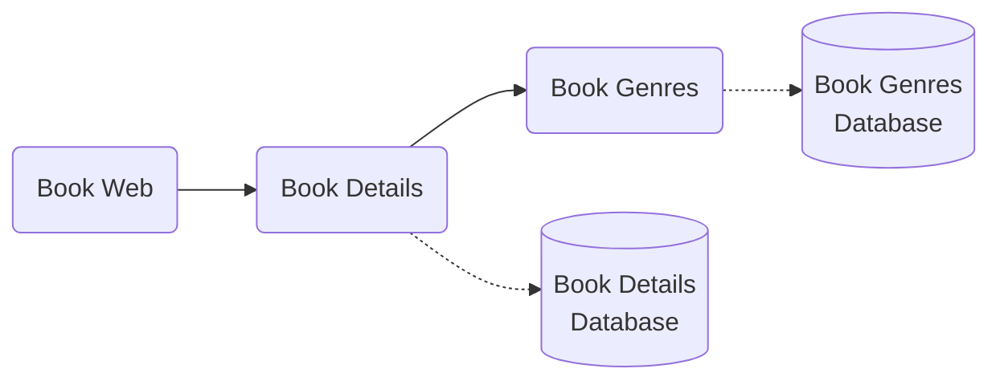
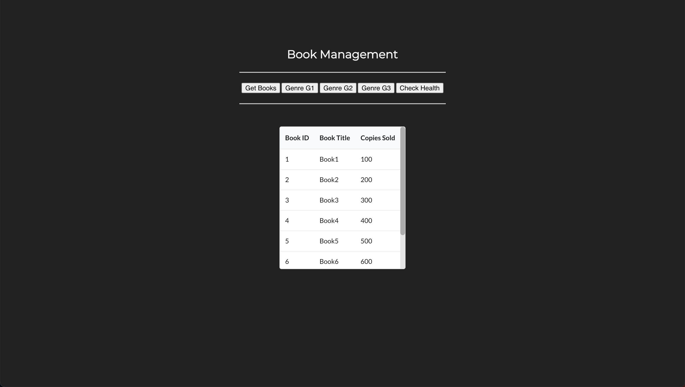
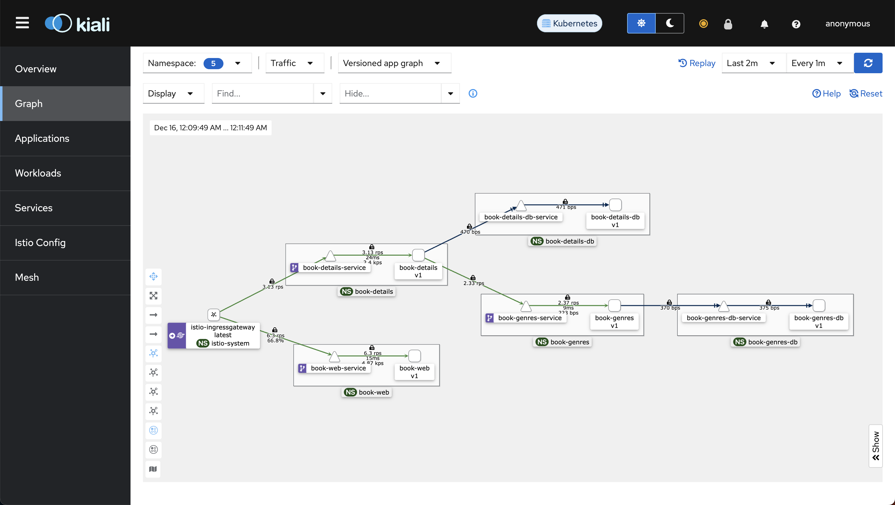

# Update Book Management Microservices With Istio Gateway

Let's update book management microservices that we created earlier. We will remove all kubernetes ingress objects and use istio gateways and virtual services instead.


## Prerequisite

To follow this tutorial, you'll require a domain and, additionally, an SSL certificate for the domain and its subdomains.

1. Register a Route 53 Domain

    Go to AWS Console and register a Route 53 domain. You can opt for a cheaper TLD (top level domain) such as `.link`

    !!! note
        It usually takes about 10 minutes but it might take about an hour for the registered domain to become available.

2. Request a Public Certificate

    Visit AWS Certificate Manager in AWS Console and request a public certificate for your domain and all the subdomains. For example, if you registered for a domain `example.com` then request certificate for `example.com` and `*.example.com`

    !!! note
        Make sure you request the certificate in the region where your EKS cluster is in.

3. Validate the Certificate

    Validate the requested certificate by adding `CNAME` records in Route 53. It is a very simple process. Go to the certificate you created and click on `Create records in Route 53`. The `CNAMEs` will be automatically added to Route 53.

    !!! note
        It usually takes about 5 minutes but it might take about an hour for the certificate to be ready for use.


Now that you have everything you need, let's move on to the demonstration.


## Docker Images

Here are the Docker Images used in this tutorial:

- [reyanshkharga/book-management:book-details]{:target="_blank"}
- [reyanshkharga/book-management:book-genres]{:target="_blank"}
- [reyanshkharga/book-management:book-web]{:target="_blank"}

!!! note
    1. `reyanshkharga/book-management:book-genres` is a Node.js backend app that uses MongoDB to store and retrieve data, providing a list of books for each genre.

        Environment Variables:

        - `MONGODB_URI` (Required)
        
    2. `reyanshkharga/book-management:book-details` is a Node.js backend app that uses MongoDB to store and retrieve data, providing details for a given book. It also calls the `book-genres` microservice to return the list of books for a given genre.

        Environment variables:

        - `MONGODB_URI` (Required)
        - `REACT_APP_AGENRES_API_ENDPOINTPI_ENDPOINT` (Required)

    3. `reyanshkharga/book-management:book-web` is the frontend for book management application.

        Environment variables:

        - `REACT_APP_API_ENDPOINT` (Required)


## Objective

We are going to deploy the following microservices on our EKS kubernetes cluster:

1. Book Details Database microservice
2. Book Genres Database microservice
3. Book Details microservice
4. Book Genres microservice
5. Book Web microservice


The following diagram illustrates the communication between microservices:




## Step 1: Deploy Book Genres Database Microservice

Let's create the kubernetes objects for our Book Genres Database microservice as follows:

=== ":octicons-file-code-16: `00-namespace.yml`"

    ```yaml linenums="1"
    apiVersion: v1
    kind: Namespace
    metadata:
      name: book-genres-db
      labels:
        istio-injection: enabled
    ```

=== ":octicons-file-code-16: `storageclass.yml`"

    ```yaml linenums="1"
    apiVersion: storage.k8s.io/v1
    kind: StorageClass
    metadata:
      name: book-genres-db-storageclass
    provisioner: ebs.csi.aws.com
    parameters:
      type: gp3
      tagSpecification_1: "Name=eks-book-genres-db-storage"
      tagSpecification_2: "CreatedBy=aws-ebs-csi-driver"
    reclaimPolicy: Delete
    ```

=== ":octicons-file-code-16: `pvc.yml`"

    ```yaml linenums="1"
    apiVersion: v1
    kind: PersistentVolumeClaim
    metadata:
      name: book-genres-db-pvc
      namespace: book-genres-db
    spec:
      accessModes:
        - ReadWriteOnce
      storageClassName: book-genres-db-storageclass
      resources:
        requests:
          storage: 4Gi
    ```

=== ":octicons-file-code-16: `configmap.yml`"

    ```yaml linenums="1"
    apiVersion: v1
    kind: ConfigMap
    metadata:
      name: book-genres-mongo-initdb
      namespace: book-genres-db
    data:
      mongo-init.sh: |-
        mongo <<EOF
        use books
        db.genres.insert({_id: 1, "books": [1,2,3,4]})
        db.genres.insert({_id: 2, "books": [5,6,7]})
        db.genres.insert({_id: 3, "books": [8]})
        EOF
    ```

=== ":octicons-file-code-16: `deployment-and-service.yml`"

    ```yaml linenums="1"
    # Deployment
    apiVersion: apps/v1
    kind: Deployment
    metadata:
      name: book-genres-db-deployment
      namespace: book-genres-db
    spec:
      replicas: 1
      selector:
        matchLabels:
          app: book-genres-db
          version: v1
      template:
        metadata:
          labels:
            app: book-genres-db
            version: v1
        spec:
          containers:
          - name: book-genres-db
            image: mongo:5.0.2
            ports:
              - containerPort: 27017
            volumeMounts:
            - name: book-genres-db-storage
              mountPath: /data/db
            - name: mongo-initdb
              mountPath: /docker-entrypoint-initdb.d
          volumes:
          - name: book-genres-db-storage
            persistentVolumeClaim:
              claimName: book-genres-db-pvc
          - name: mongo-initdb
            configMap:
              name: book-genres-mongo-initdb
    ---
    # Service
    apiVersion: v1
    kind: Service
    metadata:
      name: book-genres-db-service
      namespace: book-genres-db
    spec:
      type: ClusterIP
      selector:
        app: book-genres-db
        version: v1
      ports:
        - port: 27017
          targetPort: 27017
          name: tcp
    ```

Notice the `istio-injection: enabled` label in the namespace object. This will ensure all objects in the namespace are part of the Istio service mesh.

Assuming your folder structure looks like the one below:

```
|-- manifests
|   |-- book-genres-db
│   |   |-- 00-namespace.yml
│   |   |-- configmap.yml
│   |   |-- deployment-and-service.yml
│   |   |-- storageclass.yml
│   |   |-- pvc.yml
```

Let's apply the manifests to create the kubernetes objects for Book Genres Database microservice:

```
kubectl apply -f book-genres-db/
```

This will create the following kubernetes objects:

1. A namespace named `book-genres-db`
2. A `StorageClass` (SC) for [dynamic provisioning]{:target="_blank"} of persistent volume
3. A `PersistentVolumeClaim` (PVC) in the `book-genres-db` namespace
4. MongoDB deployment in the `book-genres-db` namespace
5. MongoDB service in the `book-genres-db` namespace

We are using Amazon EBS to persist the MongoDB data. EBS is provisioned dynamically using AWS EBS-CSI driver.

With [persistent volume]{:target="_blank"} even if the MongoDB pod goes down the data will remain intact. When the new pod comes up we'll have the access to the same data.

We are also using configmap to populate data in the MongoDB database.

Verify if the resources were created successfully:

```
# List all resources in book-genres-db namespace
kubectl get all -n book-genres-db

# List StorageClass
kubectl get sc

# List PersistentVolume
kubectl get pv

# List PersistenvVolumeClaim
kubectl get pvc -n book-genres-db
```

Verify if MongoDB is working as expected:

```
# Start a shell session inside the book-genres-db container
kubectl exec -it <mongodb-pod-name> -n book-genres-db -- bash

# Start the mongo Shell to interact with MongoDB
mongo

# List Databases
show dbs

# Switch to a Database
use <db-name>

# List collections
show collections
```

## Step 2: Deploy Book Details Database Microservice

Let's create the kubernetes objects for our Book Details Database microservice as follows:

=== ":octicons-file-code-16: `00-namespace.yml`"

    ```yaml linenums="1"
    apiVersion: v1
    kind: Namespace
    metadata:
      name: book-details-db
      labels:
        istio-injection: enabled
    ```

=== ":octicons-file-code-16: `storageclass.yml`"

    ```yaml linenums="1"
    apiVersion: storage.k8s.io/v1
    kind: StorageClass
    metadata:
      name: book-details-db-storageclass
    provisioner: ebs.csi.aws.com
    parameters:
      type: gp3
      tagSpecification_1: "Name=eks-book-details-db-storage"
      tagSpecification_2: "CreatedBy=aws-ebs-csi-driver"
    reclaimPolicy: Delete
    ```

=== ":octicons-file-code-16: `pvc.yml`"

    ```yaml linenums="1"
    apiVersion: v1
    kind: PersistentVolumeClaim
    metadata:
      name: book-details-db-pvc
      namespace: book-details-db
    spec:
      accessModes:
        - ReadWriteOnce
      storageClassName: book-details-db-storageclass
      resources:
        requests:
          storage: 4Gi
    ```

=== ":octicons-file-code-16: `configmap.yml`"

    ```yaml linenums="1"
    apiVersion: v1
    kind: ConfigMap
    metadata:
      name: book-details-mongo-initdb
      namespace: book-details-db
    data:
      mongo-init.sh: |-
        mongo <<EOF
        use books
        db.details.insert({_id: 1, "title": "Book1", "copies_sold": 100})
        db.details.insert({_id: 2, "title": "Book2", "copies_sold": 200})
        db.details.insert({_id: 3, "title": "Book3", "copies_sold": 300})
        db.details.insert({_id: 4, "title": "Book4", "copies_sold": 400})
        db.details.insert({_id: 5, "title": "Book5", "copies_sold": 500})
        db.details.insert({_id: 6, "title": "Book6", "copies_sold": 600})
        db.details.insert({_id: 7, "title": "Book7", "copies_sold": 700})
        db.details.insert({_id: 8, "title": "Book8", "copies_sold": 800})
        EOF
    ```

=== ":octicons-file-code-16: `deployment-and-service.yml`"

    ```yaml linenums="1"
    # Deployment
    apiVersion: apps/v1
    kind: Deployment
    metadata:
      name: book-details-db-deployment
      namespace: book-details-db
    spec:
      replicas: 1
      selector:
        matchLabels:
          app: book-details-db
          version: v1
      template:
        metadata:
          labels:
            app: book-details-db
            version: v1
        spec:
          containers:
          - name: book-details-db
            image: mongo:5.0.2
            ports:
              - containerPort: 27017
            volumeMounts:
            - name: book-details-db-storage
              mountPath: /data/db
            - name: mongo-initdb
              mountPath: /docker-entrypoint-initdb.d
          volumes:
          - name: book-details-db-storage
            persistentVolumeClaim:
              claimName: book-details-db-pvc
          - name: mongo-initdb
            configMap:
              name: book-details-mongo-initdb
    ---
    # Service
    apiVersion: v1
    kind: Service
    metadata:
      name: book-details-db-service
      namespace: book-details-db
    spec:
      type: ClusterIP
      selector:
        app: book-details-db
        version: v1
      ports:
        - port: 27017
          targetPort: 27017
          name: tcp
    ```

Notice the `istio-injection: enabled` label in the namespace object. This will ensure all objects in the namespace are part of the Istio service mesh.

Assuming your folder structure looks like the one below:

```
|-- manifests
|   |-- book-details-db
│   |   |-- 00-namespace.yml
│   |   |-- configmap.yml
│   |   |-- deployment-and-service.yml
│   |   |-- storageclass.yml
│   |   |-- pvc.yml
```

Let's apply the manifests to create the kubernetes objects for Book Details Database microservice:

```
kubectl apply -f book-details-db/
```

This will create the following kubernetes objects:

1. A namespace named `book-details-db`
2. A `StorageClass` (SC) for [dynamic provisioning]{:target="_blank"} of persistent volume
3. A `PersistentVolumeClaim` (PVC) in the `book-details-db` namespace
4. MongoDB deployment in the `book-details-db` namespace
5. MongoDB service in the `book-details-db` namespace

We are using Amazon EBS to persist the MongoDB data. EBS is provisioned dynamically using AWS EBS-CSI driver.

With [persistent volume]{:target="_blank"} even if the MongoDB pod goes down the data will remain intact. When the new pod comes up we'll have the access to the same data.

We are also using configmap to populate data in the MongoDB database.

Verify if the resources were created successfully:

```
# List all resources in book-details-db namespace
kubectl get all -n book-details-db

# List StorageClass
kubectl get sc

# List PersistentVolume
kubectl get pv

# List PersistenvVolumeClaim
kubectl get pvc -n book-details-db
```

Verify if MongoDB is working as expected:

```
# Start a shell session inside the book-details-db container
kubectl exec -it <mongodb-pod-name> -n book-details-db -- bash

# Start the mongo Shell to interact with MongoDB
mongo

# List Databases
show dbs

# Switch to a Database
use <db-name>

# List collections
show collections
```


## Step 3: Deploy Book Genres Microservice

Let's create the kubernetes objects for our Book Genres microservice as follows:

=== ":octicons-file-code-16: `00-namespace.yml`"

    ```yaml linenums="1"
    apiVersion: v1
    kind: Namespace
    metadata:
      name: book-genres
      labels:
        istio-injection: enabled
    ```

=== ":octicons-file-code-16: `deployment-and-service.yml`"

    ```yaml linenums="1"
    # Deployment
    apiVersion: apps/v1
    kind: Deployment
    metadata:
      name: book-genres-deployment
      namespace: book-genres
    spec:
      replicas: 1
      selector:
        matchLabels:
          app: book-genres
          version: v1
      template:
        metadata:
          labels:
            app: book-genres
            version: v1
        spec:
          containers:
          - name: book-genres
            image: reyanshkharga/book-management:book-genres
            imagePullPolicy: Always
            ports:
              - containerPort: 5000
            env:
            - name: MONGODB_URI
              value: mongodb://book-genres-db-service.book-genres-db.svc.cluster.local:27017
            - name: BUGGY_CODE
              value: "false"
    ---
    # Service
    apiVersion: v1
    kind: Service
    metadata:
      name: book-genres-service
      namespace: book-genres
    spec:
      type: ClusterIP
      selector:
        app: book-genres
        version: v1
      ports:
        - port: 80
          targetPort: 5000
          name: http
    ```

=== ":octicons-file-code-16: `gateway.yml`"

    ```yaml linenums="1"
    apiVersion: networking.istio.io/v1alpha3
    kind: Gateway
    metadata:
      name: book-genres-gateway
      namespace: book-genres
    spec: 
      selector:
        istio: ingressgateway # use Istio default gateway implementation
      servers:
      - port:
          number: 80
          name: http
          protocol: HTTP
        hosts:
        - "book-genres.example.com"
    ```

=== ":octicons-file-code-16: `virtualservice.yml`"

    ```yaml linenums="1"
    apiVersion: networking.istio.io/v1alpha3
    kind: VirtualService
    metadata:
      name: book-genres-virtualservice
      namespace: book-genres
      annotations:
        external-dns.alpha.kubernetes.io/target: "istio-load-balancer-1556246780.ap-south-1.elb.amazonaws.com"
    spec: 
      hosts:
      - "book-genres.example.com"
      gateways:
      - book-genres-gateway
      http:
      - match: 
        - uri:   
            prefix: /
        route:
        - destination:
            host: book-genres-service
            port:
              number: 80
    ```

Notice the `istio-injection: enabled` label in the namespace object. This will ensure all objects in the namespace are part of the Istio service mesh.

Also, make sure to replace the value of external-dns.alpha.kubernetes.io/target with the load balancer DNS that was created by ingress we created for Istio.

Assuming your folder structure looks like the one below:

```
|-- manifests
|   |-- book-genres
│   |   |-- 00-namespace.yml
│   |   |-- deployment-and-service.yml
│   |   |-- gateway.yml
│   |   |-- virtualservice.yml
```

Let's apply the manifests to create the kubernetes objects for Book Genres microservice:

```
kubectl apply -f book-genres/
```

This will create the following kubernetes objects:

1. A namespace named `book-genres`
2. Book Genres deployment in the `book-genres` namespace
3. Book Genres service in the `book-genres` namespace
4. Istio Gateway for Book Genres service
5. Istio Virtual Service for Book Genres service


View the updated proxy configuration:

```
# Retrieve proxy configuration
istioctl proxy-config routes svc/istio-ingressgateway -n istio-system
```

Verify if the resources were created successfully:

```
# List all resources in book-genres namespace
kubectl get all -n book-genres

# List gateways and virtual services
kubectl get gateway,virtualservice -n book-genres
```

Open any browser on your local host machine and hit the URL to access the book genres service:

```
https://book-genres.example.com
```


## Step 4: Deploy Book Details Microservice

Let's create the kubernetes objects for our Book Details microservice as follows:

=== ":octicons-file-code-16: `00-namespace.yml`"

    ```yaml linenums="1"
    apiVersion: v1
    kind: Namespace
    metadata:
      name: book-details
      labels:
        istio-injection: enabled
    ```

=== ":octicons-file-code-16: `deployment-and-service.yml`"

    ```yaml linenums="1"
    # Deployment
    apiVersion: apps/v1
    kind: Deployment
    metadata:
      name: book-details-deployment
      namespace: book-details
    spec:
      replicas: 1
      selector:
        matchLabels:
          app: book-details
          version: v1
      template:
        metadata:
          labels:
            app: book-details
            version: v1
        spec:
          containers:
          - name: book-details
            image: reyanshkharga/book-management:book-details
            imagePullPolicy: Always
            ports:
              - containerPort: 5000
            env:
            - name: MONGODB_URI
              value: mongodb://book-details-db-service.book-details-db.svc.cluster.local:27017
            - name: BUGGY_CODE
              value: "false"
            - name: GENRES_API_ENDPOINT
              value: http://book-genres-service.book-genres.svc.cluster.local
    ---
    # Service
    apiVersion: v1
    kind: Service
    metadata:
      name: book-details-service
      namespace: book-details
    spec:
      type: ClusterIP
      selector:
        app: book-details
        version: v1
      ports:
        - port: 80
          targetPort: 5000
          name: http
    ```

=== ":octicons-file-code-16: `gateway.yml`"

    ```yaml linenums="1"
    apiVersion: networking.istio.io/v1alpha3
    kind: Gateway
    metadata:
      name: book-details-gateway
      namespace: book-details
    spec: 
      selector:
        istio: ingressgateway # use Istio default gateway implementation
      servers:
      - port:
          number: 80
          name: http
          protocol: HTTP
        hosts:
        - "book-details.example.com"
    ```

=== ":octicons-file-code-16: `virtualservice.yml`"

    ```yaml linenums="1"
    apiVersion: networking.istio.io/v1alpha3
    kind: VirtualService
    metadata:
      name: book-details-virtualservice
      namespace: book-details
      annotations:
        external-dns.alpha.kubernetes.io/target: "istio-load-balancer-1556246780.ap-south-1.elb.amazonaws.com"
    spec: 
      hosts:
      - "book-details.example.com"
      gateways:
      - book-details-gateway
      http:
      - match: 
        - uri:   
            prefix: /
        route:
        - destination:
            host: book-details-service
            port:
              number: 80
    ```

Notice the `istio-injection: enabled` label in the namespace object. This will ensure all objects in the namespace are part of the Istio service mesh.

Also, make sure to replace the value of external-dns.alpha.kubernetes.io/target with the load balancer DNS that was created by ingress we created for Istio.

Assuming your folder structure looks like the one below:

```
|-- manifests
|   |-- book-details
│   |   |-- 00-namespace.yml
│   |   |-- deployment-and-service.yml
│   |   |-- gateway.yml
│   |   |-- virtualservice.yml
```

Let's apply the manifests to create the kubernetes objects for Book Details microservice:

```
kubectl apply -f book-details/
```

This will create the following kubernetes objects:

1. A namespace named `book-details`
2. Book Details deployment in the `book-details` namespace
3. Book Details service in the `book-details` namespace
4. Istio Gateway for Book Details service
5. Istio Virtual Service for Book Details service

View the updated proxy configuration:

```
# Retrieve proxy configuration
istioctl proxy-config routes svc/istio-ingressgateway -n istio-system
```

Verify if the resources were created successfully:

```
# List all resources in book-details namespace
kubectl get all -n book-details

# List gateways and virtual services
kubectl get gateway,virtualservice -n book-details
```

Open any browser on your local host machine and hit the URL to access the book details service:

```
https://book-details.example.com
```


## Step 5: Deploy Book Web Microservice

Let's create the kubernetes objects for our Book Web microservice as follows:

=== ":octicons-file-code-16: `00-namespace.yml`"

    ```yaml linenums="1"
    apiVersion: v1
    kind: Namespace
    metadata:
      name: book-web
      labels:
        istio-injection: enabled
    ```

=== ":octicons-file-code-16: `deployment-and-service.yml`"

    ```yaml linenums="1"
    # Deployment
    apiVersion: apps/v1
    kind: Deployment
    metadata:
      name: book-web-deployment
      namespace: book-web
    spec:
      replicas: 1
      selector:
        matchLabels:
          app: book-web
          version: v1
      template:
        metadata:
          labels:
            app: book-web
            version: v1
        spec:
          containers:
          - name: book-web
            image: reyanshkharga/book-management:book-web
            imagePullPolicy: Always
            ports:
              - containerPort: 3000
            env:
            - name: REACT_APP_API_ENDPOINT
              value: https://book-details.example.com
    ---
    # Service
    apiVersion: v1
    kind: Service
    metadata:
      name: book-web-service
      namespace: book-web
    spec:
      type: ClusterIP
      selector:
        app: book-web
        version: v1
      ports:
        - port: 80
          targetPort: 3000
          name: http
    ```

=== ":octicons-file-code-16: `gateway.yml`"

    ```yaml linenums="1"
    apiVersion: networking.istio.io/v1alpha3
    kind: Gateway
    metadata:
      name: book-web-gateway
      namespace: book-web
    spec: 
      selector:
        istio: ingressgateway # use Istio default gateway implementation
      servers:
      - port:
          number: 80
          name: http
          protocol: HTTP
        hosts:
        - "book-web.example.com"
    ```

=== ":octicons-file-code-16: `virtualservice.yml`"

    ```yaml linenums="1"
    apiVersion: networking.istio.io/v1alpha3
    kind: VirtualService
    metadata:
      name: book-web-virtualservice
      namespace: book-web
      annotations:
        external-dns.alpha.kubernetes.io/target: "istio-load-balancer-1556246780.ap-south-1.elb.amazonaws.com"
    spec: 
      hosts:
      - "book-web.example.com"
      gateways:
      - book-web-gateway
      http:
      - match: 
        - uri:   
            prefix: /
        route:
        - destination:
            host: book-web-service
            port:
              number: 80
    ```

Notice the `istio-injection: enabled` label in the namespace object. This will ensure all objects in the namespace are part of the Istio service mesh.

Also, make sure to replace the value of external-dns.alpha.kubernetes.io/target with the load balancer DNS that was created by ingress we created for Istio.

Assuming your folder structure looks like the one below:

```
|-- manifests
|   |-- book-web
│   |   |-- 00-namespace.yml
│   |   |-- deployment-and-service.yml
│   |   |-- gateway.yml
│   |   |-- virtualservice.yml
```

Let's apply the manifests to create the kubernetes objects for Book Web microservice:

```
kubectl apply -f book-web/
```

This will create the following kubernetes objects:

1. A namespace named `book-web`
2. Book Web deployment in the `book-web` namespace
3. Book Web service in the `book-web` namespace
4. Istio Gateway for Book Web service
5. Istio Virtual Service for Book Web service

View the updated proxy configuration:

```
# Retrieve proxy configuration
istioctl proxy-config routes svc/istio-ingressgateway -n istio-system
```

Verify if the resources were created successfully:

```
# List all resources in book-web namespace
kubectl get all -n book-web

# List gateways and virtual services
kubectl get gateway,virtualservice -n book-web
```

Open any browser on your local host machine and hit the URL to access the book web service:

```
https://book-web.example.com
```

<p align="center">
    
</p>

Verify if everything is properly and you can interact with book web frontend service and get the book and genre details.


## Step 6: Generate Traffic to Gather Istio Metrics

Let's generate traffic for our book management microservices to gather sufficient Istio metrics that we can visualize in Grafana. We'll use selenium to simulate and generate traffic.

First, create a python script as follows:

=== ":octicons-file-code-16: `main.py`"

    ```python linenums="1"
    from selenium import webdriver
    import time

    driver = webdriver.Chrome()
    for i in range(1000):
        driver.get("https://book-web.example.com/books")
        time.sleep(0.5)
        driver.get("https://book-web.example.com/books/genre/1")
        time.sleep(0.5)
        driver.get("https://book-web.example.com/books/genre/2")
        time.sleep(0.5)
        driver.get("https://book-web.example.com/books/genre/3")
        time.sleep(0.5)

    driver.close()
    ```

Next, create a virtual environment and install selenium using pip3:

```
# Create virtual environment
virtualenv venv

# Activate virtual environment
source venv/bin/activate

# Install selenium
pip3 install selenium
```

Now, run the traffic generator:

```
python3 main.py
```

Now, head to Grafana and check the Istio dashboards to confirm if you can view Istio metrics.

Also, view the service graph in Kiali for the updated microservices. It should looks something like this:

<p align="center">
    
</p>


Notice how `book-details-service` calls `book-genres-service` and both services independently calls their respective databases.

You won't see `book-web-service` calling `book-details-service` in the graph because `book-web-service` uses the public API to call `book-details-service`.


<!-- Hyperlinks -->
[reyanshkharga/book-management:book-details]: https://hub.docker.com/r/reyanshkharga/book-management/tags
[reyanshkharga/book-management:book-genres]: https://hub.docker.com/r/reyanshkharga/book-management/tags
[reyanshkharga/book-management:book-web]: https://hub.docker.com/r/reyanshkharga/book-management/tags
[mongo:5.0.2]: https://hub.docker.com/_/mongo
[dynamic provisioning]: https://kloudkoncepts.com/kubernetes-on-eks/kubernetes-fundamentals/storage-in-kubernetes/persistent-volume-using-amazon-ebs/dynamic-provisioning-of-pv-using-ebs/
[persistent volume]: https://kloudkoncepts.com/kubernetes-on-eks/kubernetes-fundamentals/storage-in-kubernetes/persistent-volumes/introduction-to-persistent-volumes/