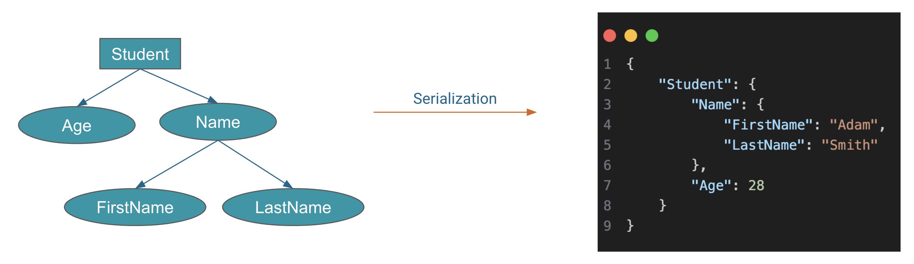

# Introduction to YAML

YAML stands for "YAML Ain't Markup Language" (a playful name). It's a human-readable data serialization format.

## What is Data Serialization?

Data serialization is like putting your data into a format that can be easily stored, transmitted, or used by different programming languages. Think of it as packing your information into a neat, transportable box.

<p align="center">
    
</p>

## Data Serizlization Languages

Some popular data formats for saving and sharing information include `JSON`, which is easy to use for APIs. `XML`, which is recognized for its versatility in web services and document storage. `YAML`, perfect for clear configuration files.

Here's a data structure represented in `JSON`, `XML`, and `YAML`.

=== ":octicons-file-code-16: `my-document.json`"

    ```json linenums="1"
    {
      "Student": {
        "name": {
          "firstName": "Adam",
          "lastName": "Smith"
        },
        "friends": [
          "John",
          "Max",
          "Bob"
        ]
      }
    }
    ```

=== ":octicons-file-code-16: `my-document.xml`"

    ```xml linenums="1"
    <Student>
      <name>
        <firstName>Adam</firstName>
        <lastName>Smith</lastName>
      </name>
      <friends>John</friends>
      <friends>Max</friends>
      <friends>Bob</friends>
    </Student>
    ```

=== ":octicons-file-code-16: `my-document.yml`"

    ```yaml linenums="1"
    Student:
    name:
      firstName: Adam
      lastName: Smith
    friends:
      - John
      - Max
      - Bob
    ```

## Why Learn YAML?

YAML might not be as famous as some other coding languages, but it's a valuable addition to your skill set. 

Learning YAML can make your life easier if you work with configuration files, data exchange between systems, or even just organizing data. It's all about simplifying complex data structures, making them readable, and reducing errors.

YAML is used in some of the most popular tools and technologies in the tech world. For instance:

- **Kubernetes (K8s):** YAML is the common language of Kubernetes. It's used for defining configurations of pods, services, deployments, and more. If you're working with container orchestration, YAML is your go-to.

- **Prometheus:** In the world of monitoring and alerting, Prometheus relies on YAML for its configuration. You define what to monitor and how to alert using YAML files.

- **Ansible:** This powerful automation tool uses YAML for writing playbooks, which are sets of instructions for configuring and managing systems. YAML makes Ansible playbooks easy to read and write.

- **Helm:** Helm is a package manager for Kubernetes, and it uses YAML for defining charts, which are pre-configured applications. With Helm, you can deploy complex applications with a single YAML file.

- **AWS CloudFormation:** When it comes to managing AWS infrastructure as code, YAML is commonly used in AWS CloudFormation templates. These templates describe the AWS resources you want to create and configure.

YAML's versatility makes it a go-to choice in various domains, from container orchestration and automation to cloud infrastructure management. Learning YAML opens doors to efficient and structured data management across a wide array of popular tools and platforms. Happy YAML coding!